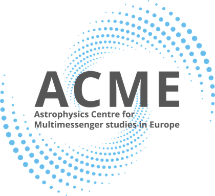

# Acknowledgements

`gwtc_analysis` is developed as part of **ACME**, the
[Astrophysics Centre for Multi-messenger studies in Europe](https://www.acme-astro.eu/), a project that
brings together European research infrastructures in gamma rays, gravitational waves, neutrinos and
cosmic rays, optical and radio astronomy, to broaden and align access to their data, instruments and
expertise for multi-messenger astrophysics.

{ width="200" style="background:#ffffff; padding:10px; border-radius:8px" }

This software is part of a project that has received funding from the European Union's Horizon Europe
Research and innovation programme under Grant Agreement No 101131928.

{ width="360" }
{ width="360" }

Funded by the European Union. Views and opinions expressed are however those of the author(s) only and
do not necessarily reflect those of the European Union or of the European Research Executive Agency
(REA). Neither the European Union nor the granting authority can be held responsible for them.
