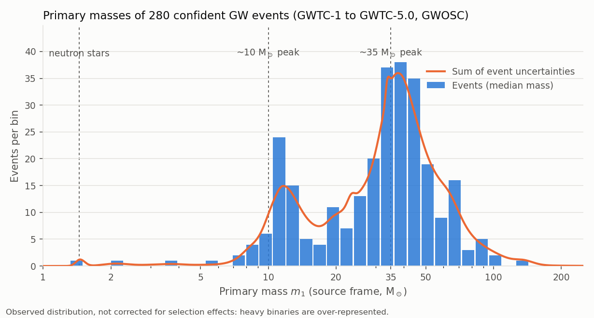

# GWTC Analysis

**GWTC Analysis** (`gwtc_analysis`) is a command-line suite for exploring the public
**Gravitational-Wave Transient Catalogs** (GWTC) of the **LIGO–Virgo–KAGRA** (LVK) collaboration,
from GWTC-1 (2015) to GWTC-5.0 (the O4b observing run, 2025).

<!-- CATALOG_COVERAGE_BEGIN -->
> **Catalogs in version 0.6.1**: GWTC-1, GWTC-2.1, GWTC-3, GWTC-4.0, GWTC-5.0, and the update GWTC-4.1 (of GWTC-4.0), observing runs O1 to O4b. **Latest catalog: GWTC-5.0 (O4b)**. Registry checked against GWOSC and Zenodo on 2026-10-01; catalogs published later need a newer version of the package (`gwtc_analysis check_catalogs` tells whether GWOSC has published one).
<!-- CATALOG_COVERAGE_END -->

It reads the catalogs directly from their public releases (GWOSC, Zenodo, an S3 mirror or Galaxy
collections) and produces TSV tables, plots and self-contained HTML reports.

## What it does

| Mode | Purpose |
|---|---|
| [`catalog_statistics`](modes/catalog-statistics.md) | Catalog-wide tables and plots: masses, distances, SNR, detector networks, sky-localization areas, remnants (radiated energy, final spin) |
| [`event_selection`](modes/event-selection.md) | Events selected by mass, distance and χ_eff ranges, or by class: neutron stars, lower mass gap, hierarchical-merger candidates |
| [`search_skymaps`](modes/search-skymaps.md) | Events whose sky localization contains a given sky position |
| [`parameters_estimation`](modes/parameters-estimation.md) | Posterior plots of one event, whitened strain overlays, q-transforms, matched-filter SNR |
| [`build_unofficial_pe`](modes/unofficial-pe.md) | A PESummary-compatible bundle for GW170817, rebuilt from public GWTC-1 products |
| [`rates`](modes/rates.md) | BNS, NSBH and BBH merger rates, R = N / ⟨VT⟩, from the catalogs and the LVK sensitivity injections |
| [`hubble_constant`](modes/hubble-constant.md) | The Hubble constant from the binary-black-hole mass spectrum (spectral siren), with icarogw |
| [`bright_siren`](modes/bright-siren.md) | The Hubble constant from an event with an identified host (bright siren): GW170817 and NGC 4993, or the candidate GW190521 flare; alone or combined with the spectral siren |
| [`area_law`](modes/area-law.md) | Hawking's area law with GW250114: initial areas from the inspiral against the remnant area from the ringdown, reproducing the published 4.4σ |
| [`stochastic`](modes/stochastic.md) | The background of unresolved compact binaries, Ω_GW(f), from the spectral-siren masses and rate evolution and the `rates` local rates, against the upper limits |
| `zenodo_releases` | The versions of the Zenodo catalog releases ([Data sources](data-sources.md#zenodo-release-versions)) |

## Highlights

- **Hubble constant from black holes alone.** The `hubble_constant` mode reproduces the
  *Power Law + Peak* spectral-siren measurement of the GWTC-4.0 cosmology paper [\[29\]](references.md#ref-29):
  H₀ = 105.8 (+44.7 / −33.2) km/s/Mpc against the published 105.5 (+46.4 / −35.8), with the same
  137 binary black holes, PE samples, injections and priors. See
  [Hubble constant (spectral siren)](science/spectral-siren.md).
- **Merger rates** of the three source classes, corrected for selection effects with the LVK
  search-sensitivity injections. See [Merger rates](science/merger-rates.md).
- **Robust access to the releases:** Zenodo versions resolved at run time, and missing PSDs of
  official releases filled from the events' discovery releases. See
  [Known issues in the public releases](known-data-issues.md).

## Where to go next

- New users: [Installation](installation.md), then [Quick start](quickstart.md).
- The physics and statistics behind the rates and H₀ modes:
  [What a GW signal measures](science/gw-signals.md) and the following pages.
- Every option of every mode: [CLI reference](cli-reference.md).
- All the papers the tool and its methods rely on: [References](references.md).

The source code is on [GitHub](https://github.com/danielsentenac/gwtc_analysis) under the MIT
license.
