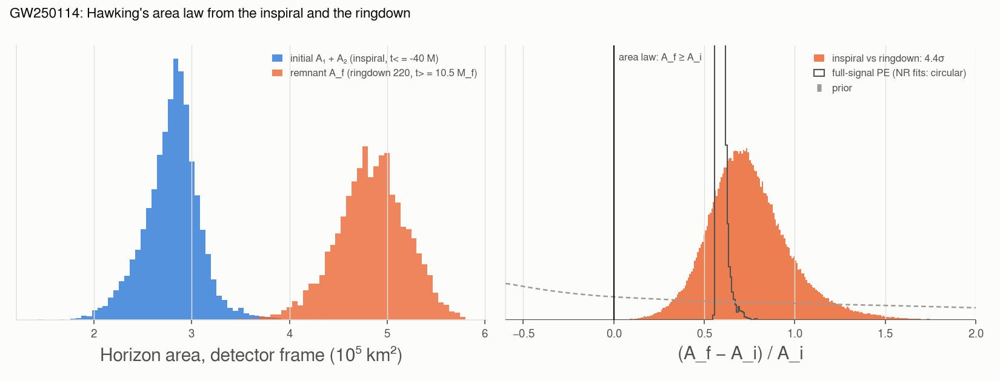
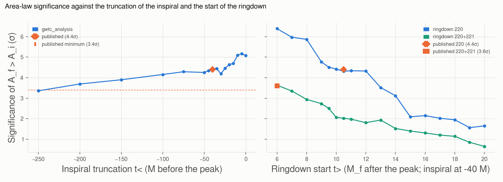

# area_law

Hawking's area law tested with **GW250114**, the loudest binary black hole so far (network SNR 80),
reproduced from the LVK data release of its discovery paper [\[79\]](../references.md#ref-79).

```bash
gwtc_analysis area_law               # downloads 114 MB once
gwtc_analysis area_law --with-imr    # also the full-signal PE, for comparison (27 MB)
```

## The test

In classical general relativity the total area of black-hole horizons never decreases (Hawking 1971
[\[80\]](../references.md#ref-80)). A merger should therefore leave a remnant whose area exceeds the sum
of the initial ones, \(A_f \ge A_1 + A_2\). The horizon area of a Kerr black hole of mass \(M\) and spin
\(\chi\) is

\[
A = 8\pi \left(\frac{GM}{c^2}\right)^2 \left(1 + \sqrt{1 - \chi^2}\right).
\]

A real test measures the two sides from **different parts of the signal**:

- **before:** \(A_i = A_1 + A_2\) from parameter estimation (NRSur7dq4) on data truncated at a time
  \(t_<\) before the peak, from −250 M to 0 M, with M the total detector-frame mass;
- **after:** \(A_f\) from fits of the ringdown quasinormal modes to the data from a time \(t_>\) after
  the peak (the fundamental 220 mode, or 220 and its first overtone 221). The mode frequencies and
  damping times give the remnant mass and spin through the Kerr spectrum alone, with no merger model.

The full-signal PE cannot test the law: its remnant comes from fits to numerical-relativity simulations,
which obey it by construction. `--with-imr` shows it only as a consistency check.

The masses are detector-frame on both sides, so the redshift cancels in \((A_f - A_i)/A_i\). The
significance is the paper's, \((\langle A_f\rangle - \langle A_i\rangle)/\sqrt{\sigma_f^2 + \sigma_i^2}\),
with the remnant areas of two ringdown codes pooled in equal numbers; the report also gives the direct
probability \(P(A_f < A_i)\) over random pairs of samples.

## Result

| Result | gwtc_analysis | Published [\[79\]](../references.md#ref-79) |
|---|---|---|
| \(A_f > A_i\), \(t_< = -40\) M, 220 mode from \(t_> = 10.5\) M\(_f\) | **4.45σ** | 4.4σ |
| minimum over the truncations −250 M to 0 M | 3.36σ | 3.4σ |
| earliest truncation above 5σ | −10 M | −10 M |
| 220 + 221 from 6 M\(_f\), its earliest time of validity | 3.63σ | 3.6σ |

The initial area is \(2.82 \times 10^5\) km² and the remnant area \(4.85 \times 10^5\) km² (medians,
detector frame): \((A_f - A_i)/A_i = 0.73\) (90%: 0.41–1.16). The direct probability of a decrease is
\(10^{-4}\).



*Left: the initial and remnant areas. Right: the area change against the prior; the full-signal PE
(black outline) is far narrower, but tells nothing about the law.*



*Keeping more of the inspiral (later \(t_<\)) measures \(A_i\) better; starting the ringdown later loses
signal, and the two-mode model costs precision.*

## Why only GW250114

The test needs inspiral-only and ringdown-only analyses, which the catalog PE files do not contain, and
enough SNR in both parts. Of the earlier results:

- **GW150914** (Isi et al. 2021 [\[81\]](../references.md#ref-81), 97% with overtones): no data release
  of the inspiral side.
- The **GWTC-3 tests of GR** release has inspiral (frequency cut, IMR consistency test) and pyRing
  ringdown posteriors for 11 O1–O3 events. Combining them is possible but is a new analysis: with a
  frequency cut instead of a time cut GW150914 gives 74% instead of 97%, and the weak events need quality
  cuts (an uninformative inspiral or ringdown can mimic a violation). Not implemented.

## Outputs

- `--out-report` (HTML): the result, the comparison with the paper, the scans, the plots;
- `--out-summary` (TSV): the comparison with the paper; `<name>.truncation.tsv` and `<name>.ringdown.tsv`:
  significance and median areas against \(t_<\) and \(t_>\);
- `--plots-dir`: `area_law_GW250114.png`, `area_law_scans_GW250114.png`.

The release is extracted (37 files) into the Zenodo cache, or `--cache-dir`.
