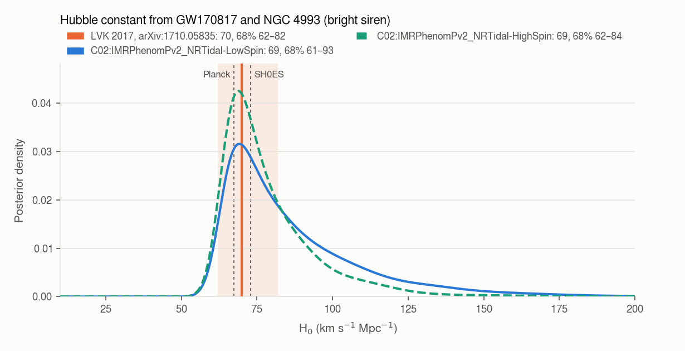
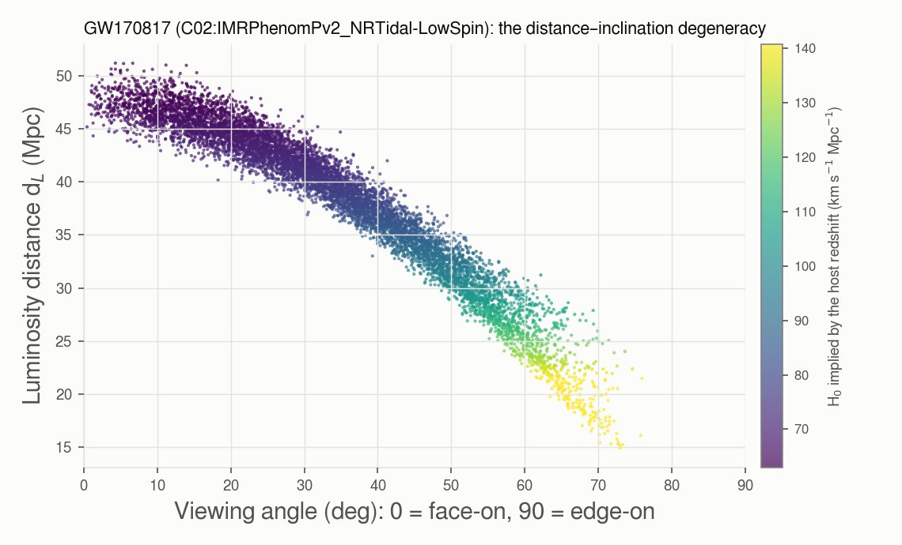
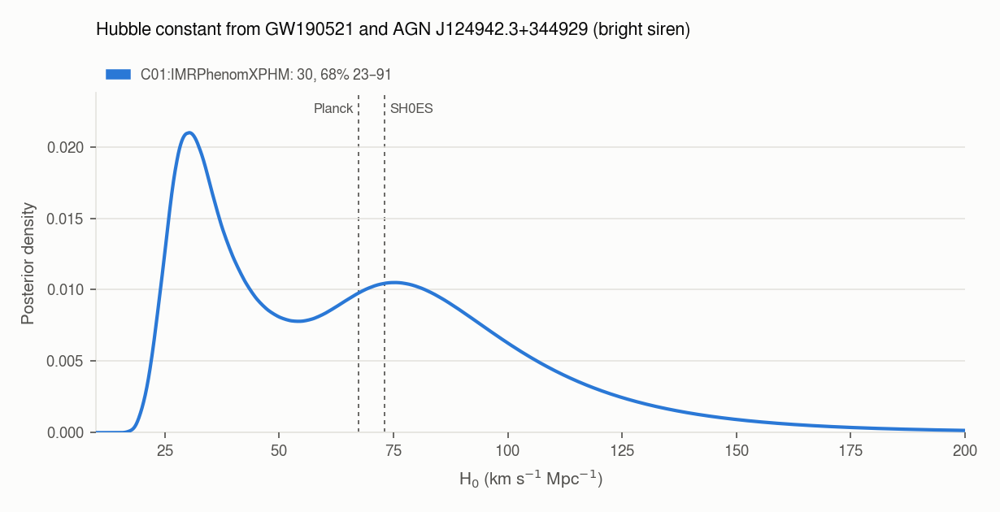
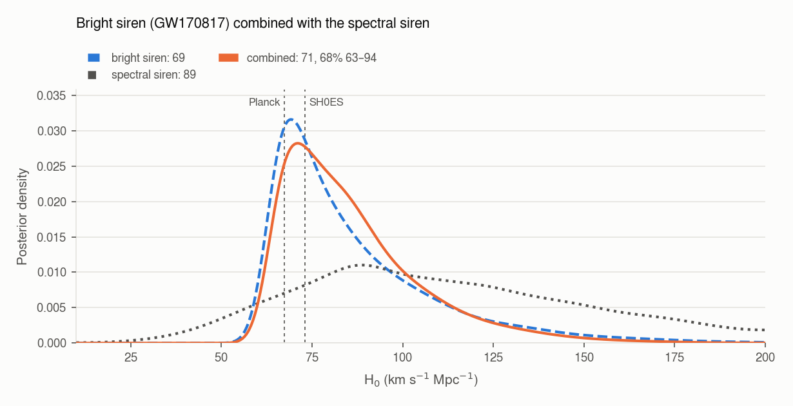

# bright_siren

The Hubble constant from an event with an **identified host galaxy** (bright siren), alone or combined
with the [spectral siren](hubble-constant.md). It takes seconds: no sampling.

```bash
gwtc_analysis bright_siren                                            # GW170817 and NGC 4993
gwtc_analysis bright_siren --spectral-posterior h0_plp              # combined with the spectral siren
gwtc_analysis bright_siren --spectral-posterior h0_dark_plp         # combined with the dark siren
gwtc_analysis bright_siren --src-name GW190521                        # candidate AGN flare, z = 0.438
```

## Method

The GW signal gives the luminosity distance \(d_L\) with no distance ladder; the host gives the
Hubble-flow redshift \(z\). For a nearby galaxy, \(z\) comes from its recession velocity minus its
peculiar velocity, \(c z = v_r - \langle v_p \rangle\). In flat ΛCDM, with \(\Omega_m = 0.3065\) as in
the spectral siren,

\[
d_L = \frac{c}{H_0}\, D(z; \Omega_m).
\]

For sources uniform in comoving volume and source-frame time,
\(p_\text{pop}(z) \propto \frac{dV_c}{dz} \frac{1}{1+z}\), and with a flat H₀ prior
(Chen, Fishbach & Holz 2018 [\[72\]](../references.md#ref-72);
Mandel, Farr & Gair 2019 [\[35\]](../references.md#ref-35)):

\[
p(H_0 \mid \text{data}) \propto \frac{1}{\beta(H_0)}
\int \mathcal{N}(z_\text{obs};\, z,\, \sigma_z)\; p_\text{pop}(z)\; \mathcal{L}_\text{GW}\big(d_L(z, H_0)\big)\, dz .
\]

\(\mathcal{L}_\text{GW}\) is the posterior of \(d_L\) divided by the PE distance prior, read from the
file (\(d_L^2\) up to O3, uniform in comoving volume in O4). Over the PE samples \(d_i\), whose
redshift at a trial H₀ is \(z_i\), the integral is a kernel sum:

\[
\sum_i \mathcal{N}(z_\text{obs};\, z_i,\, \sigma)\,
\frac{p_\text{pop}(z_i)}{\pi_\text{PE}(d_i)\; \partial d_L/\partial z\,(z_i)},
\qquad \sigma = \max(\sigma_z, h),
\]

where \(h\) is the kernel width of the \(z_i\) (Silverman's rule). It only matters for a distant host
with a spectroscopic redshift, much narrower than the spread of the samples.

**The selection term** \(\beta(H_0)\) is the fraction of the population that would be detected. At a
given redshift a larger H₀ means a smaller distance, so a louder signal. Leaving β out biases H₀:
see [Validation](#validation-mock-bright-sirens). `--selection`:

| Value | β(H₀) | Use |
|---|---|---|
| `euclidean` | ∝ H₀³: GW-limited detection of nearby sources. It cancels the volume factor of the numerator, and with a \(d_L^2\) prior the posterior becomes \(\sum_i \mathcal{N}(v_H;\, H_0 d_i,\, \sigma_v)\), the LVK 2017 formula [\[27\]](../references.md#ref-27) | z < 0.05 |
| `injections` | the found LVK sensitivity injections of the event's observing run, carried to the source frame at each trial H₀ and reweighted to the population of the event's class: Power Law + Peak for black holes (as in `rates`), uniform 1–2.5 M☉ for neutron stars; the injected isotropic spins | distant events |
| `auto` (default) | `euclidean` below z = 0.05, `injections` above | |

**Sky position.** The distance must be the one at the counterpart's position: distance and sky
position are correlated through the antenna pattern. The GWTC-1 GW170817 samples were produced with
the sky fixed to AT2017gfo and are used as they are. Other samples are restricted to those within
`--sky-radius` of the counterpart.

## Registered events

| Event | Host | z | Status | Selection (auto) |
|---|---|---|---|---|
| GW170817 | NGC 4993, AT2017gfo | 3017 ± 166 km/s (\(v_r\) 3327 ± 72, \(\langle v_p \rangle\) 310 ± 150) [\[27\]](../references.md#ref-27) | confirmed (kilonova) | euclidean |
| GW190521 | AGN J124942.3+344929, ZTF19abanrhr | 0.438 ± 0.0015 [\[74\]](../references.md#ref-74) | **candidate** | injections (O3a, BBH) |

**GW190521 is a candidate.** Graham et al. proposed the ZTF flare in an AGN disk as the counterpart
[\[74\]](../references.md#ref-74). The odds of a common source are only 1 to 12, depending on the
waveform model (Ashton et al. 2021 [\[75\]](../references.md#ref-75)). Its result is H₀ *if* the flare is
the counterpart, and the report says so.

A new event needs one entry in `COUNTERPARTS` (`gwtc_analysis/bright_siren.py`): the host, the
counterpart's position, the redshift or the velocities, the observing run, the population class, and
the PE file (`pe_event`, read from Zenodo).

## Results

| Event, PE label | Maximum a posteriori, 68% interval | Median, 90% interval |
|---|---|---|
| GW170817, LowSpin | **69.8** (+23.6 / −8.2) | 79.9, 63.0–135.5 |
| GW170817, HighSpin | **69.4** (+14.8 / −7.4) | 74.8, 62.2–112.2 |
| GW170817, LVK 2017 [\[27\]](../references.md#ref-27) | **70.0** (+12.0 / −8.0) | |
| GW190521 + ZTF19abanrhr, IMRPhenomXPHM | **30.4** (+61.0 / −7.0) | 63.2, 26.1–129.5 |



**GW170817.** The maximum a posteriori and the lower side agree with the published value. The upper
side is wider because the public GWTC-1 samples come from a later reanalysis (GWTC-1,
IMRPhenomPv2_NRTidal), whose distance has a longer low-distance tail than the 2017 analysis (43.8 +2.9
−6.9 Mpc). That tail comes from the **distance–inclination degeneracy**: an inclined binary is fainter
than a face-on one at the same distance. Constraining the inclination with the radio jet narrows H₀
considerably (Hotokezaka et al. 2019 [\[73\]](../references.md#ref-73)); this mode does not use EM
inclination constraints. The full ΛCDM \(d_L\) raises H₀ by 0.8% (0.6 km/s/Mpc) compared with the
linear Hubble law of the 2017 paper.

The report shows the degeneracy: the distance samples against the viewing angle (0° face-on, 90°
edge-on), each colored by the H₀ it implies at the host redshift.



| Viewing angle | Samples | \(d_L\) median | H₀ implied |
|---|---|---|---|
| 0–30° | 43% | 44.6 Mpc | 68 |
| 30–60° | 51% | 35.9 Mpc | 85 |
| 60–90° | 6% | 23 Mpc | 132 |

*The samples form one band: the distance falls as the orbit is seen more inclined. The inclination is
measured, from all three detectors (θ_JN = 147°, 90%: 118–171°), but broadly: Virgo's response to
GW170817 was small (the wave came close to one of its blind directions), which constrained the sky
position but carried little polarization information, and near face-on the two polarizations are almost
equal, (1 + cos²ι)/2 against cos ι. The upper tail of the H₀ posterior comes from the inclined orbits; the
radio jet of GW170817, which fixes the viewing angle, removes it.*



**GW190521.** The posterior is bimodal because the distance posterior is, in the direction of the flare.
At z = 0.438, H₀ ≈ 30 corresponds to \(d_L\) ≈ 5.6 Gpc and H₀ ≈ 75 to 2.25 Gpc; the samples within 3°
of the flare have a median of 4.6 Gpc with 16% below 2.2 Gpc. The result depends on the sky selection
(median 54.7 within 5°, against 63.2 within 3°) and on the waveform model; only IMRPhenomXPHM has enough
samples near the flare in GWTC-2.1. The selection term is computed from 106,376 found O3a injections,
with 13,000–16,000 effective injections over the H₀ range.

## Combination with the spectral or dark siren

`--spectral-posterior` takes a `hubble_constant` work directory (its `posterior_reweighted.tsv`, else
`posterior.tsv`) or any TSV with an `H0` column. The work directory can be a spectral siren or a dark siren
(`hubble_constant --galaxy-catalog`): the combination is the same, and the report names which it is (from the
work directory's `selection.json`). Bright siren × dark siren is the LVK's headline combination (GWTC-5.0: 71.7
(+9.4 / −7.5) km/s/Mpc with DES-Y6 [\[30\]](../references.md#ref-30)). The two measurements use different events
(the spectral and dark sirens use binary black holes; leave the bright-siren event out of them) and the same flat
prior, so their posteriors multiply. The siren density is a Gaussian kernel estimate, reflected at the prior bounds.



GW170817 with the *Power Law + Peak* spectral siren (GWTC-4.0 setup): H₀ = 71.7 (+22.3 / −8.0) km/s/Mpc
(maximum a posteriori, 68%). GW170817 dominates; the broad spectral siren shifts the posterior slightly
upwards. With the PLP dark siren (GLADE+ K band) instead: 72.7 (+26.9 / −8.4), the dark-siren posterior being
centred higher (maximum 121).

**Which measurement dominates.** Independent posteriors multiply, so the narrower one sets the result and the
broader one tilts it. With the GWTC-4.0 Power Law + Peak sirens, GW170817 dominates: its 68% interval is about
32 km/s/Mpc wide (61.6–93.4), the dark siren's about 80 (83–163), so the dark siren only pushes the result up
(maximum 69.8 → 72.7). In the GWTC-5.0 analysis [\[30\]](../references.md#ref-30) it is the other way round: with
235 events, the FullPop-4.0 mass model and the DES-Y6 galaxies, the dark sirens, 68.8 (+14.2 / −13.2), are narrower
than the LVK's GW170817 bright siren, 79.1 (+27.6 / −12.4), and drive the combination, 71.7 (+9.4 / −7.5). That
setup (FullPop-4.0, DES-Y6) is not in this version of `gwtc_analysis`.

## Validation: mock bright sirens

The analysis is tested on simulated detections with a known H₀ (`tests/test_bright_siren.py`).

- **Sources:** uniform in comoving volume up to z = 4, masses uniform in 20–40 M☉, random orientations.
- **Detection:** each source has a network SNR \(\rho = A(\mathcal{M}_\text{det})\, w(\iota) / d_L\)
  plus unit Gaussian noise, and is detected above 12. The detected events have a median z ≈ 0.5.
- **Observations:** each detected event gets the posterior of \(d_L\) given its observed SNR. It uses a
  \(d_L^2\) prior and is marginalized over the inclination, which reproduces the real
  distance–inclination degeneracy. The host redshift has an error of 0.001.
- **Injections:** they are made at H₀ = 70 with broader masses than the population (5–120 M☉), as the
  LVK ones, so that they cover the population at every trial H₀.

| Test | Result |
|---|---|
| β from the reweighted injections against the detected fraction simulated directly at each H₀ (40–120) | equal within 3% (β varies by more than a factor of 10) |
| 100 events, H₀ = 70: with the selection term | 70.9 ± 1.1 |
| the same without the selection term | 80.7 ± 2.7: biased by more than 3σ |
| P–P test, 100 events with H₀ drawn from the prior | uniform with the selection term (KS p = 0.16), not without (p = 10⁻⁴) |
| nearby sources (horizon z ≈ 0.02) | β from injections ∝ H₀^3.0, the `euclidean` selection |


The injections must cover the population at every trial H₀. In a first version of the mock, with
injection masses drawn from the population's own 20–40 M☉, β was wrong by up to a factor of 2.5 at the
edges of the H₀ range, and H₀ was biased by 3σ. The LVK injections are drawn much more broadly than any
population; the report gives the effective number of injections over the H₀ range.

## Options

| Option | Default | Meaning |
|---|---|---|
| `--src-name` | `GW170817` | registered event (`GW170817`, `GW190521`) |
| `--pe-label` | the registry's, else all the labels (LowSpin first) | PE labels; the first one is the main result and the one combined |
| `--pe-file` | the event's bundle or Zenodo file | another PE file (PESummary layout) |
| `--pe-cache` | that of `hubble_constant` | where Zenodo PE files are downloaded |
| `--v-recession V SIGMA`, `--v-peculiar V SIGMA` | the registry's | velocities of a nearby host, km/s |
| `--redshift Z SIGMA` | the registry's | Hubble-flow redshift of the host, instead of the velocities |
| `--selection` | `auto` | `euclidean`, `injections` or `auto` |
| `--sensitivity-release`, `--sensitivity-file` | `gwtc4` | injections of the selection term |
| `--far-threshold`, `--snr-threshold` | 0.25 /yr, 10 | found injections (real searches, semi-analytic O1+O2) |
| `--sky-radius` | 3° | for samples not fixed to the counterpart |
| `--spectral-posterior` | none | spectral- or dark-siren posterior to combine with: a `hubble_constant` work directory or a TSV |
| `--h0-range MIN MAX` | 10 200 | flat prior; keep the spectral siren's for a combination |

The published comparison is shown only with the registry's velocities or redshift.

## Outputs

- `--out-report` (HTML): the result, the caveat of a candidate counterpart, the inputs, the selection
  term and the plots;
- `--out-summary` (TSV): maximum a posteriori, 68.3% highest-density interval, median and 90%
  interval of each analysis, with the distance of each label;
- `<summary>.posterior.tsv`: the posterior densities on an H₀ grid;
- `--plots-dir`: `h0_bright_siren_<event>.png`, and `h0_combined.png` with `--spectral-posterior`.
