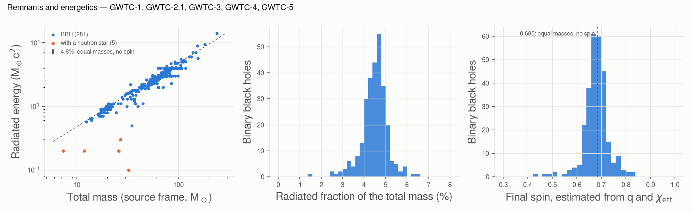
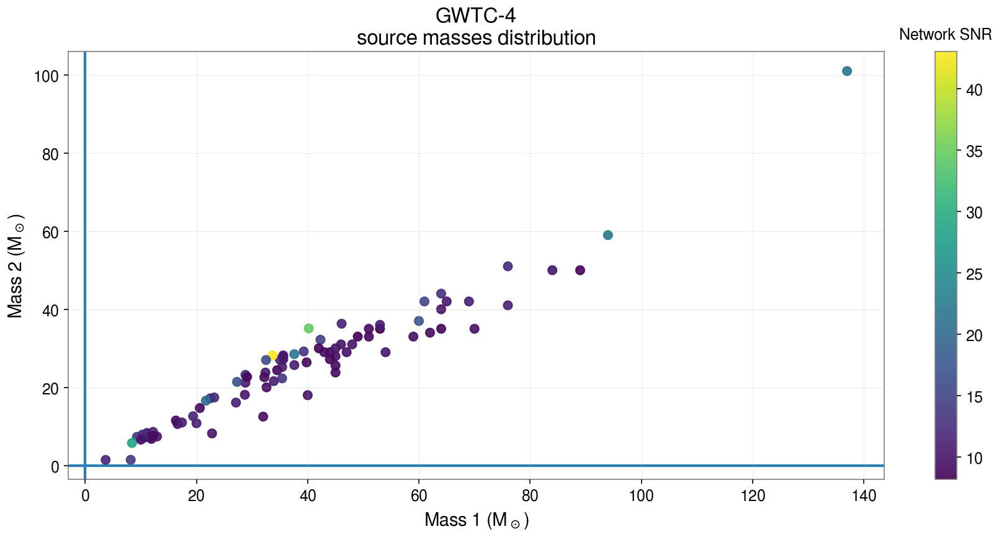
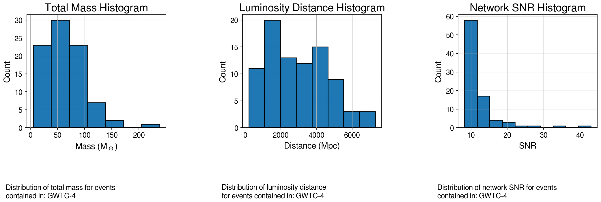
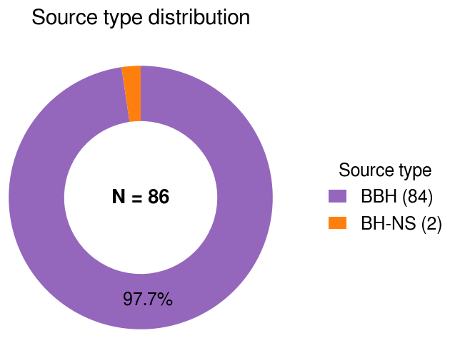
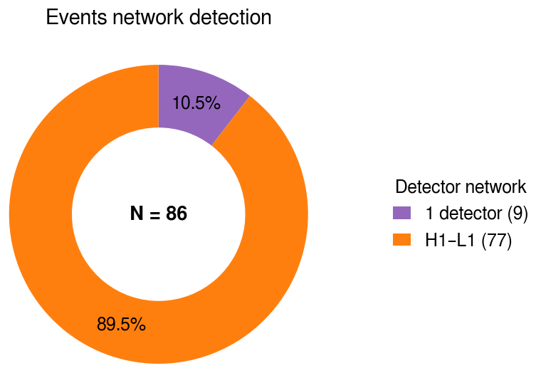
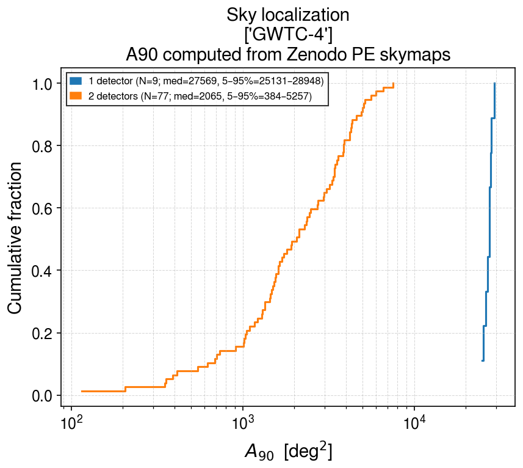

# catalog_statistics

Catalog-wide statistics of one or several catalogs: a table with one row per event, plots, and an
HTML report.

```bash
gwtc_analysis catalog_statistics --catalogs GWTC-4 GWTC-5 --include-detectors --include-area
```

**Inputs.** Event metadata from the GWOSC event lists (names, times, false-alarm rates, median
source-frame masses, distances, network SNR); with `--include-detectors`, the detector network of each
event from the GWOSC v2 API; with `--include-area`, the sky-localization area at the credible level
`--area-cred` (A90 by default), computed from the skymaps of `--data-repo`.

**Outputs.**

- `--out-events` (TSV): one row per event;
- `--plots-dir`: the primary against secondary mass diagram colored by SNR, histograms of the main
  parameters, the fraction of each source type (BBH, BNS, NSBH), the detector networks, and the
  cumulative distribution of the sky-localization areas, and the remnants (below);
- `--out-report`: the HTML report with the tables and plots.

## Remnants and energetics

Every event with a final mass in GWOSC gets, in the TSV and the report:

- **the radiated energy** E_rad = (M_total − M_final) c², in M☉c² and in erg, and the radiated
  fraction E_rad / M_total c². It is the difference of the GWOSC medians, not the median of the
  difference, and the medians are rounded (to 0.1–1 M☉), so small values are coarse;
- **an estimate of the final spin** of the binary black holes. It uses the aligned-spin fit of Rezzolla
  et al. 2008 [\[76\]](../references.md#ref-76), with both spins set to χ_eff and the mass ratio of the
  medians. It gives 0.686 for equal masses without spin. The PE value (`final_spin` of the PE
  samples) and the peak luminosity, which GWOSC does not list, are read with
  [parameters_estimation](parameters-estimation.md).

The report lists the 10 events that radiated the most energy, with a figure:



*GWTC-1 to GWTC-5: 286 events radiated 4.6% of their total mass (median), close to the 4.8% of
equal masses without spin; the events with a neutron star radiate much less (orange). The estimated
final spins cluster near 0.69, as expected for mergers of similar masses with small spins.*

| Event | Total mass (M☉) | Final mass (M☉) | E_rad (M☉c²) | E_rad (erg) | Final spin (estimate) |
|---|---|---|---|---|---|
| GW231123_135430 | 238 | 222 | 14.0 | 2.5 × 10⁵⁵ | 0.77 |
| GW190426_190642 | 181.5 | 172.9 | 9.4 | 1.7 × 10⁵⁵ | 0.74 |
| GW231028_153006 | 153 | 144 | 9.0 | 1.6 × 10⁵⁵ | 0.80 |
| GW200220_061928 | 148 | 141 | 7.0 | 1.3 × 10⁵⁵ | 0.69 |
| GW150914 (for reference) | 64.6 | 61.5 | 3.0 | 5.4 × 10⁵⁴ | 0.67 |

GW150914 matches its published values (3.0 +0.5 −0.4 M☉c², final spin 0.67–0.69).

## Example

```bash
gwtc_analysis catalog_statistics --catalogs GWTC-4 --include-detectors --include-area
```

GWTC-4.0 (O4a), 86 events with a PE release; every figure below was produced by this command.



*Median source-frame masses, colored by network SNR. The heaviest event is GW231123; the two points
near the horizontal axis are the NSBH candidates.*



| Source types | Detector networks |
|---|---|
|  |  |

*84 BBHs and 2 NSBHs; 77 events seen by the two LIGO detectors, 9 by one only (Virgo did not observe
during O4a).*

{ width="560" }

*90% sky areas from the Zenodo PE skymaps: median 2 065 deg² with two detectors, about 27 600 deg²
with a single detector, which localizes an event only to a large part of the sky.*

All options: [CLI reference](../cli-reference.md#catalog_statistics).
