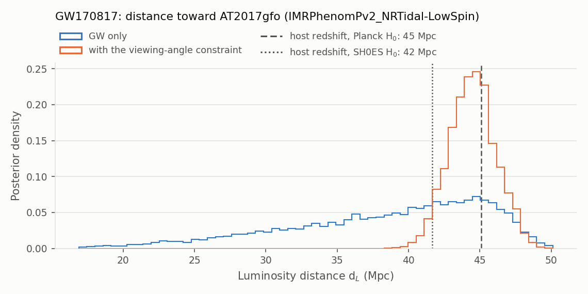
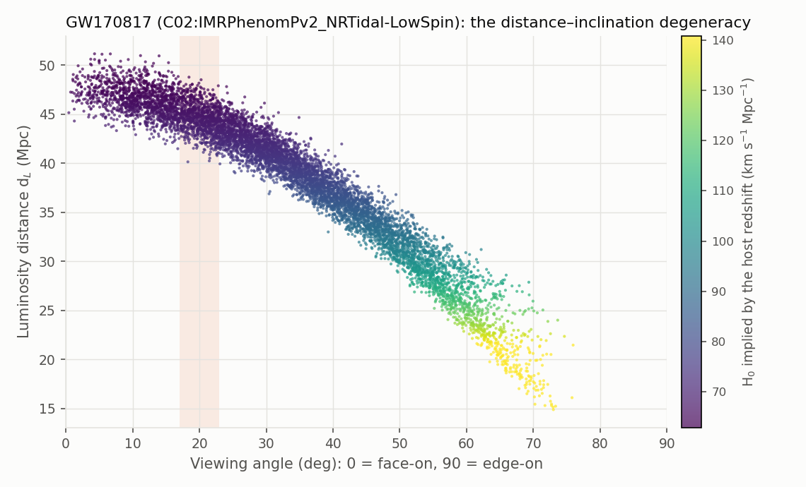
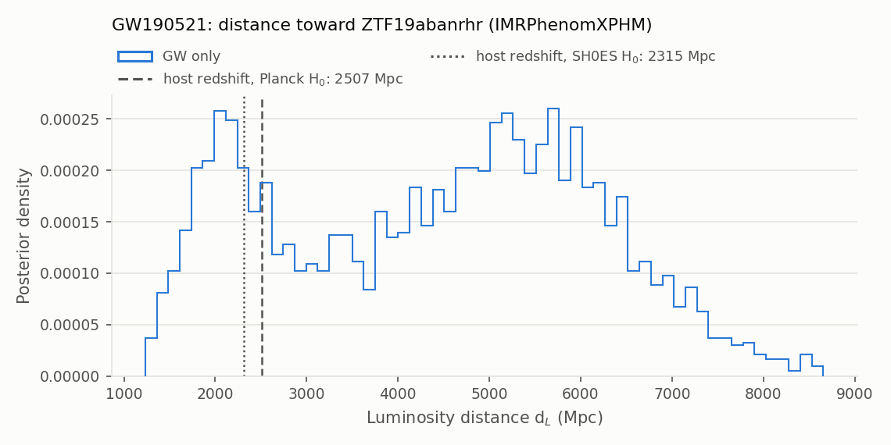

# counterpart

Where an **electromagnetic counterpart** and its host sit in the GW posterior of an event: on the sky, along the
line of sight, and against the orientation of the binary. It takes seconds. The Hubble constant of the event is
[`hubble_constant --method bright`](hubble-constant-bright.md); this mode is about the association and the
quantities the H₀ depends on.

```bash
gwtc_analysis counterpart                                   # GW170817 and AT2017gfo
gwtc_analysis counterpart --viewing-angle 20 3              # with the viewing angle of the radio jet
gwtc_analysis counterpart --event GW190521                  # candidate flare ZTF19abanrhr
gwtc_analysis counterpart --event GW190521 --ra 190 --dec 30   # another position, same host redshift
```

## Two notions used by the options

### The list of known counterparts

`gwtc_analysis` has a small built-in list of events with an electromagnetic counterpart (in the code, the
`COUNTERPARTS` dictionary of `gwtc_analysis/counterpart.py`). `--event` picks one of them, and the list supplies
everything about the counterpart that the GW data do not give, so that no option is needed for it:

| Event | Counterpart (transient) and its position | Host galaxy and its redshift | PE file read | PE labels used by default |
|---|---|---|---|---|
| GW170817 | AT2017gfo, the kilonova: RA 197.4504°, Dec −23.3815° | NGC 4993: recession velocity 3327 ± 72 km/s, peculiar velocity 310 ± 150 km/s, so a Hubble-flow velocity of 3017 ± 166 km/s (z ≈ 0.0101) | the GWTC-1 samples, rebuilt by [build_unofficial_pe](unofficial-pe.md) | both: LowSpin, then HighSpin |
| GW190521 | ZTF19abanrhr, a flare in an active galactic nucleus (**candidate**): RA 192.4263°, Dec +34.8247° | AGN J124942.3+344929: z = 0.438 ± 0.0015 | the GWTC-2.1 file of GW190521_030229, from Zenodo | `C01:IMRPhenomXPHM` |

The same list serves [`hubble_constant --method bright`](hubble-constant-bright.md#registered-events). In the
options below, "from the list" means the value of this table. `--ra`/`--dec`, `--redshift`, `--v-recession` and
`--v-peculiar` override it for one run; a new event needs a new entry in `COUNTERPARTS`.

### PE labels

The PE file of an event does not hold one posterior but several: the LVK analysed each event with several
waveform models and priors, and each analysis is stored under a **label** (see
[Waveform models](../science/waveforms.md)). The labels of the two events:

| Event | Labels in its PE file | Difference |
|---|---|---|
| GW170817 | `C02:IMRPhenomPv2_NRTidal-LowSpin`, `C02:IMRPhenomPv2_NRTidal-HighSpin` | the same waveform model with two spin priors: dimensionless spins up to 0.05 (as observed in Galactic neutron stars) or up to 0.89 |
| GW190521 | `C01:IMRPhenomXPHM`, `C01:SEOBNRv4PHM`, `C01:Mixed` | two waveform models, and their samples mixed |

Each label gives its own sky position, distance and inclination, so the results differ slightly from one label to
the other. `counterpart` analyses every label it is given and writes **one row per label** in the summary; the
plots and the viewing-angle paragraph use the **first** label. `--pe-label` chooses the labels and their order:

```bash
gwtc_analysis counterpart --pe-label C02:IMRPhenomPv2_NRTidal-HighSpin   # the high-spin analysis only
gwtc_analysis counterpart --event GW190521 --pe-label C01:SEOBNRv4PHM    # another waveform model
```

Without `--pe-label`, the labels of the list above are used; for an event without default labels, all the labels
of the file, the low-spin ones first. For GW190521 the default is IMRPhenomXPHM because it is the only model with
enough samples near the flare.

## What it computes

For each PE label:

| Quantity | How |
|---|---|
| **Searched probability** of the counterpart's position | the credible level of the smallest sky region that contains it. From the LVK sky map of the event for this label (Zenodo archive of its catalog, ligo.skymap crossmatch); without a map (`--pe-file`, `--sky-map none`), a kernel density estimate on the PE samples' sky positions |
| **Distance along its line of sight** | the PE samples within `--sky-radius` of the position (all of them when the sky was fixed to the counterpart): median and 90% interval |
| **Distance of the host redshift** | \(d_L(z; H_0)\) for Planck (67.4) and SH0ES (73.0), with its percentile in the distance posterior: a host redshift far in the tails of the GW distance makes the association, or the cosmology, doubtful |
| **Viewing angle** | the angle between the line of sight and the total angular momentum, θ_JN folded to 0–90° (0° face-on) |
| **Distance–inclination degeneracy** | the distance samples against the viewing angle, each colored by the H₀ it implies at the host redshift, and a table by angle |
| **With `--viewing-angle MEAN SIGMA`** | an independent Gaussian constraint on the viewing angle (degrees), as weights on the samples: the distance and the angle with it, and the effective number of samples |

The searched probability from the samples converges slowly for a sky with fine structure: for GW190521 and
ZTF19abanrhr, 0.55 from 20,000 samples and 0.62 from 50,000, against 0.64 from the LVK sky map. The map is used
whenever the event's PE file comes from Zenodo.

## GW170817 and AT2017gfo

The GWTC-1 samples have the sky fixed to AT2017gfo: there is no searched probability, and all the samples are on
its line of sight.

| PE label | \(d_L\) (Mpc), 90% | Host at Planck H₀: 45.1 Mpc | Host at SH0ES H₀: 41.6 Mpc | Viewing angle, 90% |
|---|---|---|---|---|
| LowSpin | 40.0 (24.9–47.3) | percentile 82 | percentile 60 | 33° (9–62°) |
| HighSpin | 41.7 (29.1–47.5) | percentile 79 | percentile 49 | 28° (8–55°) |
| LowSpin, viewing angle 20 ± 3° | 44.5 (41.9–47.3) | | | 20° (15–25°) |



The host redshift is well inside the GW distance posterior for both values of H₀. The viewing-angle constraint
(the radio jet, 14–26° at 41 Mpc, Hotokezaka et al. 2019 [\[73\]](../references.md#ref-73), here 20 ± 3°) keeps
1,600 effective samples of 8,078 and removes the low-distance tail.

### The distance–inclination degeneracy



| Viewing angle | Samples | \(d_L\) median | H₀ implied |
|---|---|---|---|
| 0–30° | 43% | 44.6 Mpc | 68 |
| 30–60° | 51% | 35.9 Mpc | 85 |
| 60–90° | 6% | 23 Mpc | 132 |

*The samples form one band: the distance falls as the orbit is seen more inclined, because an inclined binary is
fainter than a face-on one at the same distance. The inclination is measured, from all three detectors (θ_JN =
147°, 90%: 118–171°), but broadly: Virgo's response to GW170817 was small (the wave came close to one of its blind
directions), which constrained the sky position but carried little polarization information, and near face-on the
two polarizations are almost equal, (1 + cos²ι)/2 against cos ι. The upper tail of the bright-siren H₀ comes from
the inclined orbits; the shaded band is the jet constraint, which removes them.*

## GW190521 and ZTF19abanrhr

| Quantity | Value |
|---|---|
| Searched probability of ZTF19abanrhr (LVK sky map, IMRPhenomXPHM) | 0.64 |
| Samples within 3° of the flare | 3,436 of 148,527 |
| \(d_L\) along that line of sight | 4.64 Gpc (90%: 1.75–7.12) |
| Host at z = 0.438: Planck H₀, SH0ES H₀ | 2.51 Gpc (percentile 21), 2.31 Gpc (percentile 18) |
| Viewing angle | 36° (90%: 10–84°) |



The flare is inside the 64% credible region of the sky, and the distance of its host for the usual values of H₀
falls on the lower of the two modes of the GW distance in that direction. Neither confirms nor excludes the
association, whose odds are 1 to 12 depending on the waveform model (Ashton et al. 2021
[\[75\]](../references.md#ref-75)); the bimodal distance is why the bright-siren H₀ of GW190521 is bimodal.

## Options

| Option | Default | What it is for |
|---|---|---|
| `--event` | `GW170817` | which event of the [list of known counterparts](#the-list-of-known-counterparts): `GW170817` or `GW190521`. It sets the counterpart's position, the host redshift and the PE file |
| `--ra`, `--dec` | the position from the list | test another position on the sky (degrees), for instance another candidate transient; the host redshift stays that of the list unless `--redshift` is given too |
| `--pe-label` | the labels from the list, else all the labels of the file | which analyses of the PE file to use, and in which order ([PE labels](#pe-labels)); one row per label, plots from the first |
| `--pe-file` | the event's file (see the list) | read another PE file (PESummary layout, e.g. a newer release or your own run) instead |
| `--cache-dir` | `.cache_gwosc` | where the rebuilt GW170817 file is kept (as in [build_unofficial_pe](unofficial-pe.md)) |
| `--pe-cache` | that of `hubble_constant` | where the PE files downloaded from Zenodo are kept (GW190521) |
| `--redshift Z SIGMA` | from the list (GW190521) | the Hubble-flow redshift of the host and its uncertainty |
| `--v-recession V SIGMA`, `--v-peculiar V SIGMA` | from the list (GW170817) | for a nearby host, the redshift as velocities (km/s): measured recession velocity, and the peculiar velocity to subtract from it |
| `--sky-radius` | 3° | when the PE samples are spread over the sky: the samples kept as "along the line of sight", those within this angle of the position. Not used for GW170817, whose samples are all at AT2017gfo |
| `--sky-map` | the event's LVK sky map | FITS sky map for the searched probability; `none` computes it from the PE samples instead |
| `--viewing-angle MEAN SIGMA` | none | an independent measurement of the viewing angle (degrees, Gaussian), e.g. from the radio jet of GW170817, to see how it narrows the distance |
| `--pe-distance-prior` | the file's, else \(d_L^2\) up to O3 | distance prior of the PE samples, divided out of the distance posterior: `dl2`, `comoving` or `source-frame` |
| `--out-report`, `--out-summary`, `--plots-dir` | `counterpart.html`, `counterpart.tsv`, `counterpart_plots` | the HTML report, the summary table (one row per PE label) and the plots |

## Outputs

- `--out-report` (HTML): the counterpart and host, the caveat of a candidate, the searched probability, the
  distance along the line of sight against the host redshift, the degeneracy and the constraint;
- `--out-summary` (TSV): one row per PE label with all the quantities above;
- `--plots-dir`: `distance_<event>.png` and `distance_inclination_<event>.png`.
