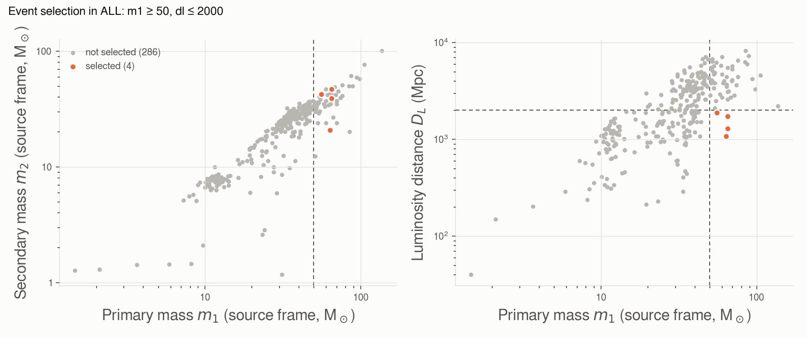
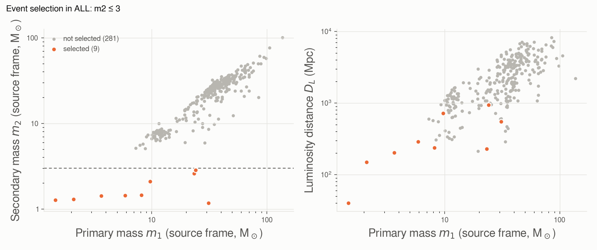

# event_selection

Events of the chosen catalogs whose median source-frame masses and luminosity distance fall in given
ranges. Every bound is optional.

```bash
# heavy binaries within 2 Gpc
gwtc_analysis event_selection --catalogs ALL --m1-min 50 --dl-max 2000

# potential neutron-star companions
gwtc_analysis event_selection --catalogs ALL --m2-max 3
```

| Option | Selects on |
|---|---|
| `--m1-min`, `--m1-max` | primary mass, source frame (M☉) |
| `--m2-min`, `--m2-max` | secondary mass, source frame (M☉) |
| `--dl-min`, `--dl-max` | luminosity distance (Mpc) |

The selection is written to `--out-selection` (TSV). It uses the GWOSC confident lists; for analyses
that need the marginal candidates as well, see [Known issues](../known-data-issues.md#gw200105-only-in-the-marginal-list).

## Examples

The mode writes the selection as a TSV (`--out-selection`, one row per event) and, with `--out-plot`, a
PNG of the selected events among all the events of the catalogs.

### Heavy binaries within 2 Gpc

```bash
gwtc_analysis event_selection --catalogs ALL --m1-min 50 --dl-max 2000 --out-plot selection.png
```

Heavy binaries within 2 Gpc; the TSV (`event_selection.tsv`) lists:

| event_id | catalog_key | mass_1_source | mass_2_source | luminosity_distance |
|---|---|---|---|---|
| GW191109_010717-v1 | GWTC-3 | 65.0 | 47.0 | 1290 |
| GW240519_012815-v1 | GWTC-5 | 65.0 | 39.0 | 1740 |
| GW241127_061008-v1 | GWTC-5 | 63.8 | 20.8 | 1080 |
| GW241225_082815-v1 | GWTC-5 | 55.7 | 42.2 | 1880 |



*The 4 selected events (orange) among the 290 events of GWTC-1 to GWTC-5 with masses and distance;
the dashed lines are the bounds m₁ ≥ 50 M☉ and D_L ≤ 2000 Mpc.*

### Potential neutron-star companions

```bash
gwtc_analysis event_selection --catalogs ALL --m2-max 3 --out-plot selection.png
```

| event_id | catalog_key | mass_1_source | mass_2_source | luminosity_distance |
|---|---|---|---|---|
| GW191219_163120-v1 | GWTC-3 | 31.1 | 1.17 | 550 |
| GW170817-v3 | GWTC-1 | 1.46 | 1.27 | 40 |
| GW190425_081805-v3 | GWTC-2.1 | 2.1 | 1.3 | 150 |
| GW230529_181500-v2 | GWTC-4 | 3.66 | 1.42 | 203 |
| GW200115_042309-v2 | GWTC-3 | 5.9 | 1.44 | 290 |
| GW230518_125908-v1 | GWTC-4 | 8.17 | 1.45 | 236 |
| GW190917_114630-v1 | GWTC-2.1 | 9.7 | 2.1 | 720 |
| GW190814_211039-v3 | GWTC-2.1 | 23.3 | 2.6 | 230 |
| GW200210_092254-v1 | GWTC-3 | 24.1 | 2.83 | 940 |

Nine events: the two binary neutron stars (GW170817, GW190425), neutron star–black hole binaries,
and binaries whose lighter component lies between 2.5 and 3 M☉, at the edge of the neutron-star range
(GW190814, GW200210).



*The selected events lie below m₂ = 3 M☉ (dashed line), well apart from the binary black holes; they
are also among the nearest events (right).*

GW200105_162426, an NSBH, is absent:
GWOSC lists it only as a marginal candidate
([Known issues](../known-data-issues.md#gw200105-only-in-the-marginal-list)).

All options: [CLI reference](../cli-reference.md#event_selection).
