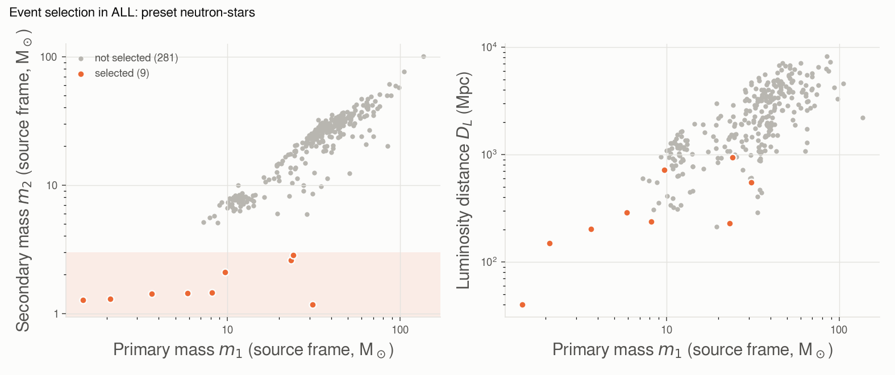
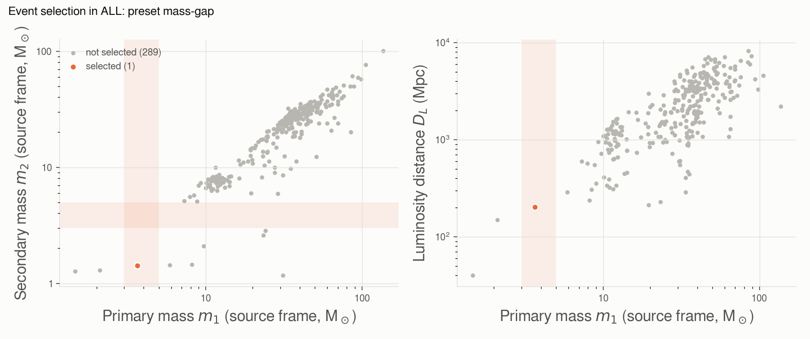
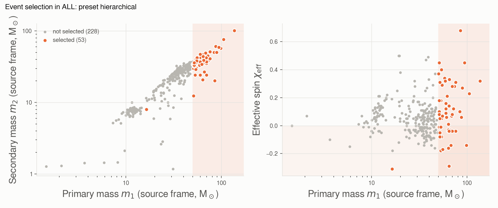

# event_selection

Events of the chosen catalogs whose median source-frame masses, luminosity distance and effective
spin χ_eff fall in given ranges, and/or that belong to a [class of sources](#presets-classes-of-sources):
neutron stars, the lower mass gap, hierarchical-merger candidates. Every bound is optional.

```bash
# heavy binaries within 2 Gpc
gwtc_analysis event_selection --catalogs ALL --m1-min 50 --dl-max 2000

# potential neutron-star companions
gwtc_analysis event_selection --catalogs ALL --m2-max 3
```

| Option | Selects on |
|---|---|
| `--m1-min`, `--m1-max` | primary mass, source frame (M☉) |
| `--m2-min`, `--m2-max` | secondary mass, source frame (M☉) |
| `--dl-min`, `--dl-max` | luminosity distance (Mpc) |
| `--chi-eff-min`, `--chi-eff-max` | effective spin χ_eff |
| `--preset` | a class of sources: `neutron-stars`, `mass-gap`, `hierarchical` |

The selection is written to `--out-selection` (TSV). It uses the GWOSC confident lists; for analyses
that need the marginal candidates as well, see [Known issues](../known-data-issues.md#gw200105-only-in-the-marginal-list).

## Examples

The mode writes the selection as a TSV (`--out-selection`, one row per event) and, with `--out-plot`, a
PNG of the selected events among all the events of the catalogs. The TSV gives, for each event, the median
source-frame masses, the luminosity distance and the **redshift**. The redshift is not measured: GWOSC
infers it from the luminosity distance for the
[Planck 2015 cosmology](../science/redshift.md#the-planck-2015-cosmology), and the source-frame masses
are the detector-frame ones divided by 1 + z, so the table shows which redshift they rely on.

### Heavy binaries within 2 Gpc

```bash
gwtc_analysis event_selection --catalogs ALL --m1-min 50 --dl-max 2000 --out-plot selection.png
```

Heavy binaries within 2 Gpc; the TSV (`event_selection.tsv`) lists:

| event_id | catalog_key | mass_1_source | mass_2_source | luminosity_distance | redshift |
|---|---|---|---|---|---|
| GW191109_010717-v1 | GWTC-3 | 65.0 | 47.0 | 1290 | 0.25 |
| GW240519_012815-v1 | GWTC-5 | 65.0 | 39.0 | 1740 | 0.32 |
| GW241127_061008-v1 | GWTC-5 | 63.8 | 20.8 | 1080 | 0.21 |
| GW241225_082815-v1 | GWTC-5 | 55.7 | 42.2 | 1880 | 0.34 |


*The 4 selected events (orange) among the 290 events of GWTC-1 to GWTC-5 with masses and distance;
the dashed lines are the bounds m₁ ≥ 50 M☉ and D_L ≤ 2000 Mpc.*

### Potential neutron-star companions

```bash
gwtc_analysis event_selection --catalogs ALL --m2-max 3 --out-plot selection.png
```

| event_id | catalog_key | mass_1_source | mass_2_source | luminosity_distance | redshift |
|---|---|---|---|---|---|
| GW191219_163120-v1 | GWTC-3 | 31.1 | 1.17 | 550 | 0.11 |
| GW170817-v3 | GWTC-1 | 1.46 | 1.27 | 40 | 0.01 |
| GW190425_081805-v3 | GWTC-2.1 | 2.1 | 1.3 | 150 | 0.03 |
| GW230529_181500-v2 | GWTC-4 | 3.66 | 1.42 | 203 | 0.04 |
| GW200115_042309-v2 | GWTC-3 | 5.9 | 1.44 | 290 | 0.06 |
| GW230518_125908-v1 | GWTC-4 | 8.17 | 1.45 | 236 | 0.05 |
| GW190917_114630-v1 | GWTC-2.1 | 9.7 | 2.1 | 720 | 0.15 |
| GW190814_211039-v3 | GWTC-2.1 | 23.3 | 2.6 | 230 | 0.05 |
| GW200210_092254-v1 | GWTC-3 | 24.1 | 2.83 | 940 | 0.19 |

Nine events: the two binary neutron stars (GW170817, GW190425), neutron star–black hole binaries,
and binaries whose lighter component lies between 2.5 and 3 M☉, at the edge of the neutron-star range
(GW190814, GW200210).


*The selected events lie below m₂ = 3 M☉ (dashed line), well apart from the binary black holes; they
are also among the nearest events (right).*

GW200105_162426, an NSBH, is absent:
GWOSC lists it only as a marginal candidate
([Known issues](../known-data-issues.md#gw200105-only-in-the-marginal-list)).

## Presets: classes of sources

`--preset` selects a class of sources; the cuts (`--m1-min`, `--chi-eff-max`, …) apply on top of it. The
GWOSC values are medians: a median inside a range is not a probability of being in it, so each preset
adds the 90% intervals and a `*_confident` flag that requires the whole interval in the range.

| Preset | Selects | Parameters | Added columns |
|---|---|---|---|
| `neutron-stars` | a component below the maximum neutron-star mass (median) | `--ns-max-mass` (3 M☉, the binary types of `catalog_statistics`) | `class` (BNS, NSBH), `mass_2_source_hi90`, `m2_below_ns_max_90` |
| `mass-gap` | a component in the lower mass gap between neutron stars and black holes (median) | `--mass-gap` (3 5 M☉) | `gap_component`, `gap_confident`, the 90% intervals of both masses |
| `hierarchical` | a primary in the pair-instability gap, or χ_eff < 0 at 90% | `--pisn-gap-min` (50 M☉) | `pisn_gap`, `pisn_gap_confident`, `negative_chi_eff`, χ_eff and its interval |

### Neutron stars

```bash
gwtc_analysis event_selection --catalogs ALL --preset neutron-stars --out-plot ns.png
```

The nine events of the m₂ < 3 M☉ example above, classified: two BNS (GW170817, GW190425) and seven
NSBH candidates. Only GW190917 and GW200210 have a 90% upper bound of m₂ above 3 M☉. GW190814 (m₂ =
2.6 M☉, 90% below 2.7) passes the mass cut, but whether its companion is the heaviest neutron star or
the lightest black hole is open: a mass alone cannot tell.



### The lower mass gap

```bash
gwtc_analysis event_selection --catalogs ALL --preset mass-gap --out-plot gap.png
```

Few compact objects have been seen between the heaviest neutron stars and the lightest black holes, at
about 3–5 M☉. One event has a median there: **GW230529_181500**, whose primary has 3.66 M☉ (90%:
2.45–4.48), so not confidently inside the gap (LVK 2024 [\[45\]](../references.md#ref-45)).
GW190814's companion (2.6 M☉) lies just below the gap with the default bounds; `--mass-gap 2.5 5`
includes it.



### Hierarchical-merger candidates

```bash
gwtc_analysis event_selection --catalogs ALL --preset hierarchical --out-plot hierarchical.png
```

Stellar evolution should not form black holes in the **pair-instability gap**, from about 50 to
130 M☉ (the lower edge is uncertain, 45–65 M☉ in the literature): such a black hole is more likely the
remnant of an earlier merger, in a dense star cluster or an AGN disk. Remnants of mergers spin with
χ ≈ 0.7 in random directions, so a **negative χ_eff**, spins anti-aligned with the orbit, is another
sign of dynamical assembly.

The preset selects 54 events of GWTC-1 to GWTC-5. 19 of them have their whole 90% interval of m₁ above
50 M☉; the heaviest are GW231123_135430 (137 M☉, 90% above 119), GW190426_190642 and GW190521_030229
(98 M☉). Two have χ_eff < 0 at 90%: GW241110_124123 (χ_eff = −0.31, a 16 M☉ primary: selected by its
spin alone) and GW241127_061008. Spin magnitudes of the components are not in the GWOSC lists; they are
read from the PE samples with [parameters_estimation](parameters-estimation.md).



*The shaded areas are the pair-instability gap (m₁ ≥ 50 M☉) and negative χ_eff.*

All options: [CLI reference](../cli-reference.md#event_selection).
