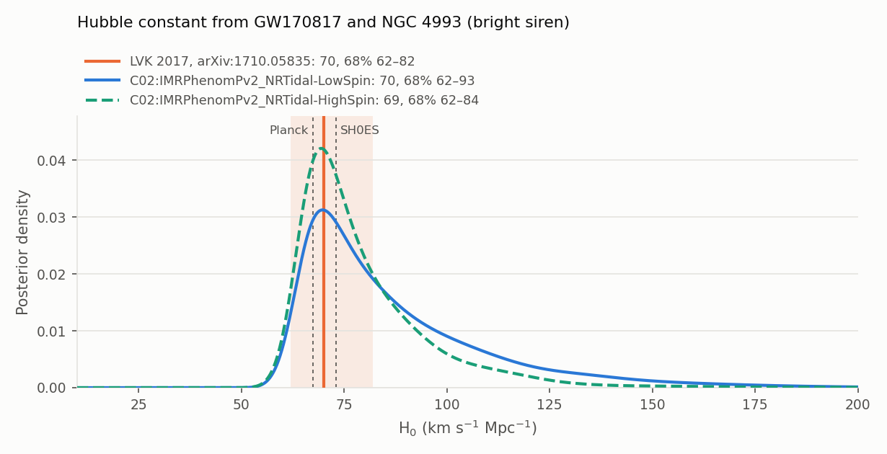
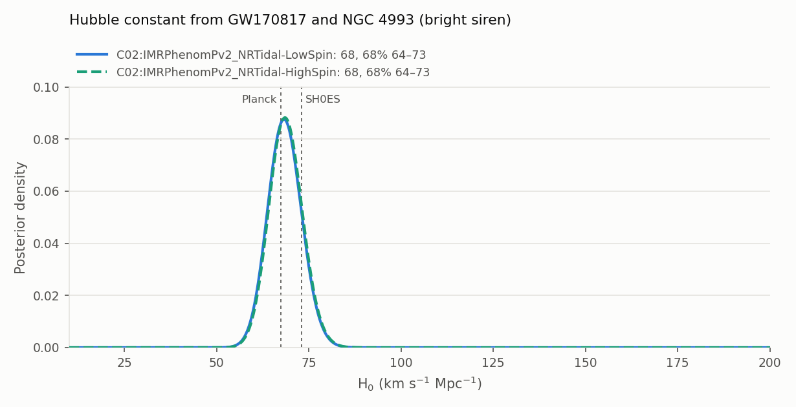
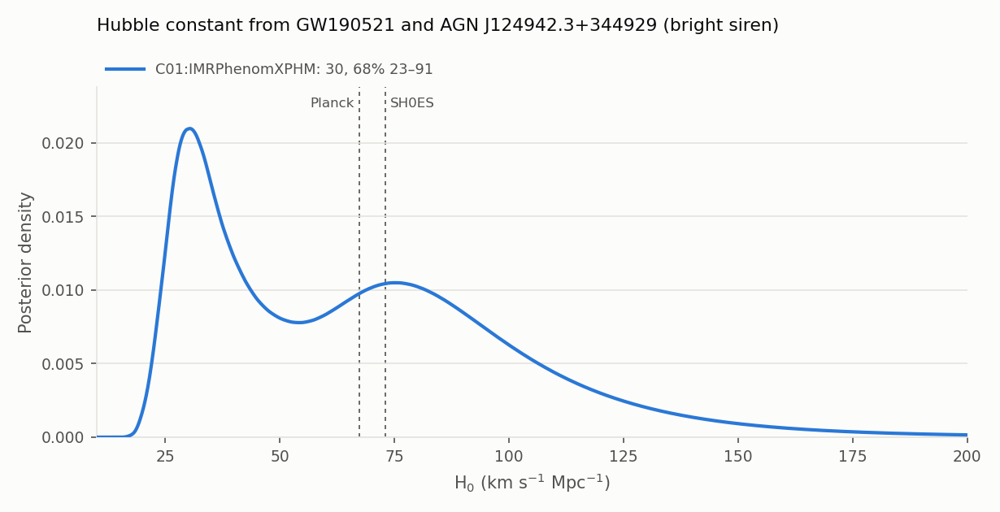
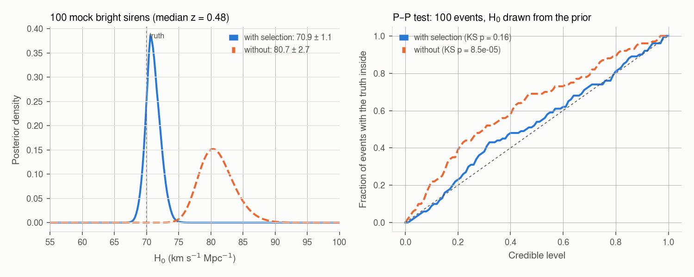

# hubble_constant: bright siren

The Hubble constant from an event with an **identified host galaxy** (bright siren), with
`hubble_constant --method bright`. It takes seconds: no sampling. The result goes to a work directory that
`--method joint` combines with the [spectral or dark siren](hubble-constant.md#joint-posterior); where the
counterpart sits in the GW posterior (sky, distance, viewing angle) is the [counterpart](counterpart.md) mode.

```bash
gwtc_analysis hubble_constant --method bright                          # GW170817 and NGC 4993
gwtc_analysis hubble_constant --method bright --viewing-angle 20 3     # with a viewing-angle constraint
gwtc_analysis hubble_constant --method bright --event GW190521         # candidate AGN flare, z = 0.438
gwtc_analysis hubble_constant --method joint \
    --inputs hubble_constant_bright h0_dark_plp                        # combined with the dark siren
```

## Method

The GW signal gives the luminosity distance \(d_L\) with no distance ladder; the host gives the
Hubble-flow redshift \(z\). For a nearby galaxy, \(z\) comes from its recession velocity minus its
peculiar velocity, \(c z = v_r - \langle v_p \rangle\). In flat ΛCDM, with \(\Omega_m = 0.3065\) as in
the spectral siren,

\[
d_L = \frac{c}{H_0}\, D(z; \Omega_m).
\]

For sources uniform in comoving volume and source-frame time,
\(p_\text{pop}(z) \propto \frac{dV_c}{dz} \frac{1}{1+z}\), and with a flat H₀ prior
(Chen, Fishbach & Holz 2018 [\[72\]](../references.md#ref-72);
Mandel, Farr & Gair 2019 [\[35\]](../references.md#ref-35)):

\[
p(H_0 \mid \text{data}) \propto \frac{1}{\beta(H_0)}
\int \mathcal{N}(z_\text{obs};\, z,\, \sigma_z)\; p_\text{pop}(z)\; \mathcal{L}_\text{GW}\big(d_L(z, H_0)\big)\, dz .
\]

\(\mathcal{L}_\text{GW}\) is the posterior of \(d_L\) divided by the PE distance prior, read from the
file (\(d_L^2\) up to O3, uniform in comoving volume in O4), or set by `--pe-distance-prior`. Over the PE samples \(d_i\), whose
redshift at a trial H₀ is \(z_i\), the integral is a kernel sum:

\[
\sum_i w_i\, \mathcal{N}(z_\text{obs};\, z_i,\, \sigma)\,
\frac{p_\text{pop}(z_i)}{\pi_\text{PE}(d_i)\; \partial d_L/\partial z\,(z_i)},
\qquad \sigma = \max(\sigma_z, h),
\]

where \(h\) is the kernel width of the \(z_i\) (Silverman's rule). It only matters for a distant host
with a spectroscopic redshift, much narrower than the spread of the samples. The weights \(w_i\) are 1,
or an independent constraint on the viewing angle ([below](#viewing-angle-constraint)).

**The selection term** \(\beta(H_0)\) is the fraction of the population that would be detected. At a
given redshift a larger H₀ means a smaller distance, so a louder signal. Leaving β out biases H₀:
see [Validation](#validation-mock-bright-sirens). `--selection`:

| Value | β(H₀) | Use |
|---|---|---|
| `euclidean` | ∝ H₀³: GW-limited detection of nearby sources. It cancels the volume factor of the numerator, and with a \(d_L^2\) prior the posterior becomes \(\sum_i \mathcal{N}(v_H;\, H_0 d_i,\, \sigma_v)\), the LVK 2017 formula [\[27\]](../references.md#ref-27) | z < 0.05 |
| `injections` | the found LVK sensitivity injections of the event's observing run, carried to the source frame at each trial H₀ and reweighted to the population of the event's class: Power Law + Peak for black holes (as in `rates`), uniform 1–2.5 M☉ for neutron stars; the injected isotropic spins | distant events |
| `auto` (default) | `euclidean` below z = 0.05, `injections` above; `injections` with `--population fullpop4` | |

**The population** (`--population`). By default the sources are uniform in comoving volume and source-frame time,
and the masses enter only the selection. `fullpop4` is the population of the GWTC-4.0 reanalysis of GW170817
[\[29\]](../references.md#ref-29) (Appendix E): the FullPop-4.0 mass distribution, which covers BNS, NSBH and BBH in
one (a broken power law with a dip between neutron stars and black holes, two Gaussian peaks, and a pairing function
in the mass ratio), and the Madau–Dickinson rate, fixed to the medians of the paper's spectral siren. Each sample then
also carries \(p_m\big(m_1/(1+z_i), m_2/(1+z_i)\big)\, \psi(z_i) / (1+z_i)^2\), with the detector-frame masses of
the samples (the PE mass prior is uniform in them), and the injections are reweighted to the same population. The
density is icarogw's `m1m2_paired_massratio_bplmulti_dip`, reimplemented with numpy (it agrees with icarogw to
10⁻¹³ in ln p), so that the bright siren does not need the icarogw environment.

**Sky position.** The distance must be the one at the counterpart's position: distance and sky
position are correlated through the antenna pattern. The GWTC-1 GW170817 samples were produced with
the sky fixed to AT2017gfo and are used as they are. Other samples are restricted to those within
`--sky-radius` of the counterpart.

## Registered events

The bright siren uses the built-in list of known counterparts (the `COUNTERPARTS` dictionary of
`gwtc_analysis/counterpart.py`, described on the [counterpart](counterpart.md#the-list-of-known-counterparts)
page): for each event, the counterpart's position, the host redshift, the observing run, the PE file and the PE
labels used by default. In the options below, "from the list" refers to it.

| Event | Host | z | Status | Selection (auto) |
|---|---|---|---|---|
| GW170817 | NGC 4993, AT2017gfo | 3017 ± 166 km/s (\(v_r\) 3327 ± 72, \(\langle v_p \rangle\) 310 ± 150) [\[27\]](../references.md#ref-27) | confirmed (kilonova) | euclidean |
| GW190521 | AGN J124942.3+344929, ZTF19abanrhr | 0.438 ± 0.0015 [\[74\]](../references.md#ref-74) | **candidate** | injections (O3a, BBH) |

**GW190521 is a candidate.** Graham et al. proposed the ZTF flare in an AGN disk as the counterpart
[\[74\]](../references.md#ref-74). The odds of a common source are only 1 to 12, depending on the
waveform model (Ashton et al. 2021 [\[75\]](../references.md#ref-75)). Its result is H₀ *if* the flare is
the counterpart, and the report says so. The [counterpart](counterpart.md) mode shows where the flare sits
in the GW posterior.

A new event needs one entry in `COUNTERPARTS` (`gwtc_analysis/counterpart.py`): the host, the
counterpart's position, the redshift or the velocities, the observing run, the population class, and
the PE file (`pe_event`, read from Zenodo).

## Results

| Event, PE label | Maximum a posteriori, 68% interval | Median, 90% interval |
|---|---|---|
| GW170817, LowSpin | **69.8** (+23.6 / −8.2) | 79.9, 63.0–135.5 |
| GW170817, HighSpin | **69.4** (+14.8 / −7.4) | 74.8, 62.2–112.2 |
| GW170817, LVK 2017 [\[27\]](../references.md#ref-27) | **70.0** (+12.0 / −8.0) | |
| GW170817, LowSpin, viewing angle 20 ± 3° | **68.2** (+4.7 / −4.4) | 68.4, 61.1–76.1 |
| GW170817 and the radio jet, Hotokezaka et al. 2019 [\[73\]](../references.md#ref-73) | 70.3 (+5.3 / −5.0) | |
| GW190521 + ZTF19abanrhr, IMRPhenomXPHM | **30.4** (+61.0 / −7.0) | 63.2, 26.1–129.5 |



**GW170817.** The maximum a posteriori and the lower side agree with the published value. The upper
side is wider because the public GWTC-1 samples come from a later reanalysis (GWTC-1,
IMRPhenomPv2_NRTidal), whose distance has a longer low-distance tail than the 2017 analysis (43.8 +2.9
−6.9 Mpc). That tail comes from the **distance–inclination degeneracy**: an inclined binary is fainter
than a face-on one at the same distance (see the [counterpart](counterpart.md#the-distanceinclination-degeneracy)
mode). The full ΛCDM \(d_L\) raises H₀ by 0.8% (0.6 km/s/Mpc) compared with the linear Hubble law of the
2017 paper.

### Against the GWTC-4.0 reanalysis

The GWTC-4.0 cosmology paper [\[29\]](../references.md#ref-29) reanalyses GW170817 with the same LowSpin samples
(H₀ = 77.8 (+25.7 / −11.6), median and 68%). Its setup differs from the default here in the population and the
selection term, which `--population fullpop4` reproduces:

| GW170817, LowSpin | Median, 68% | 90% |
|---|---|---|
| default (uniform in comoving volume, `euclidean`) | 79.9 (+27.6 / −12.4) | +55.6 / −16.9 |
| `--selection injections` | 80.0 | |
| `--population fullpop4 --selection euclidean` | 79.9 | |
| **`--population fullpop4`** (selection from injections) | **78.5 (+25.6 / −11.5)** | +51.9 / −15.9 |
| `--pe-distance-prior comoving` or `source-frame` | 79.8, 79.7 | |
| GWTC-4.0 paper | 77.8 (+25.7 / −11.6) | +52.2 / −16.2 |

The shift comes from the selection term with the full population, not from the mass term of the numerator: with
FullPop-4.0 most of the detectable binaries are black holes, seen out to z ≈ 0.3, and β(H₀) no longer goes as H₀³.
With it the widths are the paper's to 0.3 km/s/Mpc and the median is 0.7 above; the paper's result is an equal
mixture of icarogw and gwcosmo. The distance prior does not matter at 40 Mpc, where a uniform-in-volume prior is
\(d_L^2\) to 1%.

### Viewing-angle constraint

`--viewing-angle MEAN SIGMA` multiplies the GW likelihood by an independent Gaussian constraint on the viewing
angle (degrees, folded to 0–90°): the PE samples are weighted by it. For GW170817 the superluminal motion of the
radio jet gives \(0.25 < \theta_\text{obs}\,(d_L / 41\ \text{Mpc}) < 0.45\) rad, i.e. 14–26° at 41 Mpc
(Hotokezaka et al. 2019 [\[73\]](../references.md#ref-73)). Approximated as 20 ± 3°, it removes the inclined
orbits, hence the upper tail:



H₀ = 68.2 (+4.7 / −4.4) km/s/Mpc, against 70.3 (+5.3 / −5.0) in the paper. The Gaussian ignores the distance
dependence of the jet constraint (the angle scales as 1/d_L) and the jet modelling behind it; the constraint
must not come from the GW data.



**GW190521.** The posterior is bimodal because the distance posterior is, in the direction of the flare.
At z = 0.438, H₀ ≈ 30 corresponds to \(d_L\) ≈ 5.6 Gpc and H₀ ≈ 75 to 2.25 Gpc; the samples within 3°
of the flare have a median of 4.6 Gpc with 16% below 2.2 Gpc. The result depends on the sky selection
(median 54.7 within 5°, against 63.2 within 3°) and on the waveform model; only IMRPhenomXPHM has enough
samples near the flare in GWTC-2.1. The selection term is computed from 106,376 found O3a injections,
with 13,000–16,000 effective injections over the H₀ range.

## Validation: mock bright sirens

The analysis is tested on simulated detections with a known H₀ (`tests/test_h0_bright.py`).

- **Sources:** uniform in comoving volume up to z = 4, masses uniform in 20–40 M☉, random orientations.
- **Detection:** each source has a network SNR \(\rho = A(\mathcal{M}_\text{det})\, w(\iota) / d_L\)
  plus unit Gaussian noise, and is detected above 12. The detected events have a median z ≈ 0.5.
- **Observations:** each detected event gets the posterior of \(d_L\) given its observed SNR. It uses a
  \(d_L^2\) prior and is marginalized over the inclination, which reproduces the real
  distance–inclination degeneracy. The host redshift has an error of 0.001.
- **Injections:** they are made at H₀ = 70 with broader masses than the population (5–120 M☉), as the
  LVK ones, so that they cover the population at every trial H₀.

| Test | Result |
|---|---|
| β from the reweighted injections against the detected fraction simulated directly at each H₀ (40–120) | equal within 3% (β varies by more than a factor of 10) |
| 100 events, H₀ = 70: with the selection term | 70.9 ± 1.1 |
| the same without the selection term | 80.7 ± 2.7: biased by more than 3σ |
| P–P test, 100 events with H₀ drawn from the prior | uniform with the selection term (KS p = 0.16), not without (p = 10⁻⁴) |
| nearby sources (horizon z ≈ 0.02) | β from injections ∝ H₀^3.0, the `euclidean` selection |
| distance correlated with the viewing angle, constraint 20 ± 3° | H₀ moves to the distance of the constrained angles and narrows |



The injections must cover the population at every trial H₀. In a first version of the mock, with
injection masses drawn from the population's own 20–40 M☉, β was wrong by up to a factor of 2.5 at the
edges of the H₀ range, and H₀ was biased by 3σ. The LVK injections are drawn much more broadly than any
population; the report gives the effective number of injections over the H₀ range.

## Options

Options of `--method bright` (the others of `hubble_constant` are refused):

| Option | Default | Meaning |
|---|---|---|
| `--event` | `GW170817` | which event of the [list of known counterparts](counterpart.md#the-list-of-known-counterparts): `GW170817` or `GW190521` |
| `--pe-label` | the labels from the list, else all the labels of the file | which analyses of the PE file to use ([PE labels](counterpart.md#pe-labels)): one H₀ per label; the first one is the result, the one `--method joint` uses |
| `--pe-file` | the event's bundle or Zenodo file | another PE file (PESummary layout) |
| `--cache-dir` | `.cache_gwosc` | cache of the unofficial GW170817 bundle |
| `--pe-cache` | that of the spectral siren | where Zenodo PE files are downloaded |
| `--v-recession V SIGMA`, `--v-peculiar V SIGMA` | from the list (GW170817) | velocities of a nearby host, km/s: measured recession velocity, and the peculiar velocity subtracted from it |
| `--redshift Z SIGMA` | from the list (GW190521) | Hubble-flow redshift of the host, instead of the velocities |
| `--viewing-angle MEAN SIGMA` | none | independent Gaussian constraint on the viewing angle, degrees |
| `--pe-distance-prior` | the file's, else \(d_L^2\) up to O3 | distance prior of the PE samples: `dl2`, `comoving` or `source-frame` (Planck15_LAL) |
| `--selection` | `auto` | `euclidean`, `injections` or `auto` |
| `--population` | `volume` | `volume` (uniform in comoving volume) or `fullpop4` (FullPop-4.0 and Madau–Dickinson at the GWTC-4.0 medians, [Method](#method)) |
| `--sensitivity-release`, `--sensitivity-file` | `gwtc4` | injections of the selection term |
| `--far-threshold`, `--snr-threshold` | 0.25 /yr, 10 | found injections (real searches, semi-analytic O1+O2) |
| `--sky-radius` | 3° | for samples not fixed to the counterpart |
| `--h0-range MIN MAX` | 10 200 | flat prior; `--method joint` needs the default |
| `--workdir` | `hubble_constant_bright` | the work directory |
| `--out-report`, `--out-summary` | `hubble_constant_bright.html`, `.tsv` | the report and the summary |

The published comparison is shown only with the velocities or redshift from the list, no viewing-angle constraint,
the default population and the file's distance prior.

## Outputs

- `--out-report` (HTML): the result, the caveat of a candidate counterpart, the inputs, the selection
  term and the plot;
- `--out-summary` (TSV): maximum a posteriori, 68.3% highest-density interval, median and 90%
  interval of each PE label, with its distance;
- `<workdir>/posterior_grid.tsv`: the posterior densities on an H₀ grid (`p`: the first label);
- `<workdir>/bright.json`: the event, host, redshift, labels, selection, prior range and constraint, read by
  `--method joint`;
- `<workdir>/plots/h0_posterior.png`.
