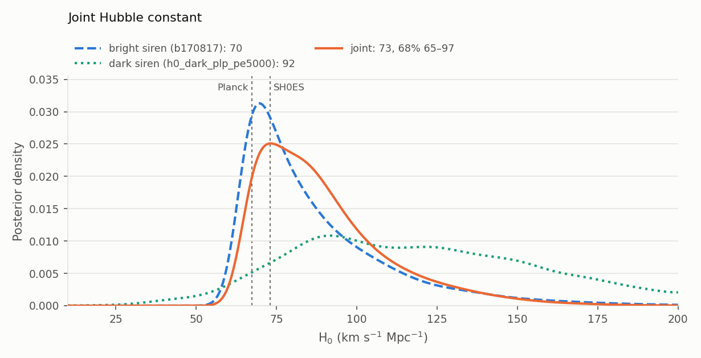
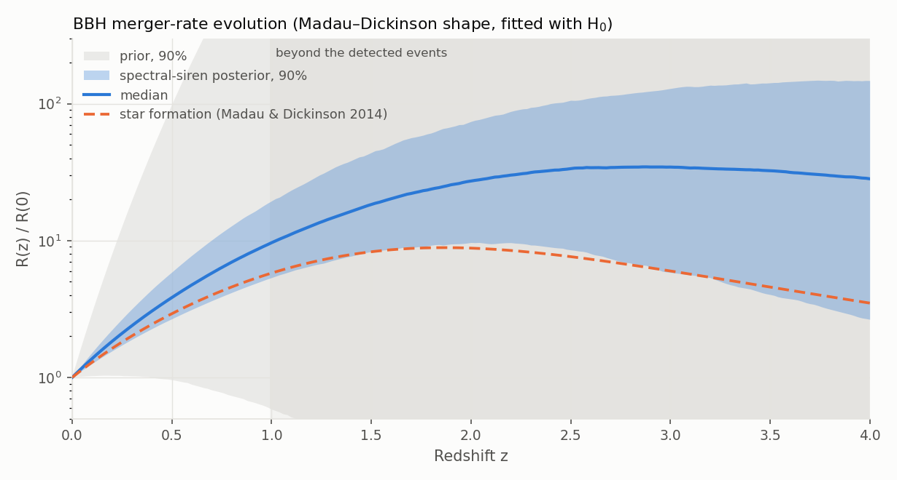

# hubble_constant

The Hubble constant from gravitational-wave events, by four methods (`--method`):

| Method | Redshift information | Events | Runtime | Page |
|---|---|---|---|---|
| `spectral` (default) | the BBH mass spectrum: features of the source-frame masses fix the redshift of the detector-frame masses | the BBHs of the catalogs | hours (icarogw, sampling) | this page |
| `dark` | the mass spectrum and the galaxies along each line of sight, from a catalog built by [galaxy_catalog](galaxy-catalog.md) | the same | hours | [below](#dark-sirens-with-a-galaxy-catalog) |
| `bright` | the redshift of the identified host of one event | GW170817, the candidate GW190521 | seconds | [bright siren](hubble-constant-bright.md) |
| `joint` | the product of independent results of the other methods | | seconds | [below](#joint-posterior) |

The dark siren is the spectral siren plus the galaxies: it is never combined with the spectral siren of the same
events. The LVK's headline results are bright × dark ([joint posterior](#joint-posterior)).

The spectral and dark sirens use [icarogw](https://github.com/icarogw-developers/icarogw)
[\[57\]](../references.md#ref-57) and bilby [\[58\]](../references.md#ref-58)/dynesty [\[60\]](../references.md#ref-60).
Their method and validation are explained in [Hubble constant (spectral siren)](../science/spectral-siren.md); the
rest of this page is about running them, then about the joint posterior. A spectral or dark run is defined by
three choices:

| Choice | Options | Default |
|---|---|---|
| **Where the redshift comes from** | `--method spectral`: the mass spectrum alone; `--method dark --galaxy-catalog FILE`: the mass spectrum and the galaxies, with a catalog built by the [galaxy_catalog](galaxy-catalog.md) mode | spectral siren |
| **Which events and injections** | `--sensitivity-release`, `--catalogs`, thresholds ([below](#which-events-and-injections)) | the GWTC-4.0 analysis: 137 BBHs of O1–O4a |
| **The mass model** | `--mass-model plp` (Power Law + Peak) or `mltp` (Multi Peak) | `plp` |

The defaults reproduce the GWTC-4.0 cosmology paper [\[29\]](../references.md#ref-29): spectral siren
105.8 (+44.7 / −33.2) km/s/Mpc against the published 105.5 (+46.4 / −35.8) for PLP; dark siren with GLADE+
114.6 (+41.5 / −33.8) against 115.4 (+40.1 / −33.8), with 5000 PE samples per event ([validation](#validation-gwtc-40-power-law-peak-glade-k-band));
with Multi Peak, 86.8 (+39.8 / −26.1) against 86.3 (+41.3 / −26.3) ([validation](#validation-gwtc-40-multi-peak-glade-k-band)).

## Quick start

Run the **spectral siren first**, then, if wanted, **add the dark siren** on the same events:

- the spectral siren is the reference: the galaxies' own contribution is the difference between the dark siren and
  the spectral siren of the same events, mass model and settings;
- its `prepare` downloads the PE files once (~35 GB) and keeps the extracted samples, sky positions included, in the
  PE cache; the dark siren's `prepare` reuses them without downloading again;
- it checks the setup (icarogw environment, selection, seeds) at a lower cost, without the catalog to build.

**Step 1: spectral siren** (icarogw in its own environment,
[Installation](../installation.md#icarogw-for-the-hubble_constant-mode)):

```bash
# events, PE samples and injections → h0_plp/inputs.h5 (gwtc_analysis environment)
gwtc_analysis hubble_constant --workdir h0_plp --stages prepare
# 4 sampler runs, 2 at a time with 2 processes each, then merge, reweight and report
gwtc_analysis hubble_constant --workdir h0_plp --stages sample combine reweight report \
    --icarogw-python ~/.conda/envs/icarogw/bin/python --seeds 1 2 3 4 --parallel 2 --npool 2
```

**Step 2: add the dark siren with GLADE+.** It needs a galaxy catalog file, which `hubble_constant` does not make:
it is built by another mode, [**galaxy_catalog**](galaxy-catalog.md), once (about an hour on 4 CPUs; its defaults
are the GLADE+ K-band catalog of the GWTC-4.0 analysis). Then run the same analysis as step 1 in a new work
directory, with `--method dark` and `--galaxy-catalog` pointing to that file; keep the selection options, `--mass-model` and the
sampling settings of step 1 so that the two results compare ([details](#dark-sirens-with-a-galaxy-catalog)):

```bash
# 2a. the galaxy catalog, with the galaxy_catalog mode → glade_k/catalog_K-glade+_nside64_eps1.hdf5
gwtc_analysis galaxy_catalog --workdir glade_k --jobs 4 --icarogw-python ~/.conda/envs/icarogw/bin/python
# 2b. the dark siren with hubble_constant, reading that catalog
gwtc_analysis hubble_constant --method dark --workdir h0_dark_plp --stages prepare \
    --galaxy-catalog glade_k/catalog_K-glade+_nside64_eps1.hdf5
gwtc_analysis hubble_constant --method dark --workdir h0_dark_plp --stages sample combine reweight report \
    --icarogw-python ~/.conda/envs/icarogw/bin/python --seeds 1 2 3 4 --parallel 2 --npool 2
```

**On a Slurm cluster** (CC-IN2P3, for instance): the same commands with `--executor slurm`, which writes the
sampling stages as a chain of batch jobs ([details](#on-a-slurm-cluster)):

```bash
gwtc_analysis hubble_constant --method dark --workdir /sps/.../h0_dark_plp --stages sample combine reweight \
    --seeds 1 2 3 4 5 6 7 8 --npool 8 --icarogw-python /sps/.../venv/bin/python --executor slurm \
    --slurm-option=--partition=htc --slurm-option=--mem=16G --slurm-option=--time=3-00:00:00 \
    --slurm-option=--licenses=sps --submit
gwtc_analysis hubble_constant --method dark --workdir /sps/.../h0_dark_plp --stages report   # when the jobs have finished
```

**Step 3, optional: the bright siren and the joint posterior**, in seconds ([bright siren](hubble-constant-bright.md),
[joint posterior](#joint-posterior)):

```bash
gwtc_analysis hubble_constant --method bright                          # GW170817 → hubble_constant_bright/
gwtc_analysis hubble_constant --method joint --inputs hubble_constant_bright h0_dark_plp
```

## Stages

The stages (`--stages`, all by default) share one work directory (`--workdir`) and can be run separately:

| Stage | Does | Writes | Needs | Cost |
|---|---|---|---|---|
| `prepare` | selects the events, downloads their PE files, prepares the injections | `inputs.h5`, `events.tsv`, `selection.json` | gwtc_analysis environment | ~35 GB of downloads the first time (restartable) |
| `sample` | chooses the injection subset (probe), then one dynesty run per seed | `probe.json`, `plan.json`, `result/`, `logs/` | icarogw | minutes of probe, then hours per run (resumable) |
| `combine` | merges the runs, checks their numerical stability | `posterior.tsv`, `corner.png`, `summary.json` | icarogw | minutes |
| `reweight` | turns the posterior of the runs into the one with all the injections | `posterior_reweighted.tsv`, `summary.json` | icarogw | minutes to an hour |
| `report` | the HTML report and the table of quantiles | `--out-report`, `--out-summary` | gwtc_analysis environment | seconds |

**One work directory = one analysis.** The options that define the analysis are fixed by the first stage that uses
them, and a later run with other values is refused rather than mixed in:

- `prepare` fixes the events, the injections and the redshift source (the [selection options](#which-events-and-injections)
  and `--galaxy-catalog`, hence the method); to change them, use another work directory. The later stages take
  the method from the work directory: `--method dark` without `--galaxy-catalog`;
- the first run fixes `--mass-model`, `--nlive`, `--pe-samples` and `--inj-fraction`, and
  `--neff-pe`/`--neff-inj` ([below](#precision-and-speed)).

## Options

Every option once, grouped by the question it answers. All of them can also come from a settings file
([below](#settings-file)).

### Which events and injections

The likelihood needs two consistent sets: the **events** (their PE samples) and the **injections** (simulated
signals found by the same searches, which measure the selection effect). Both are taken from the same observing
runs and with the same thresholds; these options are read by `prepare` only.

| Option | Default | Meaning | When to change it |
|---|---|---|---|
| `--sensitivity-release` | `gwtc4` | the LVK injection release, which sets the runs that can be analysed: `gwtc4` = O1–O4a ([\[29\]](../references.md#ref-29), validated), `gwtc5` = O1–O4b (not yet compared with a published result) | to include O4b |
| `--catalogs` | all the runs of the release | keep only the runs of these catalogs, for both events and injections: `GWTC-1` (O1–O2), `GWTC-2.1` (O3a), `GWTC-3` (O3b), `GWTC-4` (O4a), `GWTC-5` (O4b), `GWTC-4.1` (the update of GWTC-4.0), or `ALL`. The runs must be in the release: `--catalogs GWTC-5` needs `--sensitivity-release gwtc5` | to analyse a subset (e.g. O4a alone) |
| `--far-threshold` | 0.25 per year | events with a published FAR ≤ threshold; real injections found with FAR < threshold | to test the sensitivity to the event selection |
| `--snr-threshold` | 10 | O1–O2 injections are semi-analytic: found when their network SNR is above this | with `--far-threshold`, to keep the two consistent |
| `--min-mass` | 3 M☉ | both source-frame masses above it (possible neutron stars left out) | rarely: the BBH mass models start at a few M☉ |
| `--exclude` | GW231123_135430, GW200105_162426 | events left out, as in the paper (the most massive BBH, and an NSBH) | to test the influence of one event |
| `--sensitivity-file` | the release's file (downloaded) | a local injection file instead | offline, or with your own injections |
| `--pe-cache`, `--keep-pe-files` | `~/.cache_gwtc_analysis/pe_catalog`, no | where the PE samples are cached; keep the full PE files after extraction | to share the cache between machines |

The published comparison in the report is shown only for the release's own selection (all its runs and the default
thresholds).

Examples:

```bash
# O4a events and injections alone
gwtc_analysis hubble_constant --workdir h0_o4a --stages prepare --catalogs GWTC-4
# all of O1–O4b, with the GWTC-5.0 injections
gwtc_analysis hubble_constant --workdir h0_gwtc5 --stages prepare --sensitivity-release gwtc5
```

### Redshift source and population model

| Option | Default | Meaning |
|---|---|---|
| `--method` | `spectral` | `spectral` or `dark` here; `bright` and `joint` have their own options ([bright siren](hubble-constant-bright.md#options), [joint](#joint-posterior)), and the options of another method are refused |
| `--galaxy-catalog` | none | with `--method dark`: the catalog file made by [galaxy_catalog](galaxy-catalog.md) ([below](#dark-sirens-with-a-galaxy-catalog)). Given to `prepare`, which records it in `inputs.h5`; the other stages then use it |
| `--mass-model` | `plp` | BBH primary-mass model: `plp` (Power Law + Peak, Table 3 of [\[29\]](../references.md#ref-29)) or `mltp` (Multi Peak: power law and two Gaussian peaks, Table 4). One work directory per model; `prepare` can be copied (`inputs.h5`) |

The priors are those of the paper (Tables 3, 4 and 6); the merger-rate evolution is the Madau–Dickinson shape
fitted with H₀ ([below](#merger-rate-evolution)).

### Precision and speed

| Option | Default | Meaning | When to change it |
|---|---|---|---|
| `--seeds` | 1 | one independent sampler run per seed, merged by `combine` | 2 to check, 4–5 for a result, ~10 to compare with a paper ([how many](#how-many-seeds)) |
| `--nlive` | 100 | dynesty live points per run | instead of more seeds (fewer, longer runs) |
| `--naccept` | 60 | accepted steps per random walk | rarely |
| `--npool` | 4 | processes per run | to the CPUs available ([npool and parallel](#npool-and-parallel)) |
| `--parallel` | 1 | runs at the same time on this machine | idem |
| `--pe-samples` | 1500 | PE samples per event in the likelihood (up to 5000 are prepared) | 1500 is fast but leaves a Monte Carlo error of several km/s/Mpc on H₀; for a result to compare with a paper, 5000, or `--reweight-pe-samples 5000` ([validation](#validation-gwtc-40-power-law-peak-glade-k-band)) |
| `--inj-fraction` | `auto` | injections used by the runs: `auto` (a probe chooses a fast subset, `reweight` then corrects to all of them), or a fraction in (0, 1] (1 = all, as the paper) | `1` to sample the exact likelihood (slower, no reweighting) |
| `--min-ess-fraction`, `--probe-points` | 0.5, 30 | with `auto`: the smallest predicted effective sample size of the reweighting, the points of the probe | rarely ([details](#injection-subsets-probe-and-reweighting)) |
| `--reweight-pe-samples` | as the runs | PE samples per event of the reweighting target | 5000: the runs (1500, fast) corrected to the accurate likelihood |
| `--neff-pe`, `--neff-inj` | 10, 4 × events | effective PE samples per event and effective injections a likelihood point needs, else it is rejected | to match another analysis ([likelihood thresholds](#likelihood-thresholds)) |

### Where it runs

| Option | Default | Meaning |
|---|---|---|
| `--icarogw-python` | the interpreter running gwtc_analysis | Python of the icarogw environment, used by `sample`, `combine` and `reweight` ([icarogw](#icarogw)) |
| `--executor` | `local` | `local`: on this machine; `slurm`: `sample`, `combine` and `reweight` as a chain of batch jobs ([Slurm](#on-a-slurm-cluster)) |
| `--slurm-option` | none | an `#SBATCH` option of every job, repeatable (e.g. `--slurm-option=--mem=16G`) |
| `--slurm-env-setup` | none | shell lines run first in each job (e.g. activating an environment) |
| `--submit` | no | submit the chain at once (else `<workdir>/slurm/submit.sh` does it) |
| `--reweight-jobs` | 16 | array tasks of the reweighting on Slurm |

### Files

| Option | Default | Meaning |
|---|---|---|
| `--workdir` | `hubble_constant_<method>` | the work directory of the analysis |
| `--stages` | all | stages to run |
| `--out-report`, `--out-summary` | `hubble_constant_<method>.html`, `.tsv` | the report and the quantiles |
| `--settings` | none | a file of option values ([below](#settings-file)) |

### Settings file

`--settings FILE` reads option values from a JSON file (or YAML, with PyYAML), the keys being the long option names;
options given on the command line override it. The resolved options of each invocation are written to
`<workdir>/options_hubble_constant.json`.

```json
{"seeds": [1, 2, 3, 4], "npool": 8, "pe-samples": 3000, "neff-pe": 20}
```

```bash
gwtc_analysis hubble_constant --workdir h0_plp --stages sample combine reweight report --settings precise.json
```

All options with their help text: [CLI reference](../cli-reference.md#hubble_constant).

## Dark sirens with a galaxy catalog

A dark siren adds to the mass spectrum the galaxies along the line of sight of each event: every galaxy is a
possible host, weighted by its luminosity, and the galaxies the catalog misses (fainter than its threshold) are
added as a uniform completeness term (icarogw's `CBC_catalog_vanilla_rate` [\[57\]](../references.md#ref-57)
[\[29\]](../references.md#ref-29)). `--method dark` adds the galaxies to the mass spectrum; it does not replace
it: the mass model is still fitted with H₀, and the result is the combination, as the LVK dark sirens since GWTC-3
(the catalog's own contribution is the difference with the spectral siren of the same events). It takes two modes:

```
galaxy_catalog                         hubble_constant --method dark --galaxy-catalog FILE
──────────────                         ───────────────────────────────────────────────────
galaxies (GLADE+, or any catalog)      prepare: events with the sky position of their PE samples
→ threshold map, line-of-sight         sample, combine, reweight: the likelihood reads the catalog
  redshift prior per sky pixel           at the pixel and redshift of every PE sample
→ catalog_<band>_nside<N>_eps<ε>.hdf5  report: compared with the published dark siren
```

0. **Run the spectral siren of the same events first** ([quick start](#quick-start)): it is the reference the dark
   siren is compared with, and its PE downloads are reused.
1. **Build the catalog** with [galaxy_catalog](galaxy-catalog.md): its defaults are the GLADE+ K-band setup of the
   GWTC-4.0 analysis. The catalog does not depend on the events or the mass model: one catalog serves every
   `hubble_constant` work directory.
2. **Prepare** with `--method dark --galaxy-catalog FILE`. `prepare` keeps the sky position of every PE sample (extracts made
   before are made again from the cached PE files) and records the catalog, its settings and its path in `inputs.h5`.
   The injections enter the selection effect through the sky-averaged galaxy density, for which their position
   does not matter; since the LVK injection files carry none, they are given isotropic positions.
3. **Sample, combine, reweight, report** as for the spectral siren; the stages find the catalog in `inputs.h5`
   (`--method dark`, without `--galaxy-catalog`). If the work directory moved to another machine, they use the file of
   the same name next to `inputs.h5`: copy it there.

Practical points:

- **Memory.** Each process loads the catalog (single precision): a few hundred MB per process for GLADE+ at
  nside 64, more for deeper catalogs. Lower `--parallel` × `--npool` on small machines.
- **Speed.** A likelihood evaluation costs about as much as the spectral siren's (1.1 s with all the injections,
  0.4 s with 10%, for 137 events and 1500 PE samples); building the catalog adds about an hour once.
- **Published comparison.** The report compares with the dark siren of the same mass model in the GWTC-4.0 data
  release (icarogw, GLADE+ K band, ε = 1: Power Law + Peak 115.4 (+40.1 / −33.8), Multi Peak 86.3 (+41.3 / −26.3)
  km/s/Mpc), only when the catalog has all the settings the paper gives: band, ε, nside, threshold map, redshift
  range from 0 and galaxy selection ([galaxy_catalog options](galaxy-catalog.md#options)). The
  icarogw spectral sirens of the same release give 110.3 (+44.8 / −35.6) and 76.5 (+45.0 / −25.6): the catalog
  narrows the 68% interval by 8% and 4%.

### Validation: GWTC-4.0, Power Law + Peak, GLADE+ K band

The GWTC-4.0 dark siren reproduced on CC-IN2P3 (October 2026), with the [galaxy_catalog](galaxy-catalog.md)
defaults (GLADE+ Ks, nside 64, ε = 1), the paper's 137 BBH events, and the Slurm chain (8 seeds of 100 live
points, 8 CPUs each, 1500 PE samples per event), reweighted to all the injections and then to 5000 PE samples:

| | H₀ (km/s/Mpc, median and 68%) | 90% |
|---|---|---|
| runs, 10% of the injections (7 runs, 3189 samples) | 131.1 (+40.5 / −39.3) | 73.8 – 190.2 |
| reweighted to all the injections (1500 PE samples) | 120.7 (+39.9 / −37.6) | 65.6 – 182.8 |
| **reweighted to all the injections and 5000 PE samples** | **114.6 (+41.5 / −33.8)** | **63.4 – 179.9** |
| GWTC-4.0 release, icarogw dark siren | 115.4 (+40.1 / −33.8) | 64.7 – 179.0 |

- With 5000 PE samples per event the result is the release's: medians 0.8 km/s/Mpc apart (0.02σ), the same
  68% and 90% intervals. The reweightings keep effective sample sizes of 70% (all the injections, 2240 of 3189) and
  67% (5000 PE samples, 2145), reject no sample, and reproduce the runs' ln L exactly.
- As for the spectral siren, the 10% injection subset shifts H₀ up by about 10 km/s/Mpc; the reweighting removes it.
- **The number of PE samples per event matters.** With 1500 the median was 5 km/s/Mpc above the release. The
  release stores the ln L of each posterior sample, so our likelihood can be evaluated at the LVK samples, and the
  LVK posterior reweighted to it; the difference ln L(ours) − ln L(LVK) shows where the likelihoods differ:

  | Our likelihood | Spectral siren (LVK 110.3) | Dark siren (LVK 115.4) | Tilt of the difference, per 100 km/s/Mpc (spectral / dark) |
  |---|---|---|---|
  | 1500 PE samples | 113.5 | 120.7 | +0.35 / +0.48 |
  | 3000 PE samples | 111.7 | 118.5 | +0.14 / +0.26 |
  | **5000 PE samples** | **109.1** | **116.5** | **+0.02 / +0.13** |
  | 1500, `--neff-pe 1` | 114.3 | 121.8 | +0.12 / +0.25 |
  | 1500, catalog with `--ptype gaussian_nocom` | — | 120.3 | — / +0.45 |

  With 5000 PE samples the spectral-siren likelihood is the LVK's (no tilt, a sample-to-sample scatter of 0.11 in
  ln L), so the release used about 5000 samples per event; the catalog term leaves a small residual (≈ 1
  km/s/Mpc). The threshold on effective PE samples and the form of the galaxy redshift probability are not the
  cause; the galaxy selection matches the paper's ([galaxy_catalog](galaxy-catalog.md#glade-k-band)). With 1500
  samples the Monte Carlo noise of the likelihood alone moves the median by several km/s/Mpc: for a comparison with
  a published value, sample with 1500 and reweight to 5000 (`--reweight-pe-samples 5000`), or sample with 5000.
- The catalog adds almost nothing at these distances: at fixed population parameters, ln L(H₀) with and without
  the catalog differ by less than 1 over 20–200 km/s/Mpc. The sky-averaged galaxy density of the catalog (in- plus
  out-of-catalog) is within a few percent of the uniform Schechter density beyond z ≈ 0.07, where the BBHs are,
  with a 15–25% deficit at z ≈ 0.01–0.04 and the local structures below z ≈ 0.005.
- A deeper catalog helps: with the DES-Y6 galaxies instead of GLADE+, the O4a dark-siren H₀ has a 68% interval
  about 11% narrower (about 10% with GW170817), although DES covers only 12% of the sky
  (McMahon et al. 2026 [\[93\]](../references.md#ref-93)); DES-Y6 is the catalog of the GWTC-5.0 dark sirens
  [\[30\]](../references.md#ref-30). Its galaxy density is 100 to 1000 times that of GLADE+, but at the BBH
  distances the mass spectrum still carries most of the redshift information.
- Timing: the catalog took about 45 min (16 jobs); the probe 32 min; the runs 7.8–10.3 h each, at 0.39 s per
  likelihood evaluation with 10% of the injections (1.1 s with all); the reweighting 5–7 min per chunk.
- One run (seed 1) entered a slow tail (160 s per iteration after 17 h, `dlogz` 0.65) and was cancelled; the chain
  continued with the 7 other runs ([how](#on-a-slurm-cluster)).

### Validation: GWTC-4.0, Multi Peak, GLADE+ K band

The same chain with `--mass-model mltp` (October 2026), on the same catalog, events and injections:

| | H₀ (km/s/Mpc, median and 68%) | 90% |
|---|---|---|
| runs, 10% of the injections (6 runs, 3809 samples) | 96.3 (+43.0 / −26.7) | 54.5 – 173.0 |
| reweighted to all the injections (1500 PE samples) | 89.9 (+41.8 / −27.0) | 48.0 – 163.3 |
| **reweighted to all the injections and 5000 PE samples** | **86.8 (+39.8 / −26.1)** | **46.8 – 159.7** |
| GWTC-4.0 release, icarogw dark siren | 86.3 (+41.3 / −26.3) | |
| GWTC-4.0 paper, Table 1 [\[29\]](../references.md#ref-29) | 81.6 (+41.2 / −27.6) | |

- With 5000 PE samples the median is 0.5 km/s/Mpc from the release's, with the same 68% interval. The
  reweightings keep effective sample sizes of 69% (2645 and 2619 of 3809), reject no sample, and reproduce the
  runs' ln L exactly. The paper's value is 4.7 below the release's for the same model and catalog; the release
  is the one the samples reproduce.
- The two corrections go the same way as for Power Law + Peak: all the injections lower H₀ by 6 km/s/Mpc, 5000 PE
  samples by 3 more.
- Against the spectral siren of the same model (78.6 (+38.0 / −26.5), [Hubble constant (spectral
  siren)](../science/spectral-siren.md)), the catalog moves the median up and leaves the width almost unchanged,
  as in the release (76.5 and 86.3).
- Timing: the runs took 15–25 h each, about twice the Power Law + Peak runs (15 parameters instead of 12); the
  reweighting 5–9 min per chunk. Two runs (seeds 2 and 3) were still in their slow tail after 25 h and were
  cancelled; the chain combined the 6 others.

## Joint posterior

`--method joint --inputs A B ...` multiplies independent H₀ posteriors: work directories of the other methods
(spectral or dark: their `posterior_reweighted.tsv`, else `posterior.tsv`; bright: `posterior_grid.tsv`) or
posterior TSV files (an `H0` column of samples, or an `H0` grid with a `p` column). They share the flat prior of
10–200 km/s/Mpc, so the joint posterior is their normalized product; samples become a density by a Gaussian
kernel estimate reflected at the prior bounds.

```bash
gwtc_analysis hubble_constant --method joint --inputs hubble_constant_bright h0_dark_plp
```

The inputs must be independent, and this is checked:

- at most one spectral or dark siren: the dark siren already contains the spectral siren of its events;
- no event in two inputs (from the work directories' `events.tsv` and `bright.json`): GW190521 as a bright siren
  needs a spectral or dark siren run with `--exclude GW190521_030229`.

The report has the table of each input and of the joint result (maximum a posteriori, 68% interval, median, 90%
interval) and their posteriors:



| Input | Maximum a posteriori, 68% | Median, 90% |
|---|---|---|
| GW170817 bright siren (LowSpin) | 69.8 (+23.6 / −8.2) | 79.9, 63.0–135.5 |
| Dark siren, Power Law + Peak, GLADE+ K band (5000 PE samples) | 91.7 (+58.6 / −17.6) | 114.5, 62.2–180.9 |
| **Joint** | **73.2** (+24.2 / −8.4) | 84.8, 65.3–131.7 |
| GW170817 with the Power Law + Peak spectral siren instead | 71.7 (+22.3 / −8.0) | |
| GW170817 with the jet viewing angle (20 ± 3°) × the dark siren | 69.2 (+4.6 / −4.4) | 69.4, 62.2–77.1 |
| Dark siren, Multi Peak, GLADE+ K band (5000 PE samples) | 75.5 (+38.6 / −24.8) | 87.3, 45.1–160.2 |
| **GW170817 × the Multi Peak dark siren** | **70.6** (+17.3 / −7.5) | 77.5, 63.2–113.0 |

**Against the paper.** Table 1 of [\[29\]](../references.md#ref-29) quotes medians and 68% intervals of GW170817
with the dark siren. The paper's GW170817 uses the FullPop-4.0 population and a selection term from injections
([bright siren](hubble-constant-bright.md#against-the-gwtc-40-reanalysis)); with the default bright siren
(uniform in comoving volume) the joint medians are about 2 km/s/Mpc above the paper's for both models, with
`--population fullpop4` about 1:

| GW170817 × dark siren (5000 PE samples) | Default bright siren | `--population fullpop4` | GWTC-4.0 paper |
|---|---|---|---|
| Power Law + Peak | 84.8 (+23.7 / −14.2) | 83.5 (+22.4 / −13.5) | 82.5 (+22.6 / −14.2) |
| Multi Peak | 77.5 (+18.7 / −10.0) | 76.7 (+17.8 / −9.6) | 75.4 (+16.6 / −10.0) |

The remaining difference is that of GW170817 alone (78.5 against 77.8) carried through the product, plus that of
the dark sirens (our Power Law + Peak and Multi Peak reproduce the release, which is 4.8 and 4.7 above the paper's
Table 1 for the dark sirens alone).

```bash
gwtc_analysis hubble_constant --method bright --population fullpop4 --pe-label C02:IMRPhenomPv2_NRTidal-LowSpin
gwtc_analysis hubble_constant --method joint --inputs hubble_constant_bright h0_dark_mltp
```

**Which measurement dominates.** Independent posteriors multiply, so the narrower one sets the result and the
broader one tilts it. With the GWTC-4.0 Power Law + Peak sirens, GW170817 dominates: its 68% interval is about
32 km/s/Mpc wide (61.6–93.4), the dark siren's about 75 (81–156), so the dark siren only pushes the result up
(maximum 69.8 → 73.2). In the GWTC-5.0 analysis [\[30\]](../references.md#ref-30) it is the other way round: with
235 events, the FullPop-4.0 mass model and the DES-Y6 galaxies, the dark sirens, 68.8 (+14.2 / −13.2), are narrower
than the LVK's GW170817 bright siren, 79.1 (+27.6 / −12.4), and drive the combination, 71.7 (+9.4 / −7.5). That
setup (FullPop-4.0, DES-Y6) is not in this version of `gwtc_analysis`.

Outputs: `--out-report` (`hubble_constant_joint.html`), `--out-summary` (the table), `<workdir>/posterior_joint.tsv`
(the joint and input densities on the H₀ grid), `<workdir>/joint.json` (the inputs) and `<workdir>/plots/h0_joint.png`.

## The report

The report leads with the H₀ posterior, compared with the published value of the same mass model:


*GWTC-4.0, Power Law + Peak: 10 runs with 10% of the injections, reweighted to all of them; the
published result (orange line, 90% band) and the Planck and SH0ES values for comparison. Details in
[Hubble constant (spectral siren)](../science/spectral-siren.md).*

### Merger-rate evolution

The Madau–Dickinson rate shape fitted together with H₀ [\[82\]](../references.md#ref-82),

\[
\frac{R(z)}{R(0)} = \left[1 + (1 + z_p)^{-\gamma-\kappa}\right]
\frac{(1 + z)^{\gamma}}{1 + \left(\frac{1 + z}{1 + z_p}\right)^{\gamma+\kappa}},
\]

is plotted in the report with its prior and the cosmic star-formation history (γ = 2.7, κ = 2.9,
z_p = 1.9). The likelihood is scale-free: R(0) itself is the `rates` mode's.



*GWTC-4.0, Power Law + Peak: γ = 3.3 (90%: 2.5–4.4), so the rate grows faster than star formation, R(1)/R(0)
= 9.7 (5.4–19.5) against 5.8. The detected events reach z ≈ 1.0; beyond it κ and z_p, and the shape, are
the prior's. The [stochastic](stochastic.md) mode uses this shape up to the farthest events.*

### Diagnostics

`combine` evaluates, over 200 posterior draws, the effective number of injections and the smallest
per-event effective number of PE samples, against the [likelihood thresholds](#likelihood-thresholds), and names
the events with the fewest. The report flags values below the thresholds; more `--pe-samples` or a larger
`--inj-fraction` then make the Monte Carlo sums more reliable. On the reproduction, the effective
number of injections stayed above 3 800 (threshold 544), while the smallest per-event value had a
median of 27 and reached 8 at some draws (threshold 10), for the lightest BBHs such as GW190924.

## How it works

### icarogw

`gwtc_analysis/h0_icarogw.py` is a **driver of icarogw**, not a modified copy: icarogw is used as
installed, through its public API. The LVK also uses a second code, gwcosmo; the two are compared in
[icarogw and gwcosmo](../science/icarogw-gwcosmo.md).

- **icarogw provides** the hierarchical likelihood (PE and injection reweighting, selection term,
  scale-free rate marginalisation, effective-sample-size checks), the population models
  (`massprior_PowerLawPeak` with the `m1m2_conditioned_lowpass` smoothing, `rateevolution_Madau`,
  `FlatLambdaCDM_wrap`, combined by `CBC_vanilla_rate`, or `CBC_catalog_vanilla_rate` with a galaxy catalog), and
  the detector-frame conversion for each trial H₀.
- **The driver** reads `inputs.h5` into icarogw's `posterior_samples` and `injections` objects,
  chooses the model components and the priors (Tables 3 and 6 of the paper [\[29\]](../references.md#ref-29)), runs bilby/dynesty,
  merges the runs and computes the diagnostics with icarogw's own methods.
- **The analysis choices made here**, outside icarogw, are the input preparation in
  `hubble_constant.py` (event selection, PE distance prior read from each file, injection draw
  density carried to the detector frame with the spin part divided out and the mixture weights
  applied), the [likelihood thresholds](#likelihood-thresholds), and the injection subset of the
  runs, corrected by the reweighting stage.

`sample`, `combine` and `reweight` need icarogw, which requires Python ≥ 3.12 and usually has its own
environment ([Installation](../installation.md#icarogw-for-the-hubble_constant-mode)). Its interpreter
is passed with `--icarogw-python`; the mode stops before sampling if icarogw or bilby cannot be imported there. The
stages run `h0_icarogw.py` with it, in CPU mode (a `config.py` with `CUPY=False` in the work directory) and with
the environment's `lib/` on `LD_LIBRARY_PATH`.

### Likelihood thresholds

icarogw rejects a point of the population parameters when its Monte Carlo sums are too poor: when an event has
fewer than `--neff-pe` effective PE samples (default 10, the paper's choice; icarogw's class default is 20), or the
selection effect fewer than `--neff-inj` effective injections (default 4 × the number of events, icarogw's). The
thresholds are written to `<workdir>/likelihood.json` and every stage (probe, runs, combine diagnostics,
reweighting) reads them, so a work directory has one likelihood; changing them once runs exist is refused. With
`--pe-samples`, they are the Monte Carlo settings that the LVK papers do not state. Of the three, the number of PE
samples matters: from 1500 to 5000 it moves the GWTC-4.0 H₀ by about 5 km/s/Mpc, while lowering `--neff-pe` changes
little ([validation](#validation-gwtc-40-power-law-peak-glade-k-band)).

### Injection subsets, probe and reweighting

Each likelihood evaluation sums over the found injections: with all of them (about one million) it
takes about 1.3 s, with 10% about 0.3 s. Sampling with a subset is therefore much faster, but it tilts
the posterior: for PLP, 10% of the injections shift H₀ by about +13 km/s/Mpc (0.35σ)
([details](../science/spectral-siren.md#injection-subsets-and-reweighting)). The mode keeps the speed
and removes the shift in two steps:

1. **Probe** (before sampling, 5 to 20 minutes). A short ensemble MCMC (emcee, 300 steps), started
   from prior points with a finite likelihood and using the smallest subset, moves to the region the
   runs will explore. At its final positions the probe measures, for each subset (10%, 20%, 50%), the
   time per likelihood evaluation, the scatter σ of ln L_subset − ln L_all, which predicts the
   effective-sample-size fraction of a reweighting, exp(−σ²), and the fraction of positions that the
   subset rejects while all the injections accept them (a reweighting cannot recover regions the runs
   never visit). The rule: the smallest subset at least 1.25 times faster, with a predicted fraction
   ≥ `--min-ess-fraction` and at most 5% of rejected positions; otherwise all the injections.
2. **Reweighting** (after `combine`). Each posterior sample θᵢ gets the weight
   exp[ln L_all(θᵢ) − ln L_runs(θᵢ)]. The weighted samples describe the posterior with all the
   injections; `posterior_reweighted.tsv` is a resample of them, and the report leads with it. The
   stage checks that it reproduces the ln L stored by the runs, and reports the effective sample size
   (Σw)²/Σw² and the samples the full likelihood rejects. A small effective sample size (below ~10%)
   means the subset was too inaccurate: sample again with `--inj-fraction 1`.

Validation on the PLP reproduction:

| | Predicted ESS fraction, 10% subset | Speed-up per evaluation |
|---|---|---|
| probe with prior points only | 0.20 (would choose 50%) | 1.7× (50%) |
| **probe with the pilot MCMC** | **0.74** (chooses 10%) | **4.7×** |
| measured on the real posterior | 0.72 | |

The reweighting stage reproduces the result computed independently: H₀ = 106.5 (+45.0 / −34.0) with
all the injections, effective sample size 2564 of 3582. For MLTP it gives 78.5 (+38.7 / −26.7), from
89.1 with the subset, effective sample size 2592 of 3862. The runner's `reweight --target-inputs`
also reweights to a likelihood with other inputs: adding the 137th event of the paper (GW191127) this
way gives 105.8 (+44.7 / −33.2) for PLP and 78.6 (+38.0 / −26.5) for MLTP, with effective sample sizes
of 68% and 66%. A numeric `--inj-fraction` bypasses the probe; `--inj-fraction 1` samples with all the
injections, as the paper does, and needs no reweighting.

### Seeds

Each seed is an independent dynesty run (`result/<model>_seed<N>_result.json`, with `<model>` = `plp` or `mltp`);
`combine` merges all the finished ones, weighted by their evidence.

- **All runs sample the same likelihood.** The PE samples are shuffled once in `prepare`, and the
  injection subset is drawn with a fixed seed. `run_settings.json` refuses runs with another `--mass-model`,
  `--nlive`, `--pe-samples` or `--inj-fraction` values in the same work directory.
- **Restarting is safe.** Launching again resumes the interrupted runs from their checkpoint and skips
  the finished ones.
- **One process per seed.** A lock file (`result/<model>_seed<N>.lock`, holding the host and process ID)
  prevents a seed from running twice at once; a lock left by a process that died on the same host is
  taken over.
- **Interrupting** the launcher (Ctrl-C) stops its runs after they write their checkpoint.

#### How many seeds?

The seeds do not change the physics: they set how precisely the sampler describes the posterior.

1. **Checking that the runs agree** (at least 2 seeds). The evidences ln Z of the runs should agree
   within their quoted errors (about 0.4), and so should their H₀ intervals. Runs that disagree beyond
   their errors are not fixed by more seeds but by more live points (`--nlive`).
2. **Precision of the quoted numbers.** One run of 100 live points gives about 560 posterior samples,
   so its median wanders. In the 10 runs of the reproduction, the per-run H₀ medians range from 111.7
   to 126.1 km/s/Mpc (standard deviation 4.8), and the ln Z values have a standard deviation of 0.32,
   consistent with their errors. Combining N runs divides the scatter by about √N:

| Seeds (100 live points) | Uncertainty on the H₀ median | Relative to the posterior width (±40) |
|---|---|---|
| 1 | ±4.8 km/s/Mpc | 12% |
| 4 | ±2.4 km/s/Mpc | 6% |
| 10 | ±1.5 km/s/Mpc | 4% |

The PLP posterior is broad, so 3–5 seeds give the result to two significant digits; 10 seeds allow a
comparison with a published value at the level of a few km/s/Mpc. The error is a fixed fraction of the
posterior width, so the same numbers of seeds hold for narrower posteriors. Fewer runs with more live
points are equivalent: 10 runs of 100 live points give about as many samples as one run of about
1000; small runs can be spread over machines and interrupted, but each explores less carefully, which
makes the agreement check more important.

| Purpose | Settings |
|---|---|
| Quick look | 2 seeds |
| Result to report | 4–5 seeds, or 2 seeds with `--nlive 500` |
| Precise comparison with a paper | about 10 seeds |

The individual runs of the spectral-siren reproduction:

| Seed | Samples | H₀ median | 90% interval | ln Z |
|---|---|---|---|---|
| 1 | 559 | 118.3 | 57.6 – 187.5 | −3824.59 |
| 2 | 503 | 126.1 | 66.8 – 185.3 | −3823.65 |
| 3 | 611 | 123.9 | 62.2 – 187.8 | −3824.66 |
| 4 | 524 | 112.8 | 58.8 – 184.2 | −3824.02 |
| 5 | 595 | 111.7 | 60.2 – 184.3 | −3823.71 |
| 6 | 563 | 119.8 | 66.6 – 187.1 | −3824.30 |
| 7 | 603 | 115.2 | 62.9 – 186.7 | −3824.13 |
| 8 | 581 | 123.8 | 61.3 – 186.9 | −3824.21 |
| 9 | 507 | 120.1 | 63.0 – 188.8 | −3824.22 |
| 10 | 584 | 118.5 | 64.7 – 186.4 | −3824.09 |

### npool and parallel

Nearly all the time of a run goes into likelihood evaluations. At each iteration dynesty replaces the
live point of lowest likelihood L_min by a new point with L > L_min, found by a random walk from
another live point (about `--naccept` accepted steps, one likelihood evaluation per step).

```
              ┌─ worker 1: walk ... → new point A ─┐
 main process ├─ worker 2: walk ... → new point B ─┤ → A replaces the worst point,
 (dynesty)    ├─ worker 3: walk ... → new point C ─┤   B the next worst, ...
              └─ worker 4: walk ... → new point D ─┘
```

With `--npool N`, bilby starts N worker processes, each holding a copy of the likelihood, and dynesty
runs N walks at the same time. The walks all start from the same L_min, so some of their points are
no longer good enough when used: N workers give less than N times the speed.

| Option | Parallelises | Effect |
|---|---|---|
| `--npool` | within one seed | each run finishes sooner, with the same result |
| `--parallel` | across seeds | more runs at the same time |

The machine runs `--parallel` × `--npool` processes, which should not exceed its number of CPUs (the
mode warns), and each of them holds the likelihood data in memory. For the same CPUs, several seeds
with few workers each use the machine better than one seed with many workers.

| Machine | Suggested settings |
|---|---|
| 4 CPUs, 8 GB (laptop) | `--parallel 1 --npool 4`, or `--parallel 2 --npool 2` if memory allows |
| 8 CPUs, 16 GB | `--parallel 2 --npool 4` |

## Running on other machines

Runs can be spread over several machines that share the work directory: start
`python gwtc_analysis/h0_icarogw.py run --workdir DIR --seed N` with the icarogw interpreter on each,
then run the `combine` and `report` stages once. The seed locks protect against starting the same seed
twice.

**Without icarogw on the local machine.** `h0_icarogw.py` only needs numpy, h5py, icarogw and bilby,
so the sampling can run on another machine that has icarogw (a computing cluster, for instance):

1. locally: `hubble_constant --stages prepare --workdir DIR`, then copy `DIR/inputs.h5` (about
   45 MB) and `gwtc_analysis/h0_icarogw.py` to a work directory on the remote machine (with
   `--galaxy-catalog`, also the catalog file);
2. remotely, with the icarogw interpreter (and `LD_LIBRARY_PATH=<env>/lib` if needed):
   `python h0_icarogw.py run --workdir RDIR --seed N` for each seed, then
   `python h0_icarogw.py combine --workdir RDIR`;
3. locally: copy `RDIR/summary.json`, `RDIR/posterior.tsv` and `RDIR/corner.png` (a few MB) back
   into `DIR`, which still holds `events.tsv`, and run `hubble_constant --stages report --workdir DIR`.

### On a Slurm cluster

`--executor slurm` writes the sampling stages as a chain of sbatch scripts in `<workdir>/slurm` and, with
`--submit`, submits them, each after the previous one succeeded (`afterok`):

| Script | Job |
|---|---|
| `probe`, `plan` | with `--inj-fraction auto` and no runs yet: the probe (`--npool` CPUs), then the choice of the fraction (`plan.json`) |
| `run` | one array task per seed, `--npool` CPUs each, reading the planned fraction |
| `combine` | the runs merged |
| `reweight`, `reweight_merge` | the reweighting to all the injections in `--reweight-jobs` chunks, then the merge; both do nothing when the runs already used all the injections |

The runner is copied next to the scripts, so the jobs only need the icarogw environment; the `--cpus-per-task` of
each job is set from `--npool` (1 for the single jobs). On CC-IN2P3, every job must give its time limit, CPU count
and memory, and jobs using `/sps` declare `--licenses=sps`. The `prepare` stage runs where the PE files are
(`inputs.h5` can then be copied), and `report` anywhere with access to the work directory.

**A run that does not finish.** Nested sampling occasionally enters a slow tail. To finish the chain without it,
let the combine job start even though one run failed, then cancel the run: `combine` uses the runs that wrote a
result.

```bash
scontrol update JobId=<combine job> Dependency=afterany:<run array job>
scancel <run array job>_<task>
```

All options: [CLI reference](../cli-reference.md#hubble_constant).
