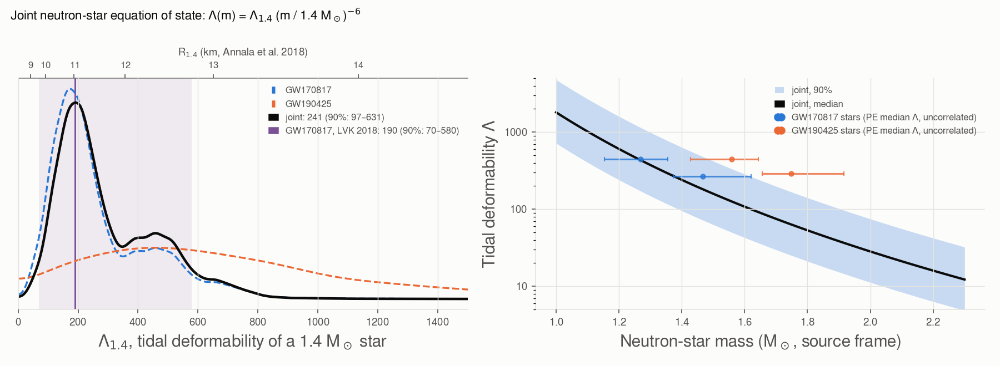

# neutron_star_eos

The **equation of state** (EOS) of neutron-star matter, the relation between pressure and density beyond
nuclear density, constrained jointly by the two binary neutron stars, GW170817 and GW190425.

```bash
gwtc_analysis neutron_star_eos                    # low-spin PE priors
gwtc_analysis neutron_star_eos --spin-prior high
```

## Method

The EOS fixes, through the equations of hydrostatic equilibrium, the radius and the tidal deformability
\(\Lambda = \frac{2}{3} k_2 (Rc^2/Gm)^5\) of a star of each mass. All neutron stars share it, so the four
stars of the two events lie on one curve. For stars of nearly equal radius
(De et al. 2018 [\[87\]](../references.md#ref-87)),

\[
\Lambda(m) = \Lambda_{1.4} \left(\frac{m}{1.4\,M_\odot}\right)^{-6},
\]

and the EOS is summarized by \(\Lambda_{1.4}\), the deformability of a 1.4 M☉ star. The radius follows from
the empirical relation \(\Lambda_{1.4} = 2.88 \times 10^{-6} (R_{1.4}/\text{km})^{7.5}\) of Annala et al. 2018
[\[88\]](../references.md#ref-88), accurate to about 0.5 km across EOS models.

The data measure mostly the mass-weighted combination \(\tilde\Lambda = a\Lambda_1 + b\Lambda_2\) (see
[Tidal deformability](../science/tidal-deformability.md)). For each event, with PE samples
\((m_{1,i}, m_{2,i}, \tilde\Lambda_i)\) in the source frame,

\[
\mathcal{L}(\Lambda_{1.4}) \propto \sum_i
\frac{K_h\big(\tilde\Lambda_i - \tilde\Lambda_\text{model}(m_{1,i}, m_{2,i}; \Lambda_{1.4})\big)}
{\pi(\tilde\Lambda_i \mid m_{1,i}, m_{2,i})},
\]

with \(K_h\) a Gaussian kernel (reflected at 0) and \(\pi\) the prior on \(\tilde\Lambda\) that the PE priors
(\(\Lambda_1, \Lambda_2\) uniform on 0–5000) imply at the sample's masses: a trapezoid, computed exactly. The
events multiply, with a flat prior on \(\Lambda_{1.4}\); the mass population is the PE mass prior.

| Event | PE label (low spin) | Masses (M☉) |
|---|---|---|
| GW170817 | `C02:IMRPhenomPv2_NRTidal-LowSpin` ([bundle](unofficial-pe.md)) | 1.47, 1.27 |
| GW190425 | `C01:IMRPhenomPv2_NRTidal:LowSpin` (GWTC-2.1) | 1.75, 1.56 |

## Result

| Analysis | Λ₁.₄, median (90%) | R₁.₄ (km) |
|---|---|---|
| GW170817 | 216 (80–628) | 11.2 (9.8–12.9) |
| GW190425 | 628 (109–1783) | 12.9 (10.2–14.9) |
| **joint, low spin** | **241 (97–631)** | **11.4 (10.1–12.9)** |
| joint, high spin | 212 (57–608) | 11.2 (9.4–12.9) |
| GW170817, LVK 2018 [\[70\]](../references.md#ref-70) | 190 (70–580) | |



*Left: the Λ₁.₄ posteriors, with the radius scale on top. Right: the common Λ(m) curve, with the PE
medians of the four stars, which the common EOS pulls together.*

GW170817 alone agrees with the published common-EOS result. GW190425 adds little: its stars are heavier,
so less deformable (Λ ≈ 0.2–0.7 Λ₁.₄), and it was seen essentially by one detector; it removes some of
the lowest values (the joint 5% bound rises from 80 to 97).

## Validation

On mock events (PE-like samples with uniform Λ priors and a Gaussian likelihood of Λ̃ around the common-EOS
value of a known Λ₁.₄), the truth falls inside the 90% interval about 90% of the time and at the posterior
median on average (`tests/test_ns_eos.py`). Dividing the smoothed posterior by the prior at the *model*
point instead of reweighting the samples diverges at small Λ₁.₄, where the prior of Λ̃ vanishes; the kernel
width is half of Silverman's rule, the full width over-smoothing (98% coverage).

## Limits

- Λ ∝ m⁻⁶ assumes stars of equal radius over 1.2–1.9 M☉; real EOSs bend this slightly.
- No maximum-mass constraint from heavy pulsars and no X-ray radii are included: this is the
  gravitational-wave constraint alone.
- GW190425's PE file does not record its Λ prior; uniform on 0–5000 is assumed, as recorded for GW170817
  (`--lambda-max`).

All options: [CLI reference](../cli-reference.md#neutron_star_eos).
