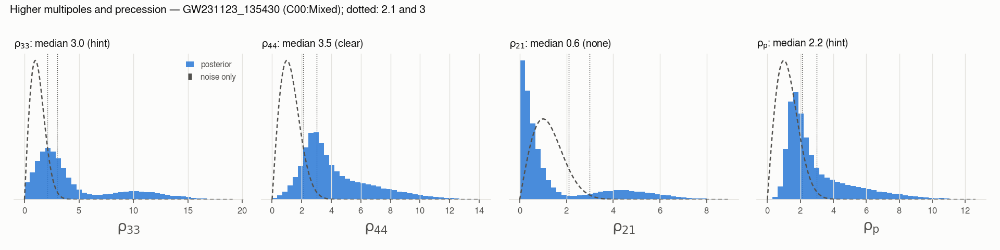
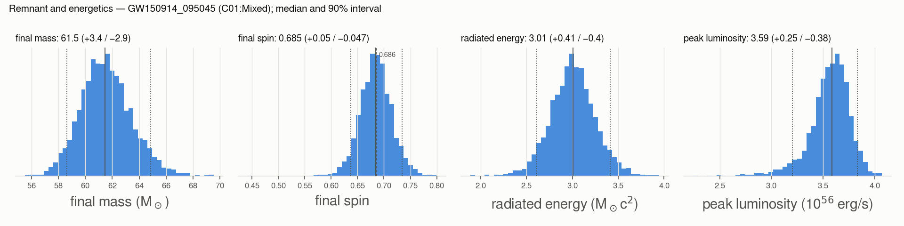
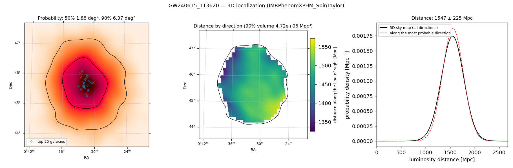
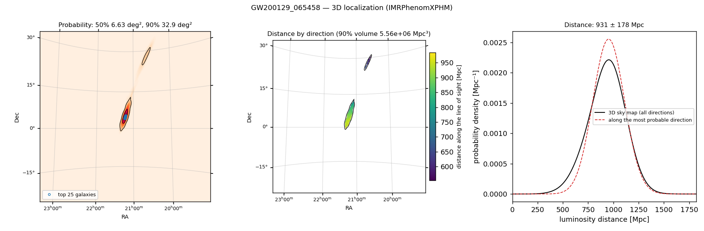
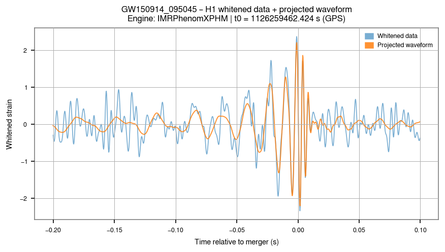
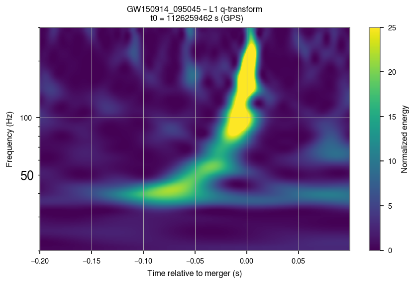
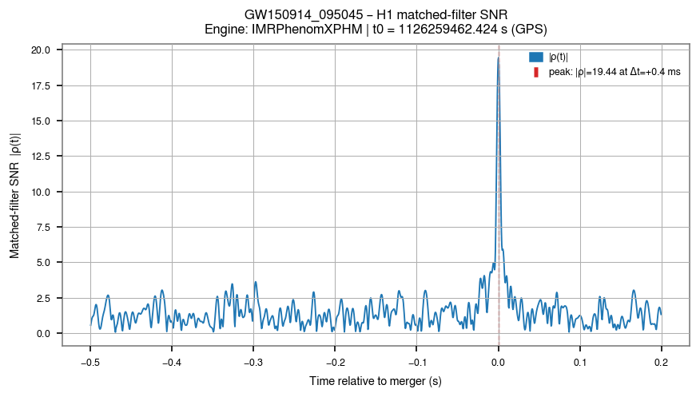
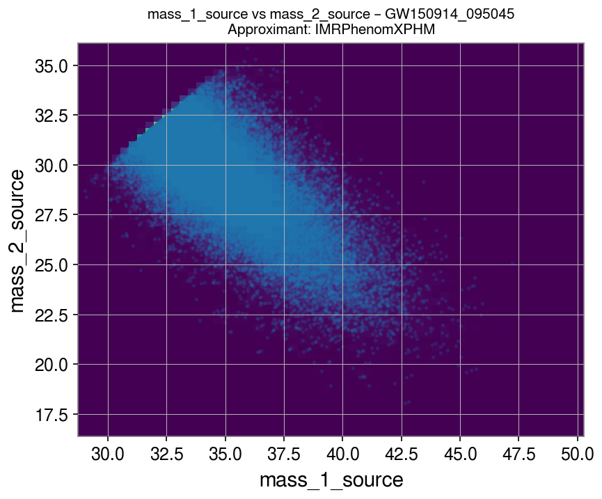
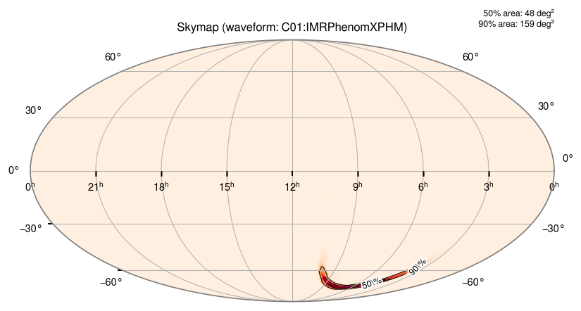

# parameters_estimation

Everything about one event: its posterior distributions, the whitened strain of each detector with
the best-fit waveform overlaid, a q-transform (time–frequency map), and the matched-filter SNR.

```bash
gwtc_analysis parameters_estimation --src-name GW231223_032836
gwtc_analysis parameters_estimation --src-name GW150914_095045 \
    --pe-vars chi_eff chi_p --pe-pairs mass_1_source:mass_2_source
```

## Posterior samples

The event's PESummary `PEDataRelease` file is read from `--data-repo`. It holds several analyses,
called **labels** (`C00:Mixed`, `C00:IMRPhenomXPHM-SpinTaylor`, `C00:SEOBNRv5PHM`, …), each with its
posterior samples, priors, PSDs, calibration envelopes and configuration. `--pe-vars` adds 1-D
posteriors and `--pe-pairs` 2-D ones (`x:y`).

### Choosing `--pe-label` and `--waveform-engine`

The mode distinguishes **which label is read** (posteriors and metadata) from **which waveform engine
synthesizes** the signal of the strain overlay.

1. **`--pe-label` given:** that label is used for the posteriors, and as the source of the PSDs and
   of the maximum-likelihood parameters of the overlay.
2. **Only `--waveform-engine` given:** the label whose name best matches the engine (substring
   match, no hard-coded mapping) is used for everything. `--waveform-engine IMRPhenomXPHM` selects
   `C00:IMRPhenomXPHM-SpinTaylor` if present.
3. **Neither:** the `Mixed` label for the posteriors (the plain `Cxx:Mixed` one when there are variants
   such as `Mixed:NSBH:*`). The strain overlay needs a PSD, which the `Mixed` labels of the Zenodo
   releases do not carry: it then uses the `IMRPhenomXPHM` label, else the first label with a PSD. Files
   without a `Mixed` label (the GW170817 bundle) use their first label.

If the requested engine cannot be instantiated (for instance outside its parameter range), the mode
logs a warning, falls back to another engine when possible, and reports both the requested and the
used engine in the logs and plot titles.

## Strain overlay and q-transform

The strain around the event is downloaded from GWOSC, whitened with the PSD of the label, band-passed,
and the maximum-likelihood waveform projected on each detector is overlaid. The time windows and
frequency bands have shared defaults and per-product overrides:

| Applies to | Options |
|---|---|
| both products | `--start`, `--stop` (seconds before and after the merger), `--fmin`, `--fmax` |
| overlay only | `--overlay-start`, `--overlay-stop`, `--overlay-fmin`, `--overlay-fmax` |
| q-transform only | `--q-start`, `--q-stop`, `--q-fmin`, `--q-fmax`, `--q-fscale {linear,log}` |

When the posterior is BNS-like (median chirp mass below 5 M☉), the windows not set explicitly switch
to a BNS profile: longer windows and a wider frequency range.

The waveform is aligned to the data in time and phase with the matched filter below, so that the
overlay stays coherent even when the stored maximum-likelihood extrinsic parameters are approximate.

## Matched-filter SNR

For each detector, the maximum-likelihood projected waveform is matched-filtered against the strain
(PyCBC; Allen et al. 2012 [\[53\]](../references.md#ref-53),
Usman et al. 2016 [\[54\]](../references.md#ref-54)). The resulting |ρ(t)| should peak at the
coalescence time, at about the detector's recovered SNR.

- The strain is conditioned the standard PyCBC way (high-pass at 15 Hz, resampled to 2048 Hz, edges
  cropped of filter transients), so that the off-source |ρ(t)| has unit-scale RMS (~0.7). A guard
  warns if it strays from that range.
- Loud glitches are gated out before filtering, and the SNR is only reported where the matched
  filter is valid.
- **Short (BBH-like) signals only.** A single template cannot coherently recover a long BNS inspiral:
  over thousands of cycles, small parameter and phase differences accumulate and the SNR is lost
  (that requires a template bank). When the template is longer than the conditioned data, the
  matched-filter SNR is skipped with a warning; the other products are still made.

## Higher multipoles and precession

From GWTC-4.0 on, the PE samples store four SNRs, and the report summarizes them for every label of the
file (the plot and the verdict are for the label of the posterior plots, `--pe-label`):

- `network_33_multipole_snr`, `network_44_multipole_snr`, `network_21_multipole_snr` (ρ₃₃, ρ₄₄, ρ₂₁): the
  SNR of the (3,3), (4,4) and (2,1) multipoles **orthogonal to the (2,2) one**, the part a change of the
  other parameters cannot absorb (Mills & Fairhurst 2021 [\[77\]](../references.md#ref-77)). These
  multipoles are strong for unequal masses and inclined orbits; they measure the mass ratio, break the
  distance–inclination degeneracy and test GR.
- `network_precessing_snr` (ρ<sub>p</sub>): a precessing signal is close to the sum of two
  non-precessing harmonics, and ρ<sub>p</sub> is the SNR of the weaker one (Fairhurst et al. 2020
  [\[78\]](../references.md#ref-78)). Precession comes from spins tilted against the orbit, a sign of
  dynamical formation.

Without the multipole (or precession), ρ² follows a χ² distribution with 2 degrees of freedom, so ρ
follows a Rayleigh distribution: P(ρ > 2.1) = 11%, P(ρ > 3) = 1%. The report classes the posterior
medians as **clear** (≥ 3) or a **hint** (2.1–3), and plots the posteriors of the selected label against
the noise-only distribution. This is the noise-only scale: the LVK papers compare with the distribution
of ρ under the prior, which needs prior samples that the files do not contain. When the labels' medians
differ by more than 1, the report says that the waveform models disagree. The table is also written to
`<event>_multipoles_precession.tsv`.

The GWTC-1 to GWTC-3 files do not store these SNRs (so GW190412, GW190814 and GW200129, whose higher
multipoles or precession were reported, cannot be checked this way); the report says so.

**Example: GW231123_135430**, the most massive binary of GWTC-4.0:



| Label | ρ₃₃ | ρ₄₄ | ρ<sub>p</sub> |
|---|---|---|---|
| `C00:Mixed` (default) | 3.0 | 3.5 | 2.2 |
| `C00:NRSur7dq4` | 2.6 | 3.5 | 2.3 |
| `C00:SEOBNRv5PHM` | 2.6 | 3.2 | 2.0 |
| `C00:IMRPhenomTPHM` | 2.1 | 2.8 | 1.7 |
| `C00:IMRPhenomXPHM-SpinTaylor` | 10.5 | 7.3 | 5.2 |

With the default `C00:Mixed`, the (4,4) multipole is clear and the (3,3) multipole and precession are hinted.
The (4,4) evidence holds with NRSur7dq4 and SEOBNRv5PHM too (3.5 and 3.2). But IMRPhenomXPHM-SpinTaylor
finds a loud (3,3) multipole and strong precession that the other models do not. The LVK analysis of this event found large waveform systematics, and the multipole content is
where they show. Most events have ρ well below 2: binaries of similar masses seen close to face-on,
which suppresses both effects.

## Remnant and energetics

The report also summarizes, for every label, the remnant quantities stored in the PE samples (GWTC-2.1
and later): the source-frame final mass `final_mass_source`, the final spin `final_spin`, the energy
radiated in gravitational waves `radiated_energy` (M☉c²) and the peak luminosity `peak_luminosity`
(10⁵⁶ erg/s), with the radiated fraction of the total mass. The table goes to `<event>_remnant.tsv`.

These come from fits to numerical-relativity simulations applied to the component masses and spins, not
from a separate measurement of the remnant: the test of the area law with a remnant measured from the
ringdown alone is the [area_law](area-law.md) mode.



*GW150914 (`C01:Mixed`): a 61.5 M☉ remnant of spin 0.68 (0.686 is the value for equal masses without
spin), 3.0 M☉c² radiated, i.e. 5.4 × 10⁵⁴ erg or 4.7% of the total mass, with a peak luminosity of
3.6 × 10⁵⁶ erg/s.*

## 3D sky map and host galaxies

Each PE release also has an archive of FITS sky maps, made with `ligo-skymap-from-samples` from the
posterior samples. It is a separate archive on the same Zenodo records: GWTC-2.1 `PESkyMaps`, GWTC-3
`PESkyLocalizations`, GWTC-4.0, GWTC-4.1 and GWTC-5.0 `Archived_Skymaps` (87 to 276 MB each). These maps are
three-dimensional [\[56\]](../references.md#ref-56): each pixel holds the probability and the distribution of
the luminosity distance along that line of sight (`DISTMU`, `DISTSIGMA`, `DISTNORM`), i.e. the probability
per unit volume. They are multi-order maps: fine pixels only where the probability is. The GW240615_113620
map has 21,504 pixels (0.7 MB), down to nside 4096. The HEALPix array inside the PE file is the same map
written at nside 4096 everywhere: 201 million pixels (1.6 GB) and no distance.

The mode downloads the archive of the event's catalog once (to `~/.cache_gwtc_analysis/skymaps`, or
`$GWTC_SKYMAP_CACHE`) and takes the map of the waveform label used for the plots, or else the `Mixed` map.
It reports the 50% and 90% credible areas and volumes, the most probable direction and the distance
there. The figure `<event>_<waveform>_skymap3d.png` shows the probability, the distance along each line of
sight across the 90% region, and the distance distribution of the map against the PE samples. The FITS
file is copied next to the plots.

**Host galaxies.** GLADE+ [\[91\]](../references.md#ref-91) is queried from VizieR, with one cone per
HEALPix cell covering the 90% region, within ±4σ of the distance. Each galaxy then gets the 3D probability
density at its position and its searched credible volume, written to `<event>_host_galaxies.tsv`; the
report lists the first ten. The query is skipped above `--galaxy-max-area` (100 deg² by default).
`--galaxies FILE` uses your own catalog instead (CSV or TSV with `ra`, `dec` and `dist` in Mpc, or `z`).
`--galaxies none` skips the cross-match; `--no-skymap-3d` skips the whole step.

The galaxies are weighted equally, and the share of the host probability assumes the catalog is complete.
GLADE+ is far from complete at a gigaparsec, so the ranking says which of the *listed* galaxies are most
compatible with the event, not where its host is.



*GW240615_113620 (GWTC-5.0, IMRPhenomXPHM-SpinTaylor): 6.4 deg² and 4.7 × 10⁶ Mpc³ at 90%, at
1547 ± 225 Mpc. Across the region the distance along the line of sight runs from about 1350 to 1550 Mpc.
GLADE+ gives 11,549 galaxies in the cones and distance range, 2,480 of them inside the 90% volume. The
first one holds 0.19% of the probability and the first ten 1.8%: even the best-localized event leaves
thousands of candidate hosts.*



*GW200129_065458 (GWTC-3, IMRPhenomXPHM): the 33 deg² of the 90% region fall in two patches at different
distances. The northern patch (3% of the probability) is at 664 ± 120 Mpc and the southern one at
962 ± 165 Mpc. A 2D map cannot show this.*

## Missing PSDs

A few official PE files have no PSDs. They are then taken from public supplementary releases: see
[Known issues in the public releases](../known-data-issues.md#missing-psds-and-calibration-envelopes).

## GW170817

GW170817 has no catalog PE file. The mode transparently uses the bundle rebuilt from public GWTC-1
products: see [build_unofficial_pe](unofficial-pe.md).

## Tidal deformability

For BNS and NSBH events, the tidal parameters (`lambda_1`, `lambda_2`, `lambda_tilde`,
`delta_lambda`) are only in the labels run with a tidal waveform, not in `Mixed`: select one with
`--pe-label`.

```bash
gwtc_analysis parameters_estimation --src-name GW170817 \
    --pe-label C02:IMRPhenomPv2_NRTidal-LowSpin \
    --pe-vars lambda_tilde lambda_2 --pe-pairs chi_eff:lambda_tilde
```

Which events carry them, how to read them (for NSBH events, `lambda_2` rather than `lambda_tilde`)
and how spin enters the measurement: see
[Tidal deformability of neutron stars](../science/tidal-deformability.md).

## Example: GW150914

```bash
gwtc_analysis parameters_estimation --src-name GW150914_095045 \
    --pe-vars chi_eff luminosity_distance --pe-pairs mass_1_source:mass_2_source
```

The first detection, from the GWTC-2.1 PE release; all the figures below come from this command.



*H1 strain, whitened and band-passed, with the maximum-likelihood IMRPhenomXPHM waveform projected on
the detector and aligned by the matched filter.*



*L1 q-transform: the chirp rises from about 35 Hz to over 200 Hz in about 0.1 s.*



*Matched-filter SNR |ρ(t)|: a peak of 19.4 in H1 (13.9 in L1) at the coalescence time, over noise of
unit-scale RMS.*

| Source-frame masses | Sky localization |
|---|---|
|  |  |

*Posterior of the source-frame masses: medians 34.9 and 29.3 M☉, with the 50% and 90% credible
regions and the density peaking close to equal masses. The samples stop at the dashed line m₁ = m₂,
since the primary is by convention the heavier component; the band follows a line of nearly constant
chirp mass, the best-measured mass parameter. Right: the skymap of the IMRPhenomXPHM analysis, 159 deg²
at 90% with the two LIGO detectors.*

All options: [CLI reference](../cli-reference.md#parameters_estimation).
