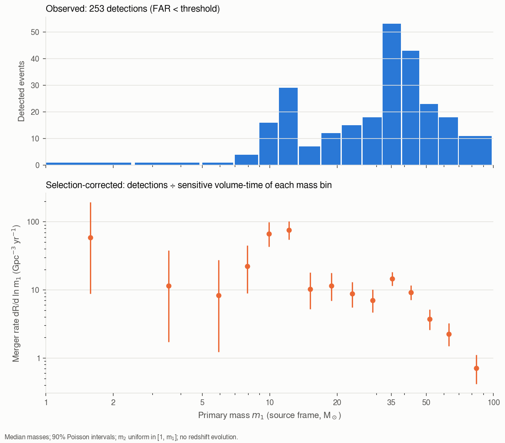

# rates

Merger rates of binary neutron stars (BNS), neutron star–black hole binaries (NSBH) and binary black
holes (BBH), per Gpc³ per year, as R = N / ⟨VT⟩. The method is explained in
[Merger rates](../science/merger-rates.md).

```bash
gwtc_analysis rates                               # GWTC-5.0 injections (O3 + O4a + O4b)
gwtc_analysis rates --sensitivity-release gwtc4   # GWTC-4.0 injections (O3 + O4a)
```

## What is counted

- **N:** the GWOSC candidates of GWTC-2.1, GWTC-3, GWTC-4.0 and GWTC-5.0, confident and marginal
  lists, inside the observing periods covered by the injections and with a false-alarm rate below
  `--far-threshold` (1 per year by default). They are classified by their median source-frame masses,
  neutron stars being below `--ns-max-mass` (2.5 M☉). Candidates without masses are left out.
- **⟨VT⟩:** the sensitive volume-time of each population, from the LVK injections, downloaded
  automatically (`--sensitivity-release gwtc5` by default, or `gwtc4`; `--sensitivity-file` for a
  local file).

The observing periods are those of the injections (their times split at gaps longer than a week), so
candidates of the engineering run ER15, just before O4a, are not counted.

## Selecting catalogs

`--catalogs` restricts the rates to the observing runs of some catalogs, for the events **and** the
injections, so that the counts and the sensitive volume-time describe the same observing time:

| Catalog | Runs |
|---|---|
| `GWTC-1` | O1, O2 |
| `GWTC-2.1` | O3a |
| `GWTC-3` | O3b |
| `GWTC-4` | O4a |
| `GWTC-5` | O4b |

```bash
gwtc_analysis rates --catalogs GWTC-5          # O4b only
gwtc_analysis rates --catalogs GWTC-4 GWTC-5   # O4a + O4b
gwtc_analysis rates --catalogs ALL             # O1 to O4b
```

Without `--catalogs`, the rates cover the runs of the real-injection mixture of the release (O3 onward).
Selecting GWTC-1 uses the release's mixture with semi-analytic O1+O2 injections, found above
`--snr-threshold` (10). The restriction keeps the importance sums of the selected runs: with the
mixture weights, they are the ⟨VT⟩ of those runs, and the ⟨VT⟩ of separate catalogs add up to that of
all of them. An event listed in two catalogs (the O1–O2 events of GWTC-1 and GWTC-2.1) is counted
once.

BBH rates of each catalog (GWTC-5.0 injections, R ∝ (1+z)^2.9, at z = 0.2, Gpc⁻³ yr⁻¹, median [90%]):

| Catalog | BBH candidates | BBH rate |
|---|---|---|
| GWTC-2.1 (O3a) | 37 | 31.1 [23.5, 40.3] |
| GWTC-3 (O3b) | 23 | 20.9 [14.5, 28.8] |
| GWTC-4 (O4a) | 84 | 25.2 [21.0, 30.0] |
| GWTC-5 (O4b) | 104 | 24.8 [21.0, 29.0] |
| O3a–O4b | 248 | 25.2 [22.7, 27.9] |

The catalogs agree with one another. O4b has no BNS or NSBH candidate below 1 per year: its BNS and
NSBH rates are upper limits (90%: 113 and 40 Gpc⁻³ yr⁻¹).

## Population models

| Population | Mass model | Spins | Redshift |
|---|---|---|---|
| BNS | both masses uniform in [1, 2.5] M☉ | isotropic, \|χ\| < 0.4 | constant rate |
| NSBH | black hole ∝ m^−2.35 on [2.5, 40] M☉, neutron star uniform in [1, 2.5] M☉ | BH \|χ\| < 0.99, NS \|χ\| < 0.4 | constant rate |
| BBH | GWTC-3 Power Law + Peak [\[12\]](../references.md#ref-12) | isotropic, \|χ\| < 0.99 | R ∝ (1+z)^κ, reported at z = 0.2 (`--bbh-kappa`, `--bbh-z-ref`), and constant |

## Results

| Release | Candidates | BNS | NSBH | BBH at z = 0.2 |
|---|---|---|---|---|
| `gwtc5` (O3–O4b, 2.59 yr) | 259 | 26 [4, 87] | 33 [13, 67] | 25 [23, 28] |
| `gwtc4` (O3–O4a, 1.7 yr) | 155 | 43 [6, 143] | 54 [21, 109] | 26 [23, 30] |

Rates in Gpc⁻³ yr⁻¹, median [90%]. They are consistent with the LVK population papers:
GWTC-5.0 [\[14\]](../references.md#ref-14) (BBH 27.5–49.4 at z = 0.2 for masses 2.5–200 M☉),
GWTC-4.0 [\[13\]](../references.md#ref-13) (z = 0: BNS 7.6–250, NSBH 9.1–84, BBH 14–26) and
GWTC-3 [\[12\]](../references.md#ref-12).

## Outputs

- `--out-rates` (TSV): one row per population model, with N, ⟨VT⟩, the effective number of
  injections and the rate quantiles;
- `--out-events` (TSV): the events counted, with their class;
- `--out-report` (HTML): the tables, and the observed and selection-corrected primary-mass
  distributions.

## Example

```bash
gwtc_analysis rates
```

The HTML report shows, with the rates table, the observed and the selection-corrected primary-mass
distributions:

{ width="640" }

*O3 to O4b, GWTC-5.0 injections. Top: detected candidates per bin of primary mass. Bottom: merger
rate per logarithmic mass interval, the counts divided by the sensitive volume-time of each bin. The
peaks near 10 and 35 M☉ stand out once the heavy binaries' larger detection volume is removed.*

All options: [CLI reference](../cli-reference.md#rates).
