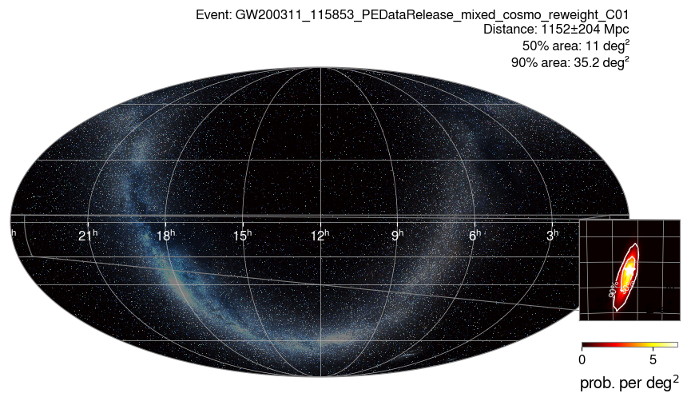

# search_skymaps

Which events could come from a given direction? For each event of the chosen catalogs, the mode
reads its sky localization (HEALPix FITS skymap) and tests whether the position (`--ra-deg`,
`--dec-deg`) lies inside the credible region `--prob` (0.9 for the 90% region).

```bash
gwtc_analysis search_skymaps --catalogs GWTC-4 --ra-deg 265.0 --dec-deg -46.0 --prob 0.9
```

- `--skymap-label` chooses the analysis whose skymap is used (`Mixed`, the combined samples, by
  default).
- GWTC-1 events are covered by the GWTC-2.1 skymap release; `ALL` expands to GWTC-2.1, GWTC-3,
  GWTC-4 and GWTC-5.
- Skymaps come from `--data-repo`: the Zenodo tarballs (a given version with `--zenodo-version`), the
  S3 bucket, or Galaxy collections.

**Outputs.** `--out-events` (TSV) lists every event with the credible level of the position; the
events that contain it are plotted in `--plots-dir` and gathered in `--out-report`.

The catalog skymaps are built by the LVK from the PE posterior samples; see
Singer et al. 2016 [\[56\]](../references.md#ref-56) for the three-dimensional skymap format.

## Example: an event seen by three detectors

```bash
gwtc_analysis search_skymaps --catalogs GWTC-3 --ra-deg 1.63 --dec-deg -6.58 --prob 0.9
```

The position is the most probable point of GW200311_115853, a binary black hole observed by H1, L1 and
Virgo: 2 of the 36 GWTC-3 skymaps contain it in their 90% region, GW200311 (at the 0% credible level,
its peak) and GW200322_091133 (at the 32% level).



*GW200311_115853: with three detectors, the 90% region of the PE skymap covers 35 deg² (zoom, lower
right), against thousands of deg² with two detectors.*

For comparison, a single-detector event:

```bash
gwtc_analysis search_skymaps --catalogs GWTC-4 --ra-deg 265.0 --dec-deg -46.0 --prob 0.9
```


*GW230529_181500, seen by L1 alone: its 90% region covers 25 400 deg², more than half of the sky, and
contains the position (star) at the 16% credible level. The same position is inside the 90% region of
13 of the 86 GWTC-4.0 skymaps.*

All options: [CLI reference](../cli-reference.md#search_skymaps).
