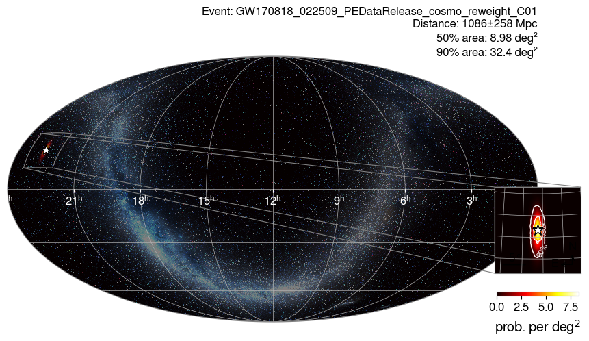
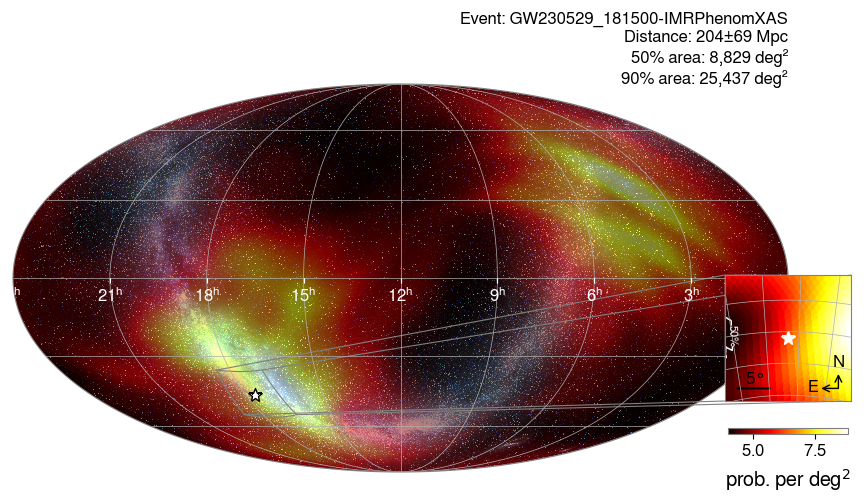

# search_skymaps

Which events could come from a given direction? For each event of the chosen catalogs, the mode
reads its sky localization (HEALPix FITS skymap) and tests whether the position (`--ra-deg`,
`--dec-deg`) lies inside the credible region `--prob` (0.9 for the 90% region).

```bash
gwtc_analysis search_skymaps --catalogs GWTC-4 --ra-deg 265.0 --dec-deg -46.0 --prob 0.9
```

- `--skymap-label` chooses the analysis whose skymap is used, one map per event: `Mixed`, the combined
  samples, by default. An event without a map for that label falls back to `Mixed`, then to
  `IMRPhenomXPHM_SpinTaylor`: GWTC-5.0 has no `Mixed` maps, so its events use the IMRPhenomXPHM-SpinTaylor
  map, the only waveform run on all of them. `any` searches every map of every event.
- GWTC-1 events are covered by the GWTC-2.1 skymap release; `ALL` expands to GWTC-2.1, GWTC-3,
  GWTC-4 and GWTC-5.
- Skymaps come from `--data-repo`: the Zenodo tarballs (a given version with `--zenodo-version`), the
  S3 bucket, or Galaxy collections.

**Outputs.** `--out-events` (TSV) lists every event with the credible level of the position; the
events that contain it are plotted in `--plots-dir` and gathered in `--out-report`.

The catalog skymaps are built by the LVK from the PE posterior samples; see
Singer et al. 2016 [\[56\]](../references.md#ref-56) for the three-dimensional skymap format.

## Example: an event seen by three detectors

```bash
gwtc_analysis search_skymaps --catalogs GWTC-1 --ra-deg 341.28 --dec-deg 21.66 --prob 0.9
```

The position is the most probable point of GW170818_022509, a binary black hole observed by H1, L1 and
Virgo in August 2017. GWTC-1 has no skymap release of its own: the mode reads the GWTC-2.1 skymaps and
keeps the 10 GWTC-1 events they contain (GW170817, a binary neutron star, is not in the GWTC-2.1
re-analysis). Only GW170818 contains the position in its 90% region, at the 0.03% credible level, its
peak; for the 9 others it lies outside the 99.9% region.



*GW170818_022509: with three detectors, the 90% region of the PE skymap covers 32 deg², the small red
area around the star (upper left), enlarged in the zoom (right); two detectors give thousands of deg².*

For comparison, a single-detector event:

```bash
gwtc_analysis search_skymaps --catalogs GWTC-4 --ra-deg 265.0 --dec-deg -46.0 --prob 0.9
```



*GW230529_181500, seen by L1 alone: its 90% region covers 25 400 deg², more than half of the sky, and
contains the position (star) at the 16% credible level. The same position is inside the 90% region of
13 of the 86 GWTC-4.0 skymaps.*

All options: [CLI reference](../cli-reference.md#search_skymaps).
