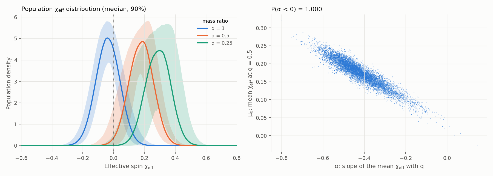

# spin_population

The **population of binary-black-hole effective spins**: the distribution of χ_eff and how it changes with
the mass ratio, inferred hierarchically from the catalog with the selection effects of the LVK
search-sensitivity injections.

```bash
gwtc_analysis spin_population                     # chi_eff - q correlated model
gwtc_analysis spin_population --no-correlation    # Gaussian chi_eff
```

## What it measures

The effective spin \(\chi_\text{eff} = (m_1 \chi_{1z} + m_2 \chi_{2z})/(m_1 + m_2)\) is the mass-weighted spin
along the orbital angular momentum, the best-measured spin combination. Its distribution separates
formation channels: binaries formed in isolation tend to have spins aligned with the orbit
(\(\chi_\text{eff} > 0\)), binaries assembled dynamically in clusters have isotropic spins, as many negative
as positive.

The model (Callister et al. 2021 [\[89\]](../references.md#ref-89)) is

\[
\chi_\text{eff} \mid q \sim \mathcal{N}\big(\mu_0 + \alpha\,(q - 0.5),\ \sigma\big) \quad\text{on } [-1, 1],
\]

with \(q = m_2/m_1 \le 1\): \(\mu_0\) is the mean at \(q = 0.5\), \(\alpha\) its slope with the mass ratio
(\(\alpha < 0\): unequal-mass binaries spin more), σ the width. `--no-correlation` sets \(\alpha = 0\).

## Method

- **Events:** the 137 binary black holes of the `hubble_constant` selection (GWTC-4.0 setup: lowest FAR
  ≤ 0.25 /yr, both masses ≥ 3 M☉, GW231123 and GW200105 left out), each with 5000 PE samples of its
  IMRPhenomXPHM analysis (χ_eff, masses, distance).
- **Spins:** the other spin degrees of freedom are isotropic with magnitude uniform on [0, 1], reweighted
  in χ_eff only. The spin factor of a PE sample or an injection is \(\mathcal{N}(\chi_\text{eff}) /
  \pi_\text{iso}(\chi_\text{eff} \mid q)\), with \(\pi_\text{iso}\) the χ_eff density of isotropic spins,
  computed exactly: \(a\cos\theta\) has density \(-\ln|s|/2\) on [−1, 1], and χ_eff is the convolution of
  two of them. The PE spin priors are isotropic too, so this factor is all their spin part.
- **Masses and redshifts:** a fixed population, that of the [rates](rates.md) mode (Power Law + Peak,
  R ∝ (1+z)^2.9, Planck15).
- **Selection:** 250,000 of the found O1–O4a injections (a random subset of the 849,000; the detectable
  fraction is unbiased), weighted by the population over their full draw density.
- **Likelihood:** marginalized over the rate,
  \(\ln\mathcal{L} = \sum_\text{events} \ln\langle w f\rangle_\text{PE} - N \ln\langle w f\rangle_\text{inj}\).
  A posterior point is kept only with at least 4N effective injections and 10 effective PE samples for
  every event (the icarogw and GWTC-4.0 cosmology criteria). Sampler: emcee.

**The injections were not drawn with isotropic spins.** Within narrow bins of mass and redshift, their
draw density minus an isotropic, uniform-magnitude spin part still correlates with the spin magnitude
(−0.34) and the tilt (+0.37). The mode therefore uses the full draw density. This does not affect
`hubble_constant`: dividing by the full draw density with an isotropic spin population makes the
population spins isotropic, whatever the draw.

## Result

| Parameter | Correlated model, median (90%) | Gaussian model (α = 0) |
|---|---|---|
| μ₀, mean χ_eff at q = 0.5 | 0.18 (0.11–0.23) | 0.036 (0.013–0.057) |
| σ, width | 0.077 (0.067–0.097) | 0.096 (0.077–0.121) |
| α, slope with q | **−0.44 (−0.58 to −0.24)** | — |
| P(α < 0) | > 0.999 (all 16,000 samples) | — |

The mean effective spin falls with the mass ratio: 0.27 (0.16–0.34) at q = 0.3, 0.14 (0.09–0.17) at
q = 0.6, −0.04 (−0.07 to 0.00) for equal masses. **Unequal-mass binaries have larger effective spins**,
as Callister et al. found at 98.7% credibility with GWTC-2 [\[89\]](../references.md#ref-89); GWTC-4.0 also
finds evidence for a χ_eff–q correlation [\[90\]](../references.md#ref-90). Most formation models predict the
opposite trend.

Averaged over the population's mass ratios (median q = 0.84), a fraction **0.35 (0.26–0.43)** of the
binaries have χ_eff < 0, against 0.24–0.42 in GWTC-4.0 [\[90\]](../references.md#ref-90): a substantial
population consistent with dynamical assembly.



*Left: the population χ_eff distribution at three mass ratios (median and 90%). Right: the posterior of the
mean at q = 0.5 against the slope; every sample has α < 0.*

Diagnostics of the correlated run: at the posterior median 14,500 effective injections (threshold 548)
and at least 16 effective PE samples per event (GW231028_153006, the one with χ_eff ≈ 0.5 at q ≈ 0.7);
20 walkers × 1200 steps, acceptance 0.61, autocorrelation time 31 steps, about 500 independent samples.

## Validation

`tests/test_spin_population.py`: the isotropic χ_eff density integrates to 1 and matches a Monte Carlo of
10⁶ isotropic spins at q = 1, 0.5 and 0.1; on a mock population of 120 events (μ₀ = 0.06, σ = 0.1,
α = −0.5) with PE samples drawn from the isotropic prior times a Gaussian measurement, the three
parameters are recovered inside their 90% intervals, with P(α < 0) > 0.9.

## Limits

- The mass and redshift population is fixed, not fitted with the spins; a joint fit would widen the
  intervals somewhat.
- Only the mean of χ_eff varies with q; GWTC-4.0 notes that the data cannot yet tell whether the mean or
  the width varies [\[90\]](../references.md#ref-90).
- χ_p (precession) is not modeled: the other spin components follow the isotropic distribution.

All options: [CLI reference](../cli-reference.md#spin_population).
