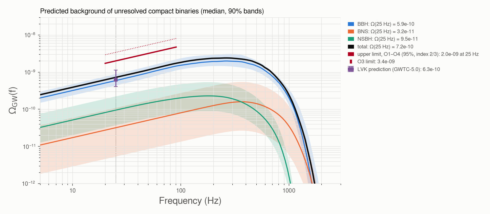

# stochastic

The **background of unresolved compact binaries**, Ω_GW(f), predicted from the catalog and compared with
the upper limits of the stochastic searches.

```bash
gwtc_analysis rates --out-rates merger_rates.tsv
gwtc_analysis stochastic --spectral-posterior hubble_constant_run --rates merger_rates.tsv
```

## Method

The energy density of the background per logarithmic frequency, in units of the critical density
ρ_c c² = 3H₀²c²/(8πG), is (Phinney 2001 [\[83\]](../references.md#ref-83))

\[
\Omega_\text{GW}(f) = \frac{f}{\rho_c c^2} \int_0^{10} dz\,
\frac{R(z)\, \langle dE/df_s \rangle\big(f(1+z)\big)}{(1+z)\, H(z)},
\]

with R(z) the merger rate per comoving volume and source-frame time, and ⟨dE/df_s⟩ the energy spectrum of
one merger averaged over the population (Planck15, as the volumes of the `rates` mode).

| Population | Rate | Masses | Spectrum |
|---|---|---|---|
| BBH | R(0.2) of `rates` (25.2 Gpc⁻³ yr⁻¹), times the [Madau–Dickinson shape](hubble-constant.md#merger-rate-evolution) of each spectral-siren draw | Power Law + Peak of each draw | inspiral–merger–ringdown, Ajith et al. 2008 [\[84\]](../references.md#ref-84) |
| BNS | R(0) of `rates`, star-formation history [\[82\]](../references.md#ref-82) | uniform 1–2.5 M☉ | inspiral to the ISCO |
| NSBH | R(0) of `rates`, star-formation history | m_BH ∝ m^−2.35 on 2.5–40 M☉, NS uniform 1–2.5 M☉ | inspiral to the ISCO |

The BBH rate is normalized at z = 0.2, where the catalog measures it best. **Beyond the farthest detected
events** (z_h ≈ 1, from the work directory) the fitted shape is only its prior: by default the rate follows
the star-formation history there, joined continuously at z_h (`--high-z sfr`); `--high-z posterior` keeps
the fitted shape up to z = 10.

## Result

GWTC-4.0 Power Law + Peak posterior, rates of GWTC-1 to GWTC-4.0:

| Population | Ω_GW(25 Hz), median (90%) |
|---|---|
| BBH | 6.0 × 10⁻¹⁰ (4.3–9.3 × 10⁻¹⁰) |
| BNS | 0.3 × 10⁻¹⁰ (0.06–1.8 × 10⁻¹⁰) |
| NSBH | 0.9 × 10⁻¹⁰ (0.4–2.2 × 10⁻¹⁰) |
| **total** | **7.5 × 10⁻¹⁰ (5.5–11.7 × 10⁻¹⁰)** |
| LVK prediction from GWTC-5.0 [\[85\]](../references.md#ref-85) | 6.3 (+5.0 / −2.2) × 10⁻¹⁰ |
| upper limit, data through April 2025 [\[85\]](../references.md#ref-85) | ≤ 2.0 × 10⁻⁹ (95%, index 2/3) |
| upper limit, O3 [\[86\]](../references.md#ref-86) | ≤ 3.4 × 10⁻⁹ |

The prediction agrees with the LVK one and lies a factor 2.7 below the current upper limit.



*Below ~100 Hz the background grows as f^2/3 (the inspiral), in the band where the searches are most
sensitive; the BBH spectrum turns over at the merger frequencies of the redshifted masses.*

## Systematics

- **The rate beyond the detected events dominates.** With `--high-z posterior`, Ω_BBH(25 Hz) = 9.8 × 10⁻¹⁰:
  77% of it then comes from z > 1, where the fitted shape is only the prior's. The default ties that region
  to the star-formation history; neither is a measurement.
- **The energy spectrum.** The Ajith et al. 2008 merger and ringdown overestimate the radiated energy
  (4.2 M☉c² for a GW150914-like binary, against ~3.0 from numerical relativity). At 25 Hz, 21% of the BBH
  background comes from the merger and ringdown of heavy, distant binaries: a ~20% upward bias at most.
- **BNS and NSBH** rest on 1 and 4 detections, rates without delay time and inspiral-only spectra; they
  contribute ~15% of the total.

All options: [CLI reference](../cli-reference.md#stochastic).
