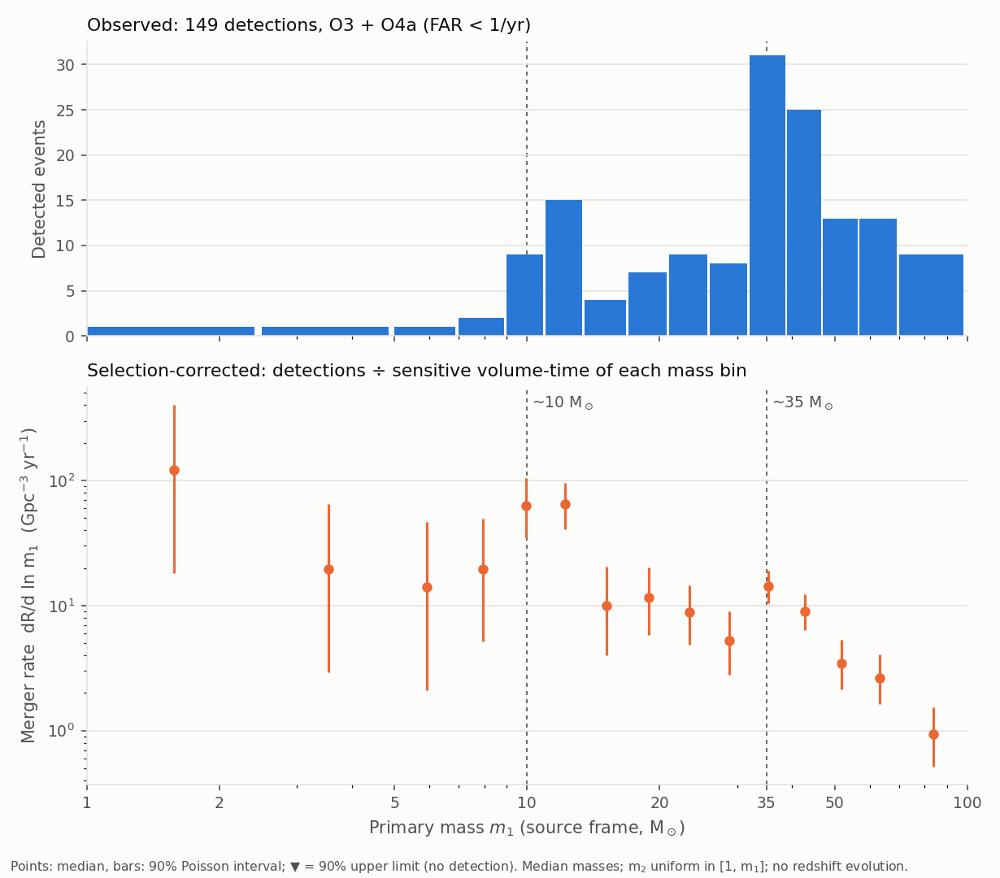

# Merger rates

How many compact-binary mergers happen per unit volume and time? The `rates` mode answers with the
simplest estimator that corrects for selection effects: a count divided by a sensitive volume-time.
Usage: [rates](../modes/rates.md).

## The estimator

Detections form a Poisson process. For a population with a rate density \(R\) (per Gpc³ per year of
source-frame time), the expected number of detections is

\[
N_\text{exp} = R\, \langle VT \rangle ,
\]

where \(\langle VT \rangle\) is the sensitive volume-time of that population, computed from the
[injections](selection-effects.md#reweighting-one-set-of-injections-for-every-population). With \(N\)
detections, the likelihood is \(p(N \mid R) \propto (R\langle VT\rangle)^N e^{-R\langle VT\rangle}\).
With the Jeffreys prior \(p(R) \propto R^{-1/2}\), the posterior of the rate is a Gamma distribution:

\[
R\,\langle VT \rangle \sim \text{Gamma}\!\left(N + \tfrac{1}{2},\, 1\right),
\]

and the quoted median and 90% interval are its quantiles divided by \(\langle VT \rangle\). The
interval is purely statistical (Poisson): the population shape is fixed.

## Populations

The events are classified by their median source-frame masses, neutron stars being below 2.5 M☉:

| Class | Condition |
|---|---|
| BNS | both masses < 2.5 M☉ |
| NSBH | secondary < 2.5 M☉ ≤ primary |
| BBH | both masses ≥ 2.5 M☉ |

Each class has a fixed population model, used to compute its ⟨VT⟩
([table](../modes/rates.md#population-models)). The BBH model is the GWTC-3 *Power Law + Peak*
(Talbot & Thrane 2018 [\[15\]](../references.md#ref-15); parameters of
GWTC-3 population [\[12\]](../references.md#ref-12)): a power law in the primary mass with a Gaussian
peak near 34 M☉ and a smooth low-mass turn-on.

The BBH rate is reported two ways:

- **constant** rate per comoving volume;
- **evolving** as \(R(z) = R_0 (1+z)^\kappa\), with \(\kappa = 2.9\) (close to the slope of the cosmic
  star-formation rate at low redshift, Madau & Dickinson 2014 [\[16\]](../references.md#ref-16)), and
  quoted at \(z = 0.2\), where the BBH detections constrain it best, as in the LVK papers [\[12\]](../references.md#ref-12) [\[13\]](../references.md#ref-13).

The two differ because detected BBHs lie at \(z \sim 0.2\)–1: if the rate grows with redshift, part of
what is seen far away comes from the higher rate there, and the local rate is lower.

## Results

| Release | Candidates | BNS | NSBH | BBH at z = 0.2 | BBH, constant |
|---|---|---|---|---|---|
| `gwtc5` (O3–O4b, 2.59 yr) | 259 | 26 [3.9, 87] | 33 [13, 67] | 25.2 [22.7, 27.9] | 41.5 [37.3, 46.0] |

Rates in Gpc⁻³ yr⁻¹, median [90%], from 1 BNS (GW190425), 4 NSBH and 248 BBH candidates with FAR
below 1 per year. GW170817 is not counted: it is in O2, before the injection periods.

These values fall in the ranges of the LVK population analyses
(GWTC-3 [\[12\]](../references.md#ref-12), GWTC-4.0 [\[13\]](../references.md#ref-13),
GWTC-5.0 [\[14\]](../references.md#ref-14)). The LVK intervals are wider because they fit the
population shape together with the rate: the BNS rate in particular rests on one or two events and
depends strongly on the assumed mass distribution.

## Selection-corrected mass distribution

The same method, applied to bins of primary mass, turns the observed mass distribution into the
distribution of merger rates: in each bin, \(dR/d\ln m_1 = N_\text{bin} / (\langle VT\rangle_\text{bin}\, \Delta \ln m_1)\),
with a population uniform in \(\ln m_1\) inside the bin.

*O3 + O4a, 149 candidates with FAR below 1 per year, GWTC-4.0 injections; secondary mass uniform in
[1 M☉, m₁], no redshift evolution.*

The observed distribution (top) is dominated by BBHs of 30–40 M☉, which are seen to large distances.
Once divided by the sensitive volume-time of each bin (bottom), the picture changes: the rate falls by
almost two orders of magnitude between 10 and 80 M☉, the peak near 10 M☉ is the strongest feature and
the one near 35 M☉ becomes a modest bump. Below 10 M☉ each bin holds one or two events, so the rates
there are poorly constrained.

## Limitations

- Fixed population shapes: the intervals do not include the uncertainty of the mass, spin and redshift
  distributions.
- Classification by median masses: events near the 2.5 M☉ boundary (GW230529, with a 2.5–4.5 M☉
  primary) may belong to either class.
- All candidates below the FAR threshold are counted as astrophysical; the LVK analyses weight them by
  their probability of astrophysical origin.
