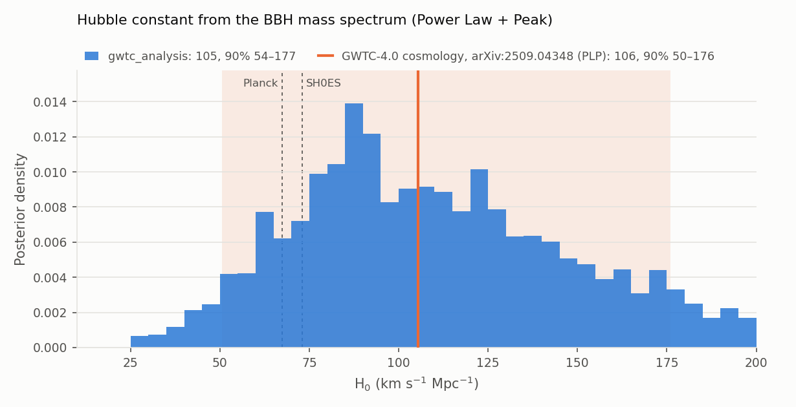
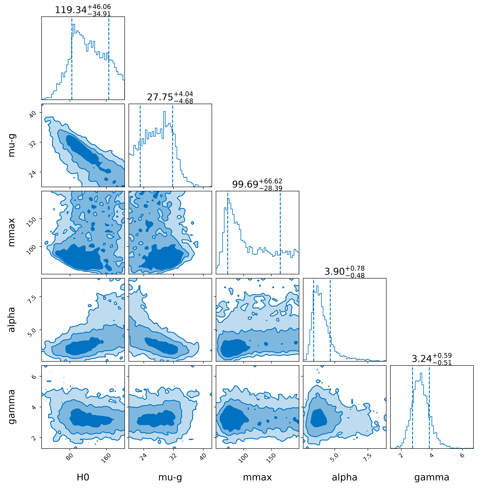
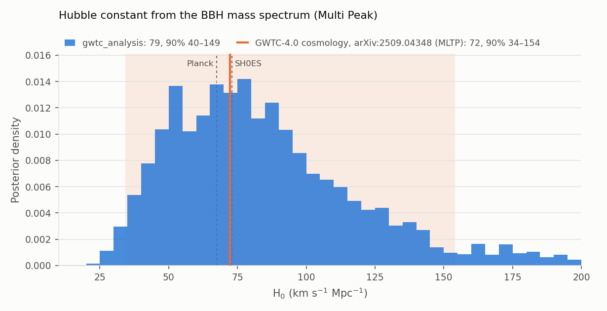

# Hubble constant from the BBH mass spectrum (spectral siren)

This page explains how the [`hubble_constant`](../modes/hubble-constant.md) mode measures the Hubble
constant from binary-black-hole (BBH) detections alone, without an electromagnetic counterpart or a
galaxy catalog, and how its result compares with the published LVK measurement.

## Result

The mode reproduces the *Power Law + Peak* (PLP) spectral-siren measurement of the GWTC-4.0
cosmology paper (LVK 2026 [\[29\]](../references.md#ref-29), published version v3), with the same event
selection, PE samples, injections, population model and priors:

| Quantity | gwtc_analysis | GWTC-4.0 paper [\[29\]](../references.md#ref-29) |
|---|---|---|
| **PLP**, H₀ (km/s/Mpc, median and 68%) | **105.8 (+44.7 / −33.2)** | 105.5 (+46.4 / −35.8) |
| PLP, H₀ 90% interval | 54.4 – 175.7 | 50.5 – 176.1 |
| PLP, position of the mass peak μ_g (M☉) | 28.7 (+3.8 / −4.6) | 28.3 (+4.1 / −4.4) |
| **MLTP**, H₀ (km/s/Mpc, median and 68%) | **78.6 (+38.0 / −26.5)** | 72.3 (+42.5 / −25.6) |
| MLTP, H₀ 90% interval | 40.2 – 150.6 | 34.2 – 154.1 |
| BBH events | 137 | 137 |

Both results use the paper's 137 events and all the found injections, as in the paper. They were
sampled with a 10% subset of the injections and 136 events (10 runs of 100 live points each), then
**reweighted** to all the injections and the 137th event
([below](#injection-subsets-and-reweighting)); the reweighting keeps an effective sample size of 68%
(PLP) and 66% (MLTP) of the samples. The PLP median agrees with the paper to 0.3 km/s/Mpc, the MLTP
one to 6 km/s/Mpc (0.2σ), and the 90% intervals nearly coincide. The remaining differences are of the
size of the Monte Carlo effects of the number of PE samples (below).

!!! note "Versions of the paper"
    The first two arXiv versions of the paper (v1 and v2, 2025) quoted PLP 112.7 (+51.0 / −35.9)
    km/s/Mpc, 90%: 57.6–186.7, with the peak at 28.6 (+3.9 / −4.9) M☉, MLTP 77.1 (+40.8 / −26.3) and
    FullPop-4.0 76.4 (+23.0 / −18.1); our PLP result agrees with those to about 0.15σ. The published
    version (v3, August 2026) revised all the spectral-siren values to those quoted here. The paper does
    not describe the changes between versions. Our runs with 10% of the injections alone happened to
    land near the v1–v2 value; with all the injections, as the paper uses, the result matches v3.



H₀ is measured only broadly: values below about 60 km/s/Mpc are excluded, but the posterior still has
weight at 200 km/s/Mpc, the upper edge of the prior. This is not yet competitive with the cosmic
microwave background (Planck 2018 [\[33\]](../references.md#ref-33): 67.4 ± 0.5) or the distance
ladder (SH0ES 2022 [\[34\]](../references.md#ref-34): 73.0 ± 1.0). Richer mass models do better
([below](#other-mass-models-and-published-results)).

## The idea

A GW signal measures its luminosity distance \(D_L\) and its detector-frame masses
\(m_\text{det} = (1+z)\, m_\text{src}\), but not its redshift
([What a GW signal measures](gw-signals.md)). A heavy nearby binary and a lighter distant one look the
same.

The **spectral siren** takes the redshift from the population
(Taylor, Gair & Mandel 2012 [\[20\]](../references.md#ref-20);
Farr et al. 2019 [\[21\]](../references.md#ref-21);
Ezquiaga & Holz 2022 [\[22\]](../references.md#ref-22)). If source-frame BBH masses pile up at a fixed
value, such as the peak near 30 M☉, the detector-frame peak must move to higher masses with distance.
For each trial H₀:

1. convert every event's \(D_L\) into \(z\);
2. compute its source-frame masses \(m_\text{src} = m_\text{det}/(1+z)\);
3. check whether the whole catalog, near and far, then forms one mass distribution that does not change
   with distance.

With a wrong H₀ the peak drifts with distance, which the model does not allow. The mass distribution
and H₀ are therefore fitted **together**, which is the origin of the strong H₀–μ_g degeneracy: the
data fix \(\mu_g (1+z)\), and \(z\) depends on H₀. The population model matters: fixing its shape
gives a biased and falsely precise H₀ (Mastrogiovanni et al. 2021 [\[23\]](../references.md#ref-23)).

## The hierarchical likelihood

The question is: *if the Universe had this population of black holes and this H₀, how probable is the
set of signals actually recorded?* The problem has two levels, hence *hierarchical*
(Mandel, Farr & Gair 2019 [\[35\]](../references.md#ref-35);
Thrane & Talbot 2019 [\[36\]](../references.md#ref-36)):

```
 Λ, H₀            population and cosmology      (inferred)
   | generate
   v
 θ₁, θ₂, … θ_N    true masses and distances     (hidden)
   | produce, with noise
   v
 d₁, d₂, … d_N    strain data of the detectors  (observed)
```

### One event

The probability of the data of event \(i\) given the population integrates over its unknown true
parameters:

\[
p(d_i \mid \Lambda, H_0) = \int p(d_i \mid \theta)\; p_\text{pop}(\theta \mid \Lambda, H_0)\; d\theta ,
\]

where \(p(d_i \mid \theta)\) is the single-event GW likelihood (how well a binary \(\theta\) explains the
data) and \(p_\text{pop}\) how common such a binary is in the population. H₀ enters only through
\(p_\text{pop}\), which converts \(D_L\) into \(z\) and \(m_\text{det}\) into \(m_\text{src}\).

The integral is evaluated with the released PE samples \(\theta_{i,s}\), drawn from
\(p(d_i \mid \theta)\, \pi_\text{PE}(\theta)\): dividing out the PE prior \(\pi_\text{PE}\) and
averaging gives

\[
p(d_i \mid \Lambda, H_0) \approx \frac{1}{S} \sum_{s=1}^{S} \frac{p_\text{pop}(\theta_{i,s} \mid \Lambda, H_0)}{\pi_\text{PE}(\theta_{i,s})} .
\]

### Selection

Multiplying the event terms alone would favor a population full of heavy, nearby binaries, because
these are the ones detected. The right question is how probable each event is *among the events that
could have been detected*. Detections form a Poisson process: with a rate \(R\) and an observing time
\(T\),

\[
\mathcal{L} = e^{-N_\text{exp}} \prod_{i=1}^{N} R\, T\, p(d_i \mid \Lambda, H_0),
\qquad N_\text{exp} = R\, T\, \xi(\Lambda, H_0),
\]

where \(\xi\) is the detectable fraction of the population, computed with the
[injections](selection-effects.md#reweighting-one-set-of-injections-for-every-population).

### Removing the rate

With a scale-invariant prior \(p(R) \propto 1/R\), the rate integrates out analytically, and only the
shape of the population remains ("scale-free" likelihood):

\[
\mathcal{L}(\Lambda, H_0) \;\propto\; \frac{\prod_{i=1}^{N} p(d_i \mid \Lambda, H_0)}{\xi(\Lambda, H_0)^{N}} .
\]

The numerator rewards populations that put weight where the events are; the denominator turns
"probable in the population" into "probable among detectable events". The merger rate is therefore
not an input of the H₀ measurement, but the **shape** of the redshift distribution is, and it is fitted
together with H₀.

### The population in the detector frame

The data constrain \((m_{1,\text{det}}, m_{2,\text{det}}, D_L)\). The population is defined in the source
frame and, for each trial H₀, carried to the detector frame with the Jacobian of
\((m_{1,\text{src}}, m_{2,\text{src}}, z) \to (m_{1,\text{det}}, m_{2,\text{det}}, D_L)\):

\[
p_\text{pop}(m_{1,\text{det}}, m_{2,\text{det}}, D_L) =
\frac{p(m_{1,\text{src}})\; p(m_{2,\text{src}} \mid m_{1,\text{src}})\; p(z)}{(1+z)^2\, \frac{dD_L}{dz}} .
\]

**Masses: Power Law + Peak** (Talbot & Thrane 2018 [\[15\]](../references.md#ref-15); as defined in
GWTC-2 population [\[11\]](../references.md#ref-11), App. B):

\[
p(m_1) \propto \Big[(1-\lambda)\, \mathcal{P}(m_1 \mid -\alpha, m_\text{min}, m_\text{max})
+ \lambda\, \mathcal{G}(m_1 \mid \mu_g, \sigma_g)\Big]\, S(m_1 \mid m_\text{min}, \delta_m),
\]

\[
p(m_2 \mid m_1) \propto m_2^{\beta}\, S(m_2 \mid m_\text{min}, \delta_m), \qquad m_\text{min} \le m_2 \le m_1 ,
\]

where \(\mathcal{P}\) is a normalized power law, \(\mathcal{G}\) a Gaussian and \(S\) a smooth turn-on
of width \(\delta_m\) above \(m_\text{min}\):

\[
S(m) = \left[1 + \exp\!\left(\frac{\delta_m}{m'} + \frac{\delta_m}{m' - \delta_m}\right)\right]^{-1},
\quad m' = m - m_\text{min} \in (0, \delta_m),
\]

with \(S = 0\) below \(m_\text{min}\) and \(S = 1\) above \(m_\text{min} + \delta_m\).

**Redshift: Madau–Dickinson** shape (Madau & Dickinson 2014 [\[16\]](../references.md#ref-16)),
as implemented in icarogw:

\[
p(z) \propto \frac{dV_c}{dz}\, \frac{\psi(z)}{1+z}, \qquad
\psi(z) = \left[1 + (1+z_p)^{-\gamma-\kappa}\right] \frac{(1+z)^{\gamma}}{1 + \left(\frac{1+z}{1+z_p}\right)^{\gamma+\kappa}} ,
\]

which rises as \((1+z)^\gamma\), peaks near \(z_p\) and falls as \((1+z)^{-\kappa}\).

**Cosmology:** flat ΛCDM with H₀ free and \(\Omega_m = 0.3065\) fixed.

## Priors

Three kinds of priors enter, each set by a different rule.

### PE priors (fixed by the LVK, divided out)

| Parameter | PE prior |
|---|---|
| Masses | uniform in the detector-frame component masses |
| Spins | isotropic directions, magnitudes uniform in [0, 0.99] |
| Distance, O1–O3 | \(\pi(D_L) \propto D_L^2\) (uniform in Euclidean volume) |
| Distance, O4a | uniform in comoving volume and source-frame time, Planck15 cosmology (H₀ = 67.9, Ω_m = 0.3065): \(\pi(D_L) \propto \frac{dV_c/dz}{(1+z)\, dD_L/dz}\) |
| Sky position and orientation | isotropic |

They are read from each PESummary file (`prior:luminosity_distance`), with the catalog defaults when a
file does not record them. Using the wrong \(\pi_\text{PE}\) biases every event term. The injection
draw density \(p_\text{draw}\) plays the same role for the selection term.

### Hyperpriors (the analyst's choice)

Copied from the paper [\[29\]](../references.md#ref-29) (Tables 3 and 6), all uniform:

| Parameter | Meaning | Prior |
|---|---|---|
| H₀ | Hubble constant | 10 – 200 km/s/Mpc |
| α | power-law slope of m₁ | 1.5 – 12 |
| β | slope of the mass-ratio pairing | −4 – 12 |
| m_min | minimum BH mass | 2 – 10 M☉ |
| m_max | maximum BH mass of the power law | 50 – 200 M☉ |
| δ_m | width of the low-mass turn-on | 0 – 10 M☉ |
| μ_g | position of the Gaussian peak | 20 – 50 M☉ |
| σ_g | width of the Gaussian peak | 0.4 – 10 M☉ |
| λ | fraction of BBHs in the peak | 0 – 1 |
| γ | low-redshift slope of the rate | 0 – 12 |
| κ | high-redshift slope of the rate | 0 – 6 |
| z_p | redshift of the rate peak | 0 – 4 |

The principles: wide uniform ranges so that the data decide; physical bounds (m_min above the
neutron-star masses, λ a fraction); ranges that bracket the expected features without assuming their
position (μ_g around the known ~30 M☉ peak); numerical protection (σ_g ≥ 0.4 M☉ forbids an unresolvable,
infinitely narrow peak, which would collapse the effective sample sizes); Ω_m fixed because data at
z ≲ 1.5 barely constrain it.

### Rate prior

\(p(R) \propto 1/R\), which makes the rate marginalization analytic (above).

### What the priors mean for the result

Where the data are informative, the hyperprior does not matter: γ and μ_g are much narrower than their
priors. Where they are not, the posterior follows the prior: κ and z_p are not measured, and **the
upper part of the H₀ interval depends on the prior bound of 200 km/s/Mpc**. The lower limit near 60 is
set by the data.

## Implementation, step by step

1. **Events.** From the GWOSC confident and marginal lists of GWTC-1 to GWTC-4.0: events of O1–O4a with
   lowest FAR below 0.25 per year and both source-frame masses above 3 M☉ (the GWTC-4.0 criterion for
   potential neutron stars). GW231123, whose PE depends strongly on the waveform model
   (LVK 2025 [\[46\]](../references.md#ref-46)), and the NSBH GW200105 are left out, as in the paper;
   candidates of the engineering run ER15 fall outside the run windows. Result: **137 BBHs** (O1 3,
   O2 7, O3a 31, O3b 21, O4a 75), as in the paper. The FARs published by GWOSC are each event's lowest
   FAR over the search pipelines, rounded to two decimals, while the paper cuts at full precision:
   GW191127_050227 is listed at 0.25, so the rounded values are compared inclusively (FAR ≤ 0.25). The mass cut matters: with GW190814 (secondary of 2.6 M☉,
   LVK 2020 [\[43\]](../references.md#ref-43)), no PE sample overlaps the BBH model and the likelihood
   is zero everywhere.
2. **PE samples.** From the Zenodo PE releases (33 GB for 159 events): `C01:IMRPhenomXPHM`
   (Pratten et al. 2021 [\[51\]](../references.md#ref-51)) for O1–O3 and
   `C00:IMRPhenomXPHM-SpinTaylor` (Colleoni et al. 2024 [\[52\]](../references.md#ref-52)) for O4a,
   reduced to \((m_{1,\text{det}}, m_{2,\text{det}}, D_L)\), 1500 samples per event in the runs.
3. **PE priors,** read from each file (above).
4. **Injections.** The GWTC-4.0 mixture of semi-analytic O1+O2 and real O3+O4a injections
   ([Zenodo 16740128](https://zenodo.org/records/16740128)); found when the semi-analytic SNR exceeds
   10 or the lowest search FAR is below 0.25 per year: 1 007 181 found injections, drawn from
   \(1.13 \times 10^9\) generated, over 2.12 years. Their draw density is carried to the detector
   frame, \(p_\text{draw}(m_{1,\text{det}}, m_{2,\text{det}}, D_L) = p_\text{draw}(m_1, m_2, z)/[(1+z)^2\, dD_L/dz]\);
   the spin part is divided out (the population spins are then the injected, isotropic ones, as in
   the PE prior), and the mixture weights applied. The runs use a random 10% subset, with
   \(N_\text{gen}\) scaled by the same factor, and their posterior is then reweighted to all the
   injections ([below](#injection-subsets-and-reweighting)).
5. **Likelihood.** icarogw 2.0.3 (Mastrogiovanni et al. 2024 [\[57\]](../references.md#ref-57)):
   `CBC_vanilla_rate(FlatLambdaCDM_wrap, m1m2_conditioned_lowpass(massprior_PowerLawPeak), rateevolution_Madau, scale_free=True)`
   in `hierarchical_likelihood`.
6. **Sampling.** bilby (Ashton et al. 2019 [\[58\]](../references.md#ref-58)) with the dynesty nested
   sampler (Speagle 2020 [\[60\]](../references.md#ref-60)): 10 independent runs of 100 live points,
   seeds 1–10.
7. **Combination.** The runs are merged, weighted by their evidence (bilby `ResultList.combine`). Their
   evidences agree to within their errors, so all found the same posterior.

## Results in detail

Posterior of the population parameters (median and 90% interval):

| Parameter | Value |
|---|---|
| α | 3.90 (3.18 – 5.76) |
| β | 1.53 (0.21 – 3.45) |
| m_min | 5.32 (4.31 – 5.97) M☉ |
| m_max | 99.7 (63.1 – 189.9) M☉ |
| δ_m | 3.29 (1.02 – 6.00) M☉ |
| μ_g | 27.8 (21.1 – 33.7) M☉ |
| σ_g | 5.7 (0.8 – 9.5) M☉ |
| λ | 0.042 (0.015 – 0.103) |
| γ | 3.24 (2.40 – 4.30) |
| κ | 2.9 (0.3 – 5.7), not measured |
| z_p | 2.9 (1.6 – 3.9), not measured |



**Correlations with H₀** (correlation coefficients over the posterior):

| Parameter | Correlation | Why |
|---|---|---|
| μ_g | −0.81 | a higher H₀ gives larger redshifts, so lighter source masses and a lower peak |
| α | +0.52 | a steeper power law partly offsets the lighter source masses of a higher H₀ |
| γ | −0.24 | a slower rate growth partly offsets the larger redshifts of a higher H₀ |
| z_p | +0.21 | |
| m_max | +0.15 | |
| κ | −0.06 | |

The mass peak dominates the H₀ information; the power-law slope contributes, the redshift evolution
little.

**The redshift evolution.** γ is measured from how the detections are spread in distance. For each
trial population and H₀, the model predicts the distance distribution of the *detected* events,
\(\propto \frac{dV_c}{dz} (1+z)^{\gamma-1} P_\text{det}\, \frac{dz}{dD_L}\) at low redshift. With γ = 0
(a constant rate per comoving volume) it predicts too few distant events, many O3 and O4a BBHs being at
z ≈ 0.5–1; with a large γ, most mergers would be beyond the horizon, which the selection term
penalizes. The result, γ = 3.2 (2.4–4.3), is close to the low-redshift slope of the cosmic star-formation
rate, about 2.7. BBHs are detected only up to z ≈ 1–1.5, so only the rising part of the rate is seen:
z_p and κ stay at their priors.

**m_max** has only a lower bound (about 63 M☉): an analysis that fixes it, or the other shape
parameters, gives a much too narrow and biased H₀.

## Numerical stability

The per-event and selection sums are Monte Carlo estimates, checked by their effective sample sizes
([Selection effects](selection-effects.md#the-effective-number-of-injections)): icarogw requires at
least 4N effective injections (544 here) and, in this analysis, at least 10 effective PE samples per
event. Over the posterior of the runs with 10% of the injections, the effective number of injections
stays above 3 800 (PLP) and 2 950 (MLTP), well above the threshold. The smallest per-event value of
effective PE samples has a median of 27 (PLP) and 48 (MLTP) but approaches 10 at some posterior draws,
for the lightest BBHs (GW190924 and some O4a events).

### Injection subsets and reweighting

A subset of the injections estimates the detectable fraction \(\xi\) without bias, but not the
posterior: the likelihood contains \(-N \ln \xi\) with N = 137, and the Monte Carlo noise of that term,
which varies smoothly across parameter space, tilts a broad posterior. The effect was measured by
reweighting the PLP posterior of the runs (136 events), sample by sample, to other Monte Carlo settings (weights
\(\exp(\ln \mathcal{L}_\text{new} - \ln \mathcal{L}_\text{runs})\)):

| Monte Carlo settings | H₀ (68%) | 90% | μ_g | Effective sample size |
|---|---|---|---|---|
| runs: 10% of the injections, 1500 PE samples per event | 119.3 (+46.1 / −34.9) | 62.9 – 186.1 | 27.7 | – |
| **all the injections, 1500 PE** | **106.5 (+45.0 / −34.0)** | **54.3 – 176.9** | **28.6** | 2564 of 3582 |
| 10% of the injections, 3000 PE | 125.1 (+44.9 / −38.0) | 65.4 – 188.0 | 27.2 | 3483 |
| all the injections, 3000 PE | 111.4 (+44.9 / −36.2) | 55.4 – 179.4 | 28.1 | 2742 |
| paper {C(27)} | 105.5 (+46.4 / −35.8) | 50.5 – 176.1 | 28.3 | – |

- The 10% subset alone shifts H₀ up by 13 km/s/Mpc, about 0.35σ; with all the injections the result
  matches the paper.
- The number of PE samples per event matters too: 3000 instead of 1500 raises H₀ by about
  5 km/s/Mpc. The paper does not state its number, so agreement within a few km/s/Mpc is what can be
  expected, and the 1 km/s/Mpc agreement at 1500 is partly chance.
- For MLTP, the reweighting to all the injections moves H₀ from 89.1 (+39.0 / −28.1) to
  78.5 (+38.7 / −26.7).
- Adding the 137th event (GW191127, by reweighting too) moves H₀ to 105.8 (+44.7 / −33.2) for PLP and
  78.6 (+38.0 / −26.5) for MLTP.

This is why `hubble_constant` chooses its strategy automatically (`--inj-fraction auto`, the default):
a short probe measures the speed and accuracy of each subset, the runs sample with the fastest
reliable subset, and a `reweight` stage turns their posterior into the one with all the injections
([hubble_constant](../modes/hubble-constant.md#injection-subsets-probe-and-reweighting)).

## Other mass models and published results

The PLP model gives the least constraining result of the GWTC-4.0 paper [\[29\]](../references.md#ref-29). The more sharp
features the mass spectrum has, the better it pins the redshift (spectral sirens alone unless stated):

| Analysis | H₀ (km/s/Mpc, median and 68%) |
|---|---|
| GWTC-4.0, PLP (reproduced here) [\[29\]](../references.md#ref-29) | 105.5 (+46.4 / −35.8) |
| GWTC-4.0 data release, PLP dark siren with GLADE+ K band (reproduced: 120.7 (+39.9 / −37.6), [validation](../modes/hubble-constant.md#validation-gwtc-40-power-law-peak-glade-k-band)) | 115.4 (+40.1 / −33.8) |
| GWTC-4.0, MLTP (power law with two peaks) [\[29\]](../references.md#ref-29) | 72.3 (+42.5 / −25.6) |
| GWTC-4.0, FullPop-4.0 (BNS, NSBH and BBH in one mass distribution) [\[29\]](../references.md#ref-29) | 72.9 (+21.9 / −18.8) |
| GWTC-4.0, FullPop-4.0 + GW170817 [\[29\]](../references.md#ref-29) | 73.4 (+12.8 / −8.6) |
| GWTC-5.0, spectral sirens + GW170817 + DES-Y6 galaxies (LVK 2026 [\[30\]](../references.md#ref-30)) | 71.7 (+9.4 / −7.5) |
| GW170817 bright siren (LVK 2017 [\[27\]](../references.md#ref-27)) | 70 (+12 / −8) |
| Planck 2018 (Planck 2020 [\[33\]](../references.md#ref-33)) | 67.4 ± 0.5 |
| SH0ES (Riess et al. 2022 [\[34\]](../references.md#ref-34)) | 73.0 ± 1.0 |

gwtc_analysis implements PLP and MLTP (`--mass-model mltp`, with icarogw's `massprior_MultiPeak`):
78.6 (+38.0 / −26.5) km/s/Mpc for MLTP, against 72.3 (+42.5 / −25.6) in the paper, with the low-mass
peak at 9.9 (+19.7 / −1.1) M☉ (the long upper tail comes from the two peaks exchanging roles) and the
high-mass one at 29.8 (+4.6 / −6.5) M☉. FullPop-4.0 needs the neutron-star events and a more complex
model.



### Why the Multi Peak model gives a tighter and lower H₀

Only the primary-mass model changes: the events, PE samples, injections, secondary-mass power law,
low-mass smoothing, Madau–Dickinson redshift evolution and H₀ prior are the same.

| | PLP | MLTP (Multi Peak) |
|---|---|---|
| \(p(m_1)\) | \((1-\lambda)\,\mathcal{P} + \lambda\, \mathcal{G}(\mu_g, \sigma_g)\) | \((1-\lambda_g)\,\mathcal{P} + \lambda_g \left[\lambda_\text{low}\, \mathcal{G}(\mu_\text{low}, \sigma_\text{low}) + (1-\lambda_\text{low})\, \mathcal{G}(\mu_\text{high}, \sigma_\text{high})\right]\) |
| Peak priors | μ_g ∈ U(20, 50), σ_g ∈ U(0.4, 10) M☉ | μ_low, μ_high ∈ U(5, 100); σ_low ∈ U(0.4, 5); σ_high ∈ U(0.4, 10) M☉; λ_low ∈ U(0, 1) |
| Mass parameters | 8 | 11 |
| Peaks found [\[29\]](../references.md#ref-29) | one, at 28.3 M☉ | 8.9 ± 0.5 M☉ and 26.6 ± 3 M☉ |
| Peaks found, gwtc_analysis (reweighted, medians and 90%) | one, at 28.7 M☉ | 9.9 (7.4–35.2) M☉, σ 0.8 M☉; 29.8 (15.5–40.2) M☉, σ 6.7 M☉ |

1. **The BBH mass spectrum has a peak near 9–10 M☉,** its strongest feature once selection effects are
   removed ([Merger rates](merger-rates.md#selection-corrected-mass-distribution)). PLP cannot represent
   it: its single Gaussian goes to the ~28 M☉ bump, and the power law bends (α, m_min, δ_m) to mimic the
   low-mass excess.
2. **A sharp feature gives a sharp redshift.** The spectral siren measures the shift of a feature by
   \(1+z\); the precision grows as the feature narrows relative to its position and as more events
   populate it. The 9 M☉ peak has σ/μ ≈ 6%, the 28 M☉ bump ≈ 20%, and light BBHs are numerous.
   In the run the two Gaussians sometimes swap roles (label switching): the lower peak's 90% interval
   reaches 35 M☉ when its Gaussian takes the upper feature. The medians describe the dominant mode.
3. **Two rulers at different distances.** Light BBHs are detected nearby, heavy ones far away: the two
   peaks anchor the distance–redshift relation over two redshift ranges.
4. **PLP is pulled high.** In the PLP posterior α is correlated with H₀ (+0.52,
   [above](#results-in-detail)): when the power law steepens to absorb the low-mass excess, H₀ goes up.
   The paper finds the same ("a single peak is unable to fit the complex low-mass structure"), and the
   data mildly prefer MLTP over PLP.

FullPop-4.0 goes further (72.9 (+21.9 / −18.8)): it adds the neutron-star events (141 events) and models
the gap between neutron stars and black holes, whose edges are further sharp features at known masses.

## Limitations

- **One code:** the published results mix the samples of icarogw and gwcosmo, while `gwtc_analysis`
  uses icarogw only ([icarogw and gwcosmo](icarogw-gwcosmo.md)).

- **Monte Carlo approximations:** 1500 PE samples per event and 100 live points per run; the number
  of PE samples moves H₀ by about 5 km/s/Mpc. The injection subset of the runs is corrected by the
  reweighting.
- **Prior dependence** of the upper part of the H₀ interval.
- **`gwtc5` release** (O1–O4b) not yet validated against a published result.
