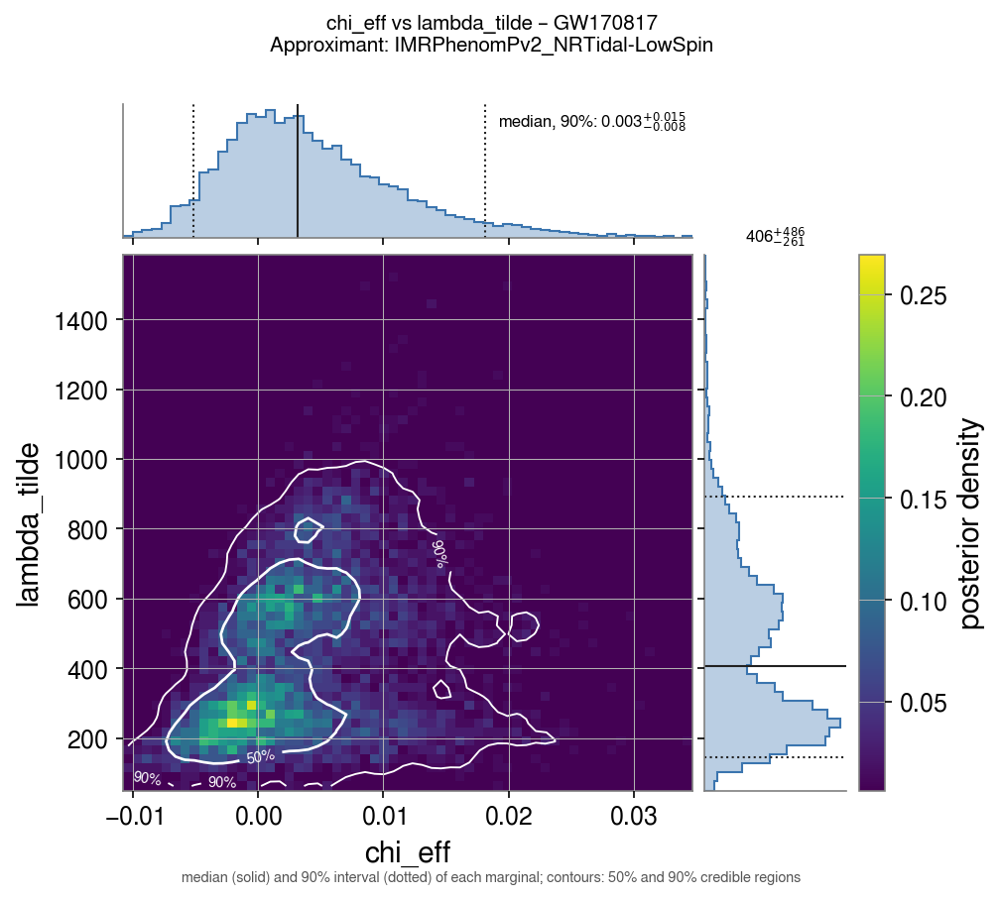

# Tidal deformability of neutron stars

This page explains how the tidal deformation of neutron stars is read from a gravitational-wave
signal, what the public catalog files contain, and how spin enters the measurement. The posteriors
are plotted with [parameters_estimation](../modes/parameters-estimation.md#tidal-deformability).

## The tidal deformability

In the last orbits before a merger, each neutron star is distorted by the tidal field
\(\mathcal{E}_{ij}\) of its companion and acquires a quadrupole moment
\(Q_{ij} = -\lambda\, \mathcal{E}_{ij}\) (Flanagan & Hinderer 2008 [\[63\]](../references.md#ref-63)).
In dimensionless form,

\[
\Lambda = \frac{\lambda}{m^5} = \frac{2}{3}\, k_2 \left(\frac{R c^2}{G m}\right)^5 ,
\]

where \(k_2\) is the tidal Love number and \(R\) the radius of the star
(Hinderer 2008 [\[64\]](../references.md#ref-64)).

- \(\Lambda = 0\) for a black hole.
- For a 1.4 M☉ neutron star, \(\Lambda\) is of order 100–1000, depending on the equation of state
  (EOS) of dense matter. The \(R^5\) factor makes it a sensitive probe of the radius: a stiff EOS
  gives large, easily deformed stars.

## How it shows up in the signal

The deformation takes energy out of the orbit, so the inspiral speeds up at the end. In the
frequency-domain phase, the leading tidal term enters at 5PN order,

\[
\Psi_\text{tidal}(f) = \frac{3}{128\,\eta\, x^{5/2}} \left(-\frac{39}{2}\,\tilde\Lambda\, x^{5}\right),
\qquad x = \left(\frac{\pi G M f}{c^3}\right)^{2/3},
\]

with \(\eta\) the symmetric mass ratio. Because of the \(x^5\) factor, almost all the information
comes from above a few hundred Hz, in the last tens of cycles, where the detectors are limited by
shot noise. The data constrain mainly the mass-weighted combination
(Wade et al. 2014 [\[65\]](../references.md#ref-65))

\[
\tilde\Lambda = \frac{16}{13}\,
\frac{(m_1 + 12 m_2)\, m_1^4 \Lambda_1 + (m_2 + 12 m_1)\, m_2^4 \Lambda_2}{(m_1 + m_2)^5},
\]

while the second combination, \(\delta\tilde\Lambda\), enters at higher order and is essentially
unconstrained. The LVK analyses use waveform models with tidal terms calibrated on numerical
relativity, such as IMRPhenomPv2_NRTidal (Dietrich et al. 2017 [\[66\]](../references.md#ref-66)),
and their NSBH counterparts IMRPhenomNSBH and SEOBNRv4_ROM_NRTidalv2_NSBH.

## What the catalog files contain

Tidal parameters (`lambda_1`, `lambda_2`, `lambda_tilde`, `delta_lambda`) exist only in the labels
run with a tidal waveform. The default `Mixed` label of BNS and NSBH events has none, so the label
must be chosen with `--pe-label`. The values below are computed from the posterior samples
`gwtc_analysis` reads.

| Event | Tidal labels | \(\tilde\Lambda\): median, 90% upper bound |
|---|---|---|
| GW170817 (BNS) [\[40\]](../references.md#ref-40) | `C02:IMRPhenomPv2_NRTidal-LowSpin`, `-HighSpin` ([unofficial bundle](../modes/unofficial-pe.md)) | 406, ≤ 793 (low spin); 328, ≤ 746 (high spin) |
| GW190425 (BNS) [\[42\]](../references.md#ref-42) | `C01:IMRPhenomPv2_NRTidal:LowSpin`, `:HighSpin` | 398, ≤ 1247 (low spin); 986, ≤ 2063 (high spin) |
| GW200105, GW200115 (NSBH) [\[44\]](../references.md#ref-44) | `C01:IMRPhenomNSBH:*`, `C01:SEOBNRv4_ROM_NRTidalv2_NSBH:*` | \(\Lambda_2\) uninformative |
| GW230529 (NSBH, mass-gap primary) [\[45\]](../references.md#ref-45) | `C00:IMRPhenomNSBH`, `C00:SEOBNRv4_ROM_NRTidalv2_NSBH`, `C00:IMRPhenomPv2_NRTidalv2` | \(\Lambda_2\) uninformative |

**GW170817** is the only event with a real measurement. Assuming that both stars obey the same EOS,
the LVK analysis finds \(\Lambda_{1.4} = 190^{+390}_{-120}\) and radii of about 11–13 km
[\[69\]](../references.md#ref-69), [\[70\]](../references.md#ref-70). This rules out the stiffest
EOSs. Combined with the kilonova AT2017gfo, some authors also derive a lower bound
\(\tilde\Lambda \gtrsim 400\) [\[71\]](../references.md#ref-71), but this bound depends on the
ejecta models and is debated.

**GW190425** is heavier (about 3.4 M☉ in total) and was seen essentially by LIGO Livingston alone at
lower SNR, so it gives only a weak upper bound.

**NSBH events.** The NSBH models fix \(\Lambda_1 = 0\) for the black hole, and the heavy primary
dominates the mass weighting, so `lambda_tilde` comes out small (median ~20–150) *whatever the
neutron star is*: it is not a measurement. The informative quantity is `lambda_2`, which for these
events stays close to its flat 0–5000 prior (median ~2500). With a large mass ratio and a slowly
spinning black hole, the neutron star plunges before it is tidally disrupted, which also explains
why no electromagnetic counterpart was expected. For GW230529, `C00:IMRPhenomPv2_NRTidalv2` instead
treats both objects as neutron stars (\(\Lambda_1 \neq 0\)).

## Spin and tides

The tidal effect itself does not depend on spin, but its measurement does, in three ways.

**Mass ratio–spin degeneracy.** The aligned spin \(\chi_\text{eff}\), which enters the phase at
1.5PN order, is correlated with the mass ratio \(q\). Because \(\Lambda\) depends steeply on mass, a
wider spin prior spreads \(q\), and with it \(\Lambda_1\) and \(\Lambda_2\). The LVK therefore
publishes two analyses:

- **LowSpin**, \(|\chi| \le 0.05\): the spins of the fastest Galactic double neutron stars, spun
  down to the time of merger;
- **HighSpin**, \(|\chi| \le 0.89\): agnostic, giving broader and more asymmetric bounds.

The correlation is visible directly in the GW170817 posterior:

```bash
gwtc_analysis parameters_estimation --src-name GW170817 \
  --pe-label C02:IMRPhenomPv2_NRTidal-LowSpin \
  --pe-vars lambda_tilde delta_lambda lambda_1 lambda_2 \
  --pe-pairs lambda_1:lambda_2 chi_eff:lambda_tilde mass_ratio:lambda_tilde
```



**Spin-induced quadrupole.** A spinning star is flattened, which gives it a quadrupole moment
\(Q = -\kappa\, \chi^2 m^3\) entering at 2PN order through the spin–spin terms. \(\kappa = 1\) for a
black hole and about 2–14 for a neutron star, depending on the EOS. The waveform models do not fit
\(\kappa\) separately: they tie it to \(\Lambda\) through the quasi-universal Love–Q relations
(Yagi & Yunes 2013 [\[67\]](../references.md#ref-67)). For low spins the effect is small.

**No tidal spin-up.** Tidal torques could in principle lock the stars' rotation to the orbit, but
the viscosity of neutron-star matter is far too low for this to happen before the merger
(Bildsten & Cutler 1992 [\[68\]](../references.md#ref-68)). The stars stay essentially
irrotational, as the tidal models assume.

## Practical notes

- BNS signals are long, so a `parameters_estimation` run with the strain overlays takes several
  minutes (about 7 min for GW170817).
- The log lists the labels available in the PE file, and the report flags any requested variable
  that the selected label does not have.
