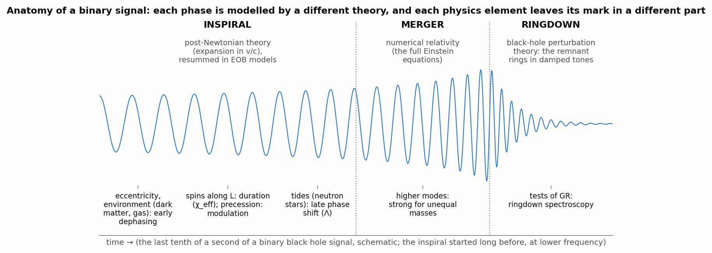
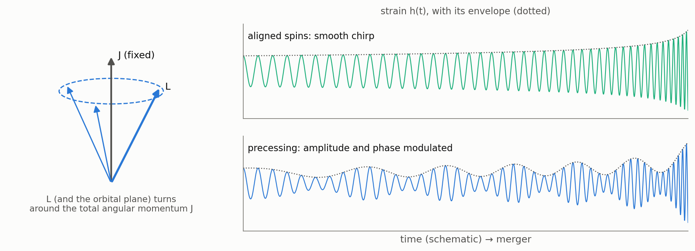
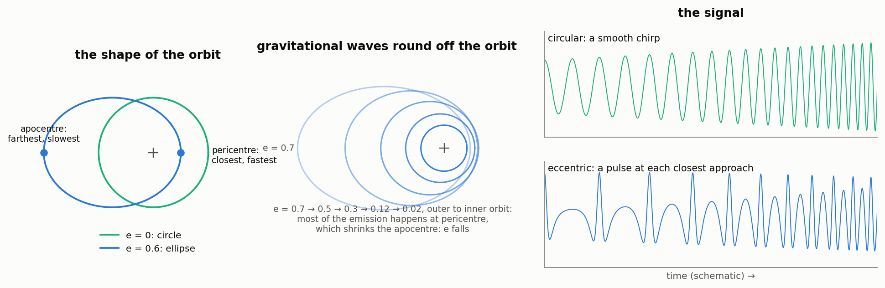

# Waveform models

Every number derived from a GW event, the masses, spins, distance, sky map and everything built on them, comes
from comparing the data with **waveform models**: for a given source (masses, spins, orientation, distance, and
possibly tides, eccentricity or an environment) a model returns the two polarizations h₊(t) and h×(t) the detectors
should record. Parameter estimation evaluates millions of them, so the posterior samples of every catalog event are
conditional on a waveform model. General relativity fixes the signal of two black holes completely, but there is
no closed formula for it: the models are approximations, each including some physics and not other. This page
explains what the models contain, how their names encode it, how they evolved from GW150914 to GWTC-5.0, and which
ones `gwtc_analysis` reads.

*The three phases of a binary signal and the theory that describes each: post-Newtonian expansions for the
inspiral, numerical relativity for the merger, black-hole perturbation theory for the ringdown; below, where each
physics element leaves its mark (schematic).*

## Three ways to build a model

- **Phenomenological models (IMRPhenom).** Analytic formulas for the amplitude and phase, mostly in the frequency
  domain, fitted to numerical-relativity and effective-one-body waveforms. The fastest, hence the workhorse of the
  catalogs (IMRPhenomXPHM, Pratten et al. 2021 [\[51\]](../references.md#ref-51)).
- **Effective-one-body models (SEOBNR, TEOBResumS).** The two-body problem is mapped onto one effective body moving
  in a deformed black-hole spacetime (Buonanno & Damour 1999 [\[94\]](../references.md#ref-94)); its equations of
  motion are integrated in time and calibrated to numerical relativity
  ([\[95\]](../references.md#ref-95), [\[96\]](../references.md#ref-96), [\[97\]](../references.md#ref-97)).
  Slower, very accurate, and the natural place to add new physics to the dynamics.
- **Numerical-relativity surrogates (NRSur).** Interpolations across a library of numerical-relativity simulations,
  the most faithful within their training range (NRSur7dq4, Varma et al. 2019 [\[98\]](../references.md#ref-98):
  mass ratios up to 4, a few tens of cycles), so used for heavy binaries whose signal in the detectors is short.
- Two related tools are not catalog models: **post-Newtonian approximants** such as TaylorF2 (inspiral only, used
  for binary neutron stars and in searches), and **numerical relativity** itself, too expensive for parameter
  estimation but used to build and test the models.

## The physics elements

| Physics element | What it does to the signal | Marker in the names | Examples |
|---|---|---|---|
| masses | the frequency sweep and duration (chirp mass), the merger frequency | all models | — |
| spins along the orbital angular momentum L | lengthen or shorten the inspiral (χ_eff), change the merger | aligned-spin models | IMRPhenomD, IMRPhenomXAS, SEOBNRv4 |
| precession (spins tilted against L) | the orbital plane wobbles around the total angular momentum J: amplitude and phase are modulated (χ_p) | **P** | IMRPhenomPv2, IMRPhenomXP, SEOBNRv4P |
| higher modes (multipoles beyond the (2,2) quadrupole) | extra harmonics, strong for unequal masses and inclined orbits; they help measure the inclination | **HM** | IMRPhenomXHM, IMRPhenomXPHM, SEOBNRv4PHM, SEOBNRv5PHM |
| better precession dynamics | spin evolution integrated from the post-Newtonian equations, or tuned to numerical relativity | SpinTaylor, PNR, XO4a | IMRPhenomXPHM-SpinTaylor [\[52\]](../references.md#ref-52), IMRPhenomXPNR, IMRPhenomXO4a |
| tides (neutron stars) | an extra phase shift at the end of the inspiral, set by the tidal deformability Λ | **NRTidal**, T | IMRPhenomPv2_NRTidal(v2) [\[66\]](../references.md#ref-66), SEOBNRv4T |
| tidal disruption (neutron star–black hole) | the neutron star is torn apart and the signal shuts off early | NSBH | IMRPhenomNSBH, SEOBNRv4_ROM_NRTidalv2_NSBH |
| eccentricity | a burst at each closest approach, extra harmonics, a faster inspiral | E, Dalí | TEOBResumS-Dalí, SEOBNRv5EHM (research models: the catalogs assume circular orbits) |
| environment (gas, dark matter) | extra dephasing in the inspiral, largest at low frequency | added terms | IMRPhenomXP_Scalar, a scalar cloud around GW190728 (Roy et al. [\[100\]](../references.md#ref-100); not an LVK model) |
| deviations from general relativity | shifted post-Newtonian, merger or ringdown coefficients | parametrized versions | parametrized IMRPhenom (TIGER, FTI), pSEOBNR; ringdown-only fits (pyRing) |

*Precession: with tilted spins, the orbital angular momentum L turns around the fixed total angular momentum J, and
the signal is modulated (schematic).*

Gravitational waves round off orbits (Peters 1964 [\[99\]](../references.md#ref-99)): a binary radiates most at
closest approach, which shrinks the far side of the orbit, so the eccentricity falls as the binary shrinks, roughly
as f^(−19/18). Binaries from two stars that evolved together arrive in the band essentially circular; binaries
assembled dynamically (dense star clusters, galactic nuclei, AGN disks) can keep a measurable eccentricity, which
is why eccentricity, like precession, is a clue to how a binary formed. The two are easily confused in short
signals: GW190521 has been read both as eccentric and as strongly precessing.

*Eccentricity (schematic): a circular and an eccentric orbit; the orbit becoming round as it radiates; a smooth
chirp against a pulse at each closest approach.*

## Decoding the names

The names are compact descriptions: a family, a generation or version, then letters for the physics included.

**Taylor approximants (post-Newtonian, inspiral only).** The inspiral is computed from energy balance: the orbital
energy and the radiated flux are both known as series in the orbital speed v/c, and "Taylor" means they are used as
Taylor series in v (as opposed to resummed forms such as the older Padé approximants).

- **TaylorT1–T4**: time-domain variants, which differ only in how the energy balance is solved or re-expanded.
- **TaylorF2**: frequency domain, the phase written directly as a function of frequency with the stationary-phase
  approximation; analytic and fast, used for long binary-neutron-star signals and in searches.
- **SpinTaylorT4, T5**: the T4 or T5 inspiral plus the post-Newtonian equations that make the spins and the orbit
  precess. IMRPhenomXPHM-SpinTaylor takes its precession angles from integrating these equations.

**IMRPhenom.** IMR = Inspiral–Merger–Ringdown, the whole signal; Phenom = phenomenological. The letter is the
generation: A, B, C (2007–2010, the first complete models, non-spinning then aligned spins), D (2016, accurate
aligned spins), Pv2 and Pv3 (precession, by "twisting" an aligned-spin model with time-dependent angles), the X
family (2020–: XAS aligned spins, XHM higher modes, XP precessing, XPHM both), T (the same physics in the time
domain, e.g. IMRPhenomTPHM), XO4a (prepared for the O4a run, with precession tuned to numerical relativity), XPNR
(precession calibrated to numerical relativity). Suffixes add physics: HM, _NRTidal(v2), NSBH, -SpinTaylor.

**SEOBNR.** S = Spinning, EOB = Effective-One-Body, NR = calibrated to Numerical Relativity; then the version (v2 to
v5), P precessing, HM higher modes, T tides, E eccentric, and _ROM a reduced-order model, a fast frequency-domain
surrogate of the EOB model itself.

**TEOBResumS.** T = Tidal, EOB = Effective-One-Body, Resum = resummed (the post-Newtonian series rewritten in closed
forms that behave better near merger), S = Spins. TEOBResumS-Dalí is its version for eccentric and generic orbits.

**NRSur.** NR = trained on Numerical-Relativity simulations, Sur = surrogate; then the number of source parameters
(d) and the largest mass ratio (q): NRSur7dq4 covers 7 parameters (the mass ratio and the six components of the two
spins) up to q = 4; NRHybSur3dq8 is a hybrid (numerical relativity joined to a post-Newtonian inspiral) with 3
parameters (mass ratio and two aligned spins) up to q = 8.

**Labels in the PE files.** A label such as `C00:IMRPhenomXPHM-SpinTaylor` is one analysis of the event: **C00**,
**C01** give the version of the detector calibration it used, then the waveform model. **Mixed** combines the samples
of two or more models equally, which folds their difference into the posterior. **HighSpin** and **LowSpin** are the
spin priors of neutron-star analyses (spins up to large values, or limited to those of known pulsars in binaries).

## How the models evolved, catalog by catalog

| Release | Models | The question that drove them |
|---|---|---|
| GW150914 (2016) | IMRPhenomPv2, SEOBNRv2 (aligned spins), compared with numerical relativity | is it two black holes, and how heavy? |
| GW170817 (2017) | TaylorF2, IMRPhenomPv2_NRTidal, low- and high-spin priors | tides: the neutron-star equation of state |
| GWTC-1 (O1–O2, 2018) | IMRPhenomPv2, SEOBNRv3 (precessing), NRTidal for the neutron stars | spins and precession across a population |
| GWTC-2 (O3a, 2020) | IMRPhenomPv3HM, SEOBNRv4PHM; NRSur7dq4 for GW190521 | higher modes became necessary with unequal-mass events (GW190412, GW190814) |
| GWTC-2.1, GWTC-3 (O3, 2021) | IMRPhenomXPHM and SEOBNRv4PHM, combined as Mixed; IMRPhenomNSBH and SEOBNRv4_ROM_NRTidalv2_NSBH for the neutron-star–black-hole events | faster, more accurate precessing models for ~90 events |
| GWTC-4.0 (O4a, 2025) | IMRPhenomXPHM-SpinTaylor and SEOBNRv5PHM for all 84 events (and Mixed); NRSur7dq4 for 44, IMRPhenomXO4a for 28; IMRPhenomNSBH and IMRPhenomPv2_NRTidalv2 for neutron-star events | louder signals need better precession; the heaviest need surrogates |
| GWTC-5.0 (O4b, 2026) | IMRPhenomXPHM-SpinTaylor, IMRPhenomXPNR and SEOBNRv5PHM for all 93 events; NRSur7dq4 for 53 | precession tuned to numerical relativity; several models per event to measure the systematics |

The O4 rows are counted from the public PE files of the two releases; the earlier ones are the models of the
catalog papers.

**When the models disagree.** For loud or heavy events the difference between models can be as large as the
statistical uncertainty. GW231123, the most massive binary of GWTC-4.0, is the clearest case: its multipole and
precession signal-to-noise ratios differ by a factor of three to four between models
([parameters_estimation](../modes/parameters-estimation.md)), and the cosmology analyses leave it out.

## New questions, new models

- **Environments and dark matter.** A binary in a dense medium loses energy and angular momentum faster than in
  vacuum, so its phase drifts from the vacuum prediction, mostly early in the inspiral. Roy et al.
  [\[100\]](../references.md#ref-100) built IMRPhenomXP_Scalar, IMRPhenomXP plus a Newtonian dynamical-friction
  torque from a scalar cloud, and re-analysed the public strain of 28 binary black holes: ln B ≈ 3.5 in favour of
  the environment for GW190728 alone, a tentative result. Such models cannot reuse the catalog posterior samples,
  which assume the vacuum model: the strain has to be analysed again.
- **Eccentricity** models (TEOBResumS-Dalí, SEOBNRv5EHM) would test dynamical formation directly.
- **Tests of general relativity** add free deviations to the coefficients of the models, or fit the ringdown tones
  alone; the area-theorem test of GW250114 uses NRSur7dq4 ([area_law](../modes/area-law.md)).
- **Lensing** is not part of the waveform model: magnification, time delay and phase shift are applied to the
  signal afterwards.

## The waveform models in gwtc_analysis

`gwtc_analysis` reads the posterior samples of the public releases; it never re-runs parameter estimation. The
waveform behind each result is the label it reads:

| Mode | Label read (default) | Choose another |
|---|---|---|
| [catalog_statistics](../modes/catalog-statistics.md), [event_selection](../modes/event-selection.md) | the GWOSC catalog values (the medians the catalog publishes) | — |
| [parameters_estimation](../modes/parameters-estimation.md) | `Mixed` for the posteriors; the strain overlay is synthesized with the waveform engine of the label | `--pe-label`, `--waveform-engine`; the report compares the multipole and precession SNRs of all the labels |
| [search_skymaps](../modes/search-skymaps.md) | the `Mixed` skymap, else IMRPhenomXPHM-SpinTaylor (GWTC-5.0 has no `Mixed` maps) | `--skymap-label` |
| [hubble_constant](../modes/hubble-constant.md), [spin_population](../modes/spin-population.md) | one model per event, as the LVK cosmology analyses: IMRPhenomXPHM-SpinTaylor (O4), IMRPhenomXPHM (O1–O3) | — |
| [hubble_constant --method bright](../modes/hubble-constant-bright.md), [counterpart](../modes/counterpart.md), [neutron_star_eos](../modes/neutron-star-eos.md) | IMRPhenomPv2_NRTidal, low-spin prior (high spin also reported) | `--pe-label` (bright, counterpart), `--spin-prior` (neutron_star_eos) |
| [area_law](../modes/area-law.md) | NRSur7dq4, on the full signal and on data truncated before the peak | — |

Using a single model per event, rather than a mixture, avoids combining samples drawn with different priors (for
instance on the luminosity distance), which the reweighting of the population analyses would otherwise have to
handle; it is the choice of the LVK cosmology analyses.
